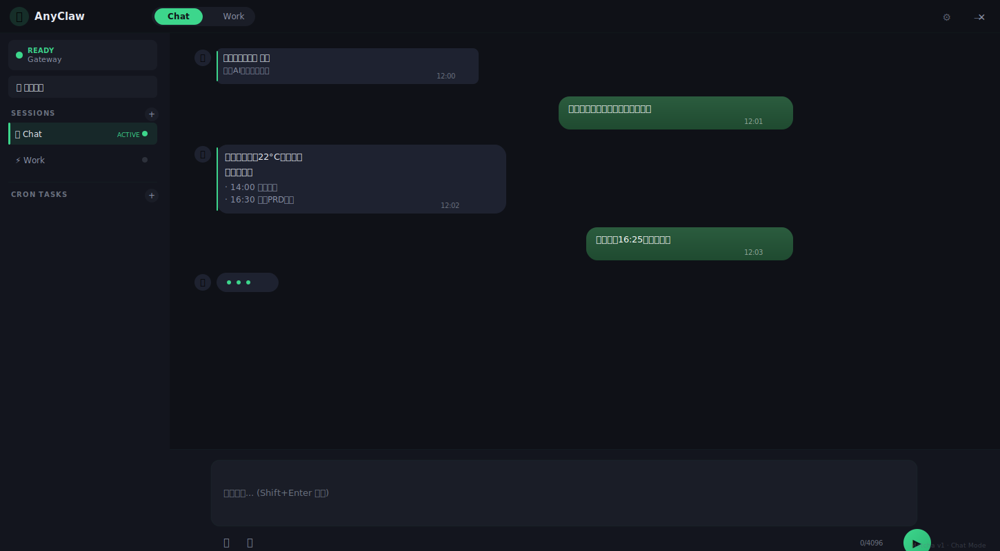

# AnyClaw LVGL — 设计规范 v2.2.11

> 版本：v2.2.11（整合修订） | 目标用户：大学生 & 职场年轻人 | 更新时间：2026-04-24
> 本文档定义 AnyClaw "长什么样、怎么画、画在哪"。产品需求见 `PRD.md`。

---

## 双向索引

### A. PRD → Design（需求 → 执行规范）

> 查 PRD 中某个章节，对应 Design 里在哪里有执行规范。

|| PRD 章节 | 功能 | Design 章节 | UI 编号 |
||---------|------|-------------|---------|
| §1 | 产品概览 | Design §1 直接引用（不重写） | — |
| §2 | 安装与首次启动 | §11 首次体验 | UI-01~12 |
| §3.1 | 窗口与布局 | §12 主界面窗口规则 | UI-04,05,11,12,55 |
| §3.2 | 系统托盘 | §12 主界面窗口规则 | UI-63 |
| §3.3 | 国际化 | §3 排版系统 | — |
| §3.4 | 贴边大蒜头 | §12 主界面窗口规则 | UI-13 |
| §4.3 | 文件与多模态（附件上传） | §13 Chat 界面 | UI-36 |
| §4 | 对话 Chat | §13 Chat 界面 | UI-11~22,36 |
| §5 | 工作台 Work | §14 Work 界面 | UI-12,23~30,44 |
| §6.1 | 界面模式切换 | §15 交互组件 | UI-21 |
| §6.2 | AI 交互模式 | §15 交互组件 | UI-22,29,32 |
| §6.3 | UI 控制权模式 | §15 交互组件 | UI-22 |
| §6.4 | 键盘快捷键 | §15 交互组件 | UI-KS |
| §7.2 | 云端模型管理 | §16 配置界面 | UI-35,47 |
| §7.3 | 本地模型管理 | §11 首次体验 | UI-07 |
| §7.4 | Model Failover | §16 配置界面 | UI-47 |
| §8.2 | Skill 管理 | §17 扩展界面 → Settings → C3 → Skill Tab | UI-65 |
| §9.1 | 权限系统 | §18 权限与弹窗 | UI-31,46 |
| §10 | 工作区管理 | §19 工作区界面 | UI-39~41,64 |
| §11 | 术语表 | Design 无对应章节 | — |
| §12 | 技术架构 | Design 无对应章节（代码层面） | — |
| §13.1 | 日志 | §20 设置页 | UI-48 |
| §13.5 | Feature Flags | §20 系统界面 | UI-50 |
| §13.6 | Tracing | §20 系统界面 | UI-51 |
| §13.7 | 商业授权 | §21 系统界面 | UI-33 |

### B. Design → PRD（执行规范 → 需求依据）

> 查 Design 里某个章节，对应 PRD 里哪个需求在定义它。

|| Design 章节 | 主要内容 | 对应 PRD 章节 |
||-------------|---------|-------------|
| §1 | 设计原则 | 直接引用 PRD §1 | §1 |
| §2~§5 | 色彩/排版/间距/图标 | 视觉执行规范 | PRD §1,§3（无专章节） |
| §6~§10 | 控件库/状态/动效/音效/无障碍 | 组件执行规范 | PRD 各章节分散定义 |
| §11 | 首次体验 | 启动/向导 | PRD §2 |
| §12 | 主界面窗口规则 | 布局/LVGL常量 | PRD §3.1 |
| §13 | Chat 界面 | 对话UI | PRD §4 + §3.1 |
| §14 | Work 界面 | 工作台UI | PRD §5 + §3.1 |
| §15 | 交互组件 | 模式/AI行为/控制权 | PRD §6 |
| §16 | 配置界面 | 模型管理 | PRD §7 |
| §17 | 扩展界面 | Skills（§8.2）/ 知识库（§8.4）/ 应用授权（§8.3） → Settings → C3 | UI-43, UI-60, UI-65 |
| §18 | 权限与弹窗 | 权限系统 | PRD §9.1 |
| §19 | 工作区界面 | 工作区管理 | PRD §10 |
| §20 | 设置页 | 日志/诊断/FF | PRD §13.1,§13.5,§13.6 |
| §21 | 系统界面 | 授权/崩溃/更新 | PRD §13.7 |

---

## 目录

**第一层：基础规范**
- §1 设计原则
- §2 色彩系统
- §3 排版系统
- §4 间距与栅格
- §5 图标系统

**第二层：控件与状态**
- §6 控件库
- §7 状态系统
- §8 动效系统
- §9 音效系统
- §10 无障碍 · 性能 · 离线降级

**第三层：界面设计**
- §11 首次体验（UI-01~10）
- §12 主界面窗口规则（通用规则：左导航/标题栏/Bot骨架/File骨架；§12 专属：UI-13 贴边大蒜头、UI-52~55 主题预览、UI-63 托盘菜单）
- §13 Chat 界面（UI-11~22）
- §14 Work 界面（UI-12, UI-23~30, UI-44）
- §15 交互组件（UI-21, UI-22）
- §16 配置界面（UI-42, UI-47）
- §17 扩展界面（UI-43, UI-60, UI-65）
- §18 权限与弹窗（UI-31, UI-32, UI-46）
- §19 工作区界面（UI-39~41, UI-64）
- §20 设置页（UI-45~51, UI-48A）
- §21 系统界面（UI-33, UI-34, UI-37, UI-38, UI-56~58）

**第四层：品牌**
- §22 品牌文案

---

## 第一层：基础规范

## §1 设计原则

> 需求 → PRD §1 产品概览

目标用户、产品定位、设计关键词、参考设计语言 — 全部见 **PRD §1**，不在此重复。

本文只定义"怎么画"：
- 色彩、字体、间距、图标等视觉规范（§2~§5）
- 控件行为、状态、动效（§6~§10）
- 具体界面实现（§11~§21）

> ⚠️ PRD 是需求权威，Design 是执行规范。若两者冲突，以 PRD 为准，Design 跟着改。

---

## §2 色彩系统

> 需求 → PRD §3 主界面

### 2.1 主题体系

三套主打主题，通过 Settings General Tab 切换，即时生效无需重启。

**主打主题（完整规格）：**

| 主题 ID | 名称 | 定位 | 默认 |
|---------|------|------|------|
| `matcha` | 抹茶 Matcha v1 | 深色系，薄荷绿清新风，长时间使用 | ✅ 默认 |
| `peachy` | 桃气 Peachy v2 | 暖色系，珊瑚橘苹果风，年轻人友好 | |
| `mochi` | 糯 Mochi v3 | 米白系，奶茶棕温柔风，质感文艺 | |

---

### 🍵 主题一：抹茶 Matcha v1（默认主打）

> 需求 → PRD §3 主界面

### 2.2.1 基础色板

| 语义 Token | 色值 | 用途 |
|------------|------|------|
| `bg` | `#0F1117` | 窗口最底层背景 |
| `surface` | `#13151E` | 输入区、低层容器 |
| `panel` | `#1A1D27` | 面板、卡片、弹窗 |
| `raised` | `#1E2230` | 气泡、浮层、tooltip |
| `overlay` | `#252A38` | hover 态、选中态 |

### 2.2.2 文字色

| Token | 色值 | 用途 |
|-------|------|------|
| `text_primary` | `#E8ECF4` | 主文字、标题 |
| `text_secondary` | `#8B92A8` | 次要文字、说明 |
| `text_tertiary` | `#6B7280` | 占位符、禁用态 |
| `text_inverse` | `#0F1117` | 深色背景上的白字 |

### 2.2.3 强调色

| Token | 色值 | 用途 |
|-------|------|------|
| `accent` | `#3DD68C` | 主强调色、品牌色、成功 |
| `accent_hover` | `#2BB673` | 主按钮 hover |
| `accent_active` | `#1FA35E` | 主按钮 active |
| `accent_subtle` | `#3DD68C1A` | 背景着色（10% opacity） |
| `accent_secondary` | `#6C9FFF` | 辅助蓝、链接 |

### 2.2.4 语义色

| Token | 色值 | 用途 |
|-------|------|------|
| `success` | `#3DD68C` | 成功、完成、Ready |
| `warning` | `#FFBE3D` | 警告、Busy |
| `danger` | `#FF6B6B` | 错误、删除、Error |
| `info` | `#6C9FFF` | 信息、Checking |

### 2.2.5 功能色

| Token | 色值 | 用途 |
|-------|------|------|
| `border` | `#3DD68C0A` | 面板边框 |
| `border_strong` | `#3DD68C20` | 输入框焦点边框 |
| `divider` | `#3DD68C08` | 分隔线 |
| `focus_glow` | `#3DD68C30` | 焦点光晕 |
| `hover_overlay` | `#FFFFFF0A` | 通用 hover 叠加 |
| `active_overlay` | `#FFFFFF14` | 通用 active 叠加 |
| `disabled_bg` | `#1A1D2780` | 禁用态背景 |
| `disabled_text` | `#6B728080` | 禁用态文字 |

### 2.2.6 气泡专用色

| Token | 色值 | 用途 |
|-------|------|------|
| `bubble_user_bg` | `#2B5C3E` | 用户气泡底色 |
| `bubble_user_bg_end` | `#1F4A30` | 用户气泡渐变终点 |
| `bubble_ai_bg` | `#1E2230` | AI 气泡底色 |
| `bubble_ai_accent_bar` | `#3DD68C` | AI 气泡左侧竖线 |

### 2.2.7 阴影

| Token | 值 | 用途 |
|-------|-----|------|
| `shadow_sm` | `0 1px 3px rgba(0,0,0,0.2)` | 卡片轻微浮起 |
| `shadow_md` | `0 2px 8px rgba(0,0,0,0.25)` | 气泡、tooltip |
| `shadow_lg` | `0 8px 24px rgba(0,0,0,0.35)` | 弹窗、dropdown |
| `shadow_glow` | `0 0 12px rgba(61,214,140,0.15)` | 焦点/品牌发光 |

### 2.2.8 Matcha 控件色映射

| 控件 | Default | Hover | Active | Disabled |
|------|---------|-------|--------|----------|
| 主按钮 | bg=accent, text=text_inverse | bg=accent_hover | bg=accent_active, scale(0.97) | bg=disabled_bg, text=disabled_text |
| 次要按钮 | border=accent, text=accent | bg=accent_subtle | — | border=disabled_text |
| 发送按钮 | bg=accent gradient, BTN_SEND 圆形 | bg=accent_hover, glow | bg=accent_active | — |
| 输入框 | bg=surface, border=border | border=border_strong | border=accent, glow | bg=disabled_bg |
| Switch 关闭 | bg=#373C55, thumb=#8B92A8 | — | — | — |
| Switch 开启 | bg=accent, thumb=white | — | — | — |
| 用户气泡 | gradient #2B5C3E→#1F4A30 | — | — | — |
| AI 气泡 | bg=raised, 左侧 accent 竖线 | — | — | — |

---

### 🍑 主题二：桃气 Peachy v2

> 需求 → PRD §3 主界面

**设计理念：** "简单但不简陋，活泼但不花哨，温暖但不刺眼"

- 🧡 **暖色系**：珊瑚橘主色 + 暖橙辅色 + 粉红点缀
- 🍎 **苹果风**：大圆角 20-24px + 柔和阴影 + 暖白背景
- 🐱 **萌系元素**：emoji 点缀 + 彩色脉冲动画 + 友好文案
- 💫 **年轻化**：渐变按钮 + 弹性胶囊 + 装饰圆点

### 2.3.1 基础色板

| 语义 Token | 色值 | 用途 |
|------------|------|------|
| `bg` | `#FFF8F3` | 暖白背景 |
| `surface` | `#FFF1E8` | 暖浅面，输入区 |
| `panel` | `#FFFFFF` | 卡片、面板、弹窗 |
| `raised` | `#FFF5EE` | 气泡、浮层、tooltip |
| `overlay` | `#FFE8D6` | hover 态、选中态 |

### 2.3.2 文字色

| Token | 色值 | 用途 |
|-------|------|------|
| `text_primary` | `#2D1B14` | 暖黑主文字 |
| `text_secondary` | `#8B7355` | 暖灰次要文字 |
| `text_tertiary` | `#B8A089` | 占位符、禁用态 |
| `text_inverse` | `#FFFFFF` | 深色背景上的白字 |

### 2.3.3 强调色

| Token | 色值 | 用途 |
|-------|------|------|
| `accent` | `#FF7F50` | 珊瑚橘主强调色 |
| `accent_hover` | `#E86D3C` | 主按钮 hover |
| `accent_active` | `#CC5A2A` | 主按钮 active |
| `accent_subtle` | `#FF7F501A` | 背景着色（10% opacity） |
| `accent_secondary` | `#FFB347` | 暖橙辅色 |
| `accent_tertiary` | `#FF6B8A` | 粉红点缀 |

### 2.3.4 语义色

| Token | 色值 | 用途 |
|-------|------|------|
| `success` | `#7ECFB3` | 薄荷绿，成功、完成 |
| `warning` | `#FFB347` | 暖橙，警告、Busy |
| `danger` | `#FF5C5C` | 暖红，错误、删除 |
| `info` | `#B8A9E8` | 薰衣草紫，信息、Checking |

### 2.3.5 功能色

| Token | 色值 | 用途 |
|-------|------|------|
| `border` | `#F0E0D0` | 暖边框 |
| `border_strong` | `#E0C8B0` | 输入框焦点边框 |
| `divider` | `#F5E6D8` | 分隔线 |
| `focus_glow` | `#FF7F5030` | 焦点光晕 |
| `hover_overlay` | `#FF7F500A` | 通用 hover 叠加 |
| `active_overlay` | `#FF7F5014` | 通用 active 叠加 |
| `disabled_bg` | `#FFF1E880` | 禁用态背景 |
| `disabled_text` | `#B8A08980` | 禁用态文字 |

### 2.3.6 气泡专用色

| Token | 色值 | 用途 |
|-------|------|------|
| `bubble_user_bg` | `#FFE8D6` | 用户气泡底色（暖杏） |
| `bubble_user_bg_end` | `#FFD6BE` | 用户气泡渐变终点 |
| `bubble_ai_bg` | `#FFFFFF` | AI 气泡底色（纯白） |
| `bubble_ai_accent_bar` | `#FF7F50` | AI 气泡左侧竖线（珊瑚橘） |

### 2.3.7 阴影

| Token | 值 | 用途 |
|-------|-----|------|
| `shadow_sm` | `0 1px 3px rgba(139,80,50,0.08)` | 卡片轻微浮起 |
| `shadow_md` | `0 2px 8px rgba(139,80,50,0.12)` | 气泡、tooltip |
| `shadow_lg` | `0 8px 24px rgba(139,80,50,0.18)` | 弹窗、dropdown |
| `shadow_glow` | `0 0 12px rgba(255,127,80,0.15)` | 焦点/品牌发光 |

### 2.3.8 Peachy 控件色映射

| 控件 | Default | Hover | Active | Disabled |
|------|---------|-------|--------|----------|
| 主按钮 | bg=accent, text=text_inverse, radius=12 | bg=accent_hover | bg=accent_active, scale(0.97) | bg=disabled_bg, text=disabled_text |
| 次要按钮 | border=accent, text=accent | bg=accent_subtle | — | border=disabled_text |
| 发送按钮 | bg=accent gradient, BTN_SEND 圆形 | bg=accent_hover, glow | bg=accent_active | — |
| 输入框 | bg=panel, border=border, radius=12 | border=border_strong | border=accent, glow | bg=disabled_bg |
| Switch 关闭 | bg=#E0D0C0, thumb=#B8A089 | — | — | — |
| Switch 开启 | bg=accent, thumb=white | — | — | — |
| 用户气泡 | bg=暖杏 #FFE8D6 | — | — | — |
| AI 气泡 | bg=白色 #FFFFFF, 左侧 accent 竖线 | — | — | — |

### 2.3.9 Peachy 特色元素

| 元素 | 说明 |
|------|------|
| 圆角放大 | 卡片/弹窗 radius=radius_2xl（Matcha 为 radius_lg） |
| 渐变按钮 | 主按钮使用 `linear-gradient(135deg, #FF7F50, #FFB347)` |
| 装饰圆点 | 空状态、向导背景添加半透明装饰圆点 |
| 暖色阴影 | 阴影色相偏暖（rgba 含暖棕分量） |
| emoji 风格 | 操作图标优先使用 emoji（🍑🧡💫） |

---

### 🍡 主题三：糯 Mochi v3

> 需求 → PRD §3 主界面

**设计理念：** "温润如玉，静谧如茶，精致如器"

- 🤎 **米白暖棕**：奶茶棕主色 + 香槟金辅色 + 豆沙粉点缀
- 🫖 **茶道美学**：克制圆角 SCALE(base) 随主题倍率 + 柔和阴影 + 米白留白
- 📖 **文艺质感**：细线图标 + 衬线点缀 + 安静的高级感
- 🎋 **侘寂风**：不张扬、不喧哗，越看越舒服

**与现有主题的互补定位：**

| 维度 | Matcha v1 | Peachy v2 | Mochi v3 |
|------|-----------|-----------|----------|
| 色温 | 冷（暗底绿调） | 暖（亮底橘调） | 中性暖（米白棕调） |
| 情绪 | 清新、锐利、科技 | 活泼、可爱、社交 | 温柔、安静、文艺 |
| 目标 | 效率型用户 | 年轻社交用户 | 阅读/写作型用户 |
| 类比 | Linear / VS Code | Apple / Discord | Notion / Bear |

### 2.4.1 基础色板

| 语义 Token | 色值 | 用途 |
|------------|------|------|
| `bg` | `#FAF6F0` | 米白背景 |
| `surface` | `#F3EDE4` | 浅暖面，输入区 |
| `panel` | `#FFFDF9` | 卡片、面板（暖白） |
| `raised` | `#EDE7DC` | 气泡、浮层、tooltip |
| `overlay` | `#E4DDD0` | hover 态、选中态 |

### 2.4.2 文字色

| Token | 色值 | 用途 |
|-------|------|------|
| `text_primary` | `#3D3226` | 深棕主文字 |
| `text_secondary` | `#8B7D6B` | 暖灰次要文字 |
| `text_tertiary` | `#B0A394` | 占位符、禁用态 |
| `text_inverse` | `#FFFDF9` | 深色背景上的白字 |

### 2.4.3 强调色

| Token | 色值 | 用途 |
|-------|------|------|
| `accent` | `#A67B5B` | 奶茶棕主强调色 |
| `accent_hover` | `#8F6A4D` | 主按钮 hover |
| `accent_active` | `#7A5A40` | 主按钮 active |
| `accent_subtle` | `#A67B5B15` | 背景着色（8% opacity） |
| `accent_secondary` | `#C9A96E` | 香槟金辅色 |
| `accent_tertiary` | `#C4868C` | 豆沙粉点缀 |

### 2.4.4 语义色

| Token | 色值 | 用途 |
|-------|------|------|
| `success` | `#7EA87A` | 苔藓绿，成功、完成 |
| `warning` | `#C9A96E` | 香槟金，警告、Busy |
| `danger` | `#C47070` | 砖红，错误、删除 |
| `info` | `#7B98A6` | 青瓷蓝，信息、Checking |

### 2.4.5 功能色

| Token | 色值 | 用途 |
|-------|------|------|
| `border` | `#D6CFC4` | 暖边框 |
| `border_strong` | `#C4BBAD` | 输入框焦点边框 |
| `divider` | `#E8E2D8` | 分隔线 |
| `focus_glow` | `#A67B5B25` | 焦点光晕 |
| `hover_overlay` | `#A67B5B08` | 通用 hover 叠加 |
| `active_overlay` | `#A67B5B12` | 通用 active 叠加 |
| `disabled_bg` | `#F3EDE480` | 禁用态背景 |
| `disabled_text` | `#B0A39480` | 禁用态文字 |

### 2.4.6 气泡专用色

| Token | 色值 | 用途 |
|-------|------|------|
| `bubble_user_bg` | `#E8DFD0` | 用户气泡底色（暖杏） |
| `bubble_user_bg_end` | `#DDD2C0` | 用户气泡渐变终点 |
| `bubble_ai_bg` | `#FFFDF9` | AI 气泡底色（暖白） |
| `bubble_ai_accent_bar` | `#A67B5B` | AI 气泡左侧竖线（奶茶棕） |

### 2.4.7 阴影

| Token | 值 | 用途 |
|-------|-----|------|
| `shadow_sm` | `0 1px 3px rgba(120,100,80,0.06)` | 卡片轻微浮起 |
| `shadow_md` | `0 2px 8px rgba(120,100,80,0.10)` | 气泡、tooltip |
| `shadow_lg` | `0 8px 24px rgba(120,100,80,0.14)` | 弹窗、dropdown |
| `shadow_glow` | `0 0 12px rgba(166,123,91,0.12)` | 焦点/品牌发光 |

### 2.4.8 Mochi 控件色映射

| 控件 | Default | Hover | Active | Disabled |
|------|---------|-------|--------|----------|
| 主按钮 | bg=accent, text=text_inverse, radius=8 | bg=accent_hover | bg=accent_active, scale(0.97) | bg=disabled_bg, text=disabled_text |
| 次要按钮 | border=accent, text=accent | bg=accent_subtle | — | border=disabled_text |
| 发送按钮 | bg=accent, BTN_SEND 圆形 | bg=accent_hover, glow | bg=accent_active | — |
| 输入框 | bg=panel, border=border, radius=8 | border=border_strong | border=accent, glow | bg=disabled_bg |
| Switch 关闭 | bg=#D6CFC4, thumb=#B0A394 | — | — | — |
| Switch 开启 | bg=accent, thumb=white | — | — | — |
| 用户气泡 | bg=暖杏 #E8DFD0 | — | — | — |
| AI 气泡 | bg=暖白 #FFFDF9, 左侧 accent 竖线 | — | — | — |

#### 2.4.9 Mochi 特色元素

| 元素 | 说明 |
|------|------|
| 圆角克制 | 卡片/弹窗 radius=radius_lg（介于 Matcha 和 Peachy 之间） |
| 纯色按钮 | 不用渐变，用 `bg=accent` 纯色，更安静 |
| 细线图标 | 图标描边 SCALE(1.5)（默认 SCALE(2)），更精致 |
| 暖色留白 | 大量 padding + bg 色差微妙（surface vs panel 差 5%） |
| 豆沙粉点缀 | 特殊操作（收藏、标记）使用 accent_tertiary #C4868C |

#### 2.4.10 Mochi 字体

| 类型 | 主选 | 备选 | 回退 |
|------|------|------|------|
| 中文 | **思源宋体 SC** | LXGW WenKai | 思源黑体 SC, serif |
| 英文 | **Lora** | Merriweather | Georgia, serif |
| 等宽 | JetBrains Mono | Fira Code | Consolas, monospace |

> Mochi 是三个主打主题中唯一使用衬线体的——思源宋体 + Lora 传递"安静阅读"的质感。标题用衬线，正文 UI 仍用 Noto Sans SC（可读性）。

**混合策略：**

| 场景 | 使用字体 |
|------|---------|
| 正文、消息、UI 控件 | Noto Sans SC / Plus Jakarta Sans（无衬线，保证可读性） |
| 标题、品牌文案、About 页 | 思源宋体 SC / Lora（衬线，传递质感） |
| 引用块、笔记 | 思源宋体 SC / Lora（衬线，阅读感） |
| 代码块 | JetBrains Mono（等宽） |

---

### 2.5 色彩使用规则

| 规则 | 说明 |
|------|------|
| 同层元素不加边框 | `panel` 上的 `card` 不加 border |
| 相邻层 GAP_SMALL×0.25 分隔线 | `divider` 色，opacity 4-8% |
| 弹窗从 `panel` 层开始 | 遮罩 Matcha `rgba(0,0,0,0.6)` / Peachy `rgba(0,0,0,0.3)` / Mochi `rgba(0,0,0,0.35)` |
| 最多同时使用 3 种强调色 | accent + 1 语义色 + 1 功能色 |
| 红色只用于危险/错误 | 不用于装饰 |
| Peachy 圆角放大 | 卡片/弹窗 radius +SCALE(8) 对比 Matcha |
| Mochi 圆角微收敛 | 卡片/弹窗 radius -SCALE(2) 对比 Matcha |
| 主题切换 | 300ms 全局色值过渡，不硬切 |

### 2.6 三套主打主题完整对照表

| Token | 🍵 Matcha v1 | 🍑 Peachy v2 | 🍡 Mochi v3 |
|-------|-------------|-------------|------------|
| `bg` | `#0F1117` | `#FFF8F3` | `#FAF6F0` |
| `surface` | `#13151E` | `#FFF1E8` | `#F3EDE4` |
| `panel` | `#1A1D27` | `#FFFFFF` | `#FFFDF9` |
| `raised` | `#1E2230` | `#FFF5EE` | `#EDE7DC` |
| `overlay` | `#252A38` | `#FFE8D6` | `#E4DDD0` |
| `text_primary` | `#E8ECF4` | `#2D1B14` | `#3D3226` |
| `text_secondary` | `#8B92A8` | `#8B7355` | `#8B7D6B` |
| `text_tertiary` | `#6B7280` | `#B8A089` | `#B0A394` |
| `accent` | `#3DD68C` | `#FF7F50` | `#A67B5B` |
| `accent_secondary` | `#6C9FFF` | `#FFB347` | `#C9A96E` |
| `accent_tertiary` | — | `#FF6B8A` | `#C4868C` |
| `success` | `#3DD68C` | `#7ECFB3` | `#7EA87A` |
| `warning` | `#FFBE3D` | `#FFB347` | `#C9A96E` |
| `danger` | `#FF6B6B` | `#FF5C5C` | `#C47070` |
| `info` | `#6C9FFF` | `#B8A9E8` | `#7B98A6` |
| `bubble_user_bg` | `#2B5C3E` | `#FFE8D6` | `#E8DFD0` |
| `bubble_ai_bg` | `#1E2230` | `#FFFFFF` | `#FFFDF9` |
| `border` | `#3DD68C0A` | `#F0E0D0` | `#D6CFC4` |
| `focus_glow` | `#3DD68C30` | `#FF7F5030` | `#A67B5B25` |
| 英文字体 | Plus Jakarta Sans | Nunito | Plus Jakarta Sans(正文) / Lora(标题) |
| 中文字体 | Noto Sans SC | Noto Sans SC | Noto Sans SC(正文) / 思源宋体SC(标题) |
| 圆角风格 | 标准 SCALE(8/12/16) | 放大 SCALE(12/20/22) | 微收敛 SCALE(8/10/14) |
| 阴影色相 | 冷黑 | 暖棕 | 暖棕（更淡） |
| 按钮风格 | accent 渐变圆形 | 双色渐变圆形 | accent 纯色圆形 |

---

## §3 排版系统

> 需求 → PRD §3 主界面

### 3.1 字体栈（三套主打主题）

#### 🍵 Matcha v1 — 清新锐利

| 类型 | 主选 | 备选 | 回退 |
|------|------|------|------|
| 中文（UI/正文/标题通用） | **Noto Sans SC** | 思源黑体 SC | PingFang SC, 微软雅黑, sans-serif |
| 英文（UI/正文） | **Plus Jakarta Sans** | Inter | Segoe UI, sans-serif |
| 英文（标题/品牌） | **Plus Jakarta Sans Bold** | Inter Bold | Segoe UI Bold, sans-serif |
| 等宽 | **JetBrains Mono** | Fira Code | Consolas, monospace |

> Plus Jakarta Sans 比 Inter 更圆润有温度，比 Montserrat 更现代。Noto Sans SC 比微软雅黑清晰锐利，Variable Weight 支持好。全主题统一无衬线，干净利落。

#### 🍑 Peachy v2 — 温暖亲和

| 类型 | 主选 | 备选 | 回退 |
|------|------|------|------|
| 中文（UI/正文/标题通用） | **Noto Sans SC** | 思源黑体 SC | PingFang SC, 微软雅黑, sans-serif |
| 英文（UI/正文） | **Nunito** | Quicksand | Segoe UI, sans-serif |
| 英文（标题/品牌） | **Nunito Bold** | Quicksand Bold | Segoe UI Bold, sans-serif |
| 等宽 | **JetBrains Mono** | Fira Code | Consolas, monospace |

> Nunito 圆端设计天然萌系，和珊瑚橘暖色搭配完美。字重偏轻（Regular=400 感觉比其他字体细），标题用 Bold(700) 对比更鲜明。

#### 🍡 Mochi v3 — 文艺质感（唯一混用衬线体）

| 类型 | 用途 | 主选 | 备选 | 回退 |
|------|------|------|------|------|
| 中文 UI 控件 | 按钮/输入/菜单 | **Noto Sans SC** | 思源黑体 SC | PingFang SC, sans-serif |
| 中文 标题/引用 | 弹窗标题/引用块 | **思源宋体 SC** | LXGW WenKai | Noto Serif SC, serif |
| 英文 UI 控件 | 按钮/输入/标签 | **Plus Jakarta Sans** | Inter | Segoe UI, sans-serif |
| 英文 标题/引用 | 品牌/About/引用 | **Lora** | Merriweather | Georgia, serif |
| 等宽 | 代码/日志 | **JetBrains Mono** | Fira Code | Consolas, monospace |

> Mochi 混用衬线体——UI 控件用无衬线保证可读性，标题和引用用衬线传递「安静阅读」质感。思源宋体 SC + Lora 传递茶道美学。

### 3.2 字号体系

> 所有字号 = 窗口高 × 比例 / 100。基准：窗口高 800px → body 13px。
> 实际像素 = `int(窗口高 × PCT / 100 + 0.5)`，不低于最小值。

| Token | PCT (/100) | 800px 基准 | 最小值 | 字重 | 用途 |
|-------|-----------|-----------|--------|------|------|
| `display` | 3.50% | 28px | 20px | 700 | 品牌标题 |
| `h1` | 2.75% | 22px | 16px | 700 | 弹窗标题 |
| `h2` | 2.25% | 18px | 14px | 600 | 区域标题 |
| `h3` | 1.88% | 15px | 12px | 600 | 卡片标题 |
| `body` | 1.63% | 13px | 11px | 400 | 正文、消息内容 |
| `body_strong` | 1.63% | 13px | 11px | 600 | 强调正文 |
| `small` | 1.38% | 11px | 10px | 400 | 次要信息、时间戳 |
| `caption` | 1.25% | 10px | 9px | 500 | 标签、胶囊状态 |
| `code` | 1.50% | 12px | 10px | 400 | 代码块内文字 |

> 示例：窗口高 1200px 时 body = 1200 × 1.63% ≈ 20px；窗口高 600px 时 body = 10px（触发最小值）。

### 3.3 字体 × 场景矩阵

> 每个 UI 元素 = 字体族 + 字号 Token + 字重。按主题分列。
> "无衬线" = 该主题的 UI 正文字体；"衬线" = 该主题的标题/引用字体（仅 Mochi 有）。

| UI 元素 | 字号 | 字重 | 🍵 Matcha | 🍑 Peachy | 🍡 Mochi |
|---------|------|------|-----------|-----------|----------|
| **品牌标题** (标题栏/About) | display | 700 | PJS Bold | Nunito Bold | Lora Bold |
| **弹窗标题** | h1 | 700 | PJS Bold | Nunito Bold | 思源宋体 SC Bold |
| **区域标题** (面板/Tab) | h2 | 600 | PJS SemiBold | Nunito SemiBold | 思源宋体 SC Bold |
| **卡片标题** (StepCard/Session) | h3 | 600 | PJS SemiBold | Nunito SemiBold | PJS SemiBold |
| **正文** (消息/内容) | body | 400 | PJS Regular | Nunito Regular | PJS Regular |
| **强调正文** | body | 600 | PJS SemiBold | Nunito SemiBold | PJS SemiBold |
| **Chat 消息** | body | 400 | PJS Regular | Nunito Regular | PJS Regular |
| **Chat 消息（Mochi引用块）** | body | 400 | — | — | Lora Regular |
| **按钮文字** | body | 600 | PJS SemiBold | Nunito SemiBold | PJS SemiBold |
| **输入框文字** | body | 400 | PJS Regular | Nunito Regular | PJS Regular |
| **输入框占位符** | body | 400 | PJS Regular | Nunito Regular | PJS Regular |
| **下拉选项** | body | 400 | PJS Regular | Nunito Regular | PJS Regular |
| **次要信息** (时间戳/说明) | small | 400 | PJS Regular | Nunito Regular | PJS Regular |
| **标签/胶囊** | caption | 500 | PJS Medium | Nunito Medium | PJS Medium |
| **代码块** | code | 400 | JetBrains Mono | JetBrains Mono | JetBrains Mono |
| **行内代码** | code | 400 | JetBrains Mono | JetBrains Mono | JetBrains Mono |
| **终端日志** | code | 400 | JetBrains Mono | JetBrains Mono | JetBrains Mono |
| **步骤指示器文字** | small | 400 | PJS Regular | Nunito Regular | PJS Regular |
| **向导步骤名** | caption | 500 | PJS Medium | Nunito Medium | PJS Medium |
| **设置行标签** | body | 400 | PJS Regular | Nunito Regular | PJS Regular |
| **设置行说明** | small | 400 | PJS Regular | Nunito Regular | PJS Regular |
| **Toast 通知** | body | 400 | PJS Regular | Nunito Regular | PJS Regular |
| **Tooltip** | small | 400 | PJS Regular | Nunito Regular | PJS Regular |
| **空状态文案** | body | 400 | PJS Regular | Nunito Regular | PJS Regular |
| **中文** (上述所有 CJK 场景) | 同上 | 同上 | Noto Sans SC | Noto Sans SC | 无衬线=Noto SC / 衬线=思源宋体 SC |

**缩写：** PJS = Plus Jakarta Sans, Noto SC = Noto Sans SC, 思源宋体 SC = Source Han Serif SC

**字重速查：**

| 字重值 | 名称 | 使用场景 |
|--------|------|---------|
| 400 | Regular | 正文、消息、输入、标签默认 |
| 500 | Medium | 胶囊状态、向导步骤名 |
| 600 | SemiBold | 强调正文、区域标题、按钮、卡片标题 |
| 700 | Bold | 品牌标题、弹窗标题 |

### 3.4 字体加载策略

#### 打包方式

| 文件 | 大小 | 包含变体 |
|------|------|---------|
| `PlusJakartaSans-Regular.ttf` | ~25KB | Regular 400 |
| `PlusJakartaSans-SemiBold.ttf` | ~25KB | SemiBold 600 |
| `PlusJakartaSans-Bold.ttf` | ~25KB | Bold 700 |
| `Nunito-Regular.ttf` | ~25KB | Regular 400 |
| `Nunito-Bold.ttf` | ~25KB | Bold 700 |
| `NotoSansSC-Regular.otf` | ~2MB | Regular 400 |
| `NotoSansSC-Bold.otf` | ~2MB | Bold 700 |
| `Lora-Regular.ttf` | ~150KB | Regular 400 |
| `Lora-Bold.ttf` | ~150KB | Bold 700 |
| `JetBrainsMono-Regular.ttf` | ~300KB | Regular 400 |
| **总计** | **~5MB** | |

> Nunito 不需要 SemiBold 变体（其 600 权重视觉上接近其他字体的 500，用 Regular + Bold 即可覆盖）。
> Mochi 的思源宋体 SC Bold 用于标题（对标其他主题的 SemiBold/Bold）。

#### 加载流程

```
启动 → 读取 config.json theme 字段
  → 根据主题 ID 选择字体族（见 3.1 字体栈表）
  → lv_tiny_ttf_create_file() 加载 .ttf/.otf，按 DPI 缩放
  → 创建 9 级字号对象（display/h1/h2/h3/body/small/caption/code + body_strong）
  → 注册为全局 g_theme_fonts 结构体
  → 主题切换时销毁旧字体 → 重新创建 → 触发 UI 刷新
```

#### 运行时字体结构体

```c
struct ThemeFonts {
    /* 英文/通用字体 */
    lv_font_t* display;       /* 品牌标题, 28px @800h, Bold */
    lv_font_t* h1;            /* 弹窗标题, 22px @800h, Bold */
    lv_font_t* h2;            /* 区域标题, 18px @800h, SemiBold */
    lv_font_t* h3;            /* 卡片标题, 15px @800h, SemiBold */
    lv_font_t* body;          /* 正文, 13px @800h, Regular */
    lv_font_t* body_strong;   /* 强调正文, 13px @800h, SemiBold */
    lv_font_t* small;         /* 次要信息, 11px @800h, Regular */
    lv_font_t* caption;       /* 标签胶囊, 10px @800h, Medium(500) */
    lv_font_t* code;          /* 代码, 12px @800h, Regular */

    /* 中文 CJK 字体（与英文同级，fallback 链接） */
    lv_font_t* cjk_body;      /* CJK 正文 */
    lv_font_t* cjk_title;     /* CJK 标题（仅 Mochi 用思源宋体） */
};
```

#### 各主题字体对应关系

| Font 指针 | 🍵 Matcha | 🍑 Peachy | 🍡 Mochi |
|-----------|-----------|-----------|----------|
| `display` | PJS Bold 28px | Nunito Bold 28px | Lora Bold 28px |
| `h1` | PJS Bold 22px | Nunito Bold 22px | 思源宋体 Bold 22px |
| `h2` | PJS SemiBold 18px | Nunito SemiBold 18px | 思源宋体 Bold 18px |
| `h3` | PJS SemiBold 15px | Nunito SemiBold 15px | PJS SemiBold 15px |
| `body` | PJS Regular 13px | Nunito Regular 13px | PJS Regular 13px |
| `body_strong` | PJS SemiBold 13px | Nunito SemiBold 13px | PJS SemiBold 13px |
| `small` | PJS Regular 11px | Nunito Regular 11px | PJS Regular 11px |
| `caption` | PJS Medium 10px | Nunito Medium 10px | PJS Medium 10px |
| `code` | JetBrains Mono 12px | JetBrains Mono 12px | JetBrains Mono 12px |
| `cjk_body` | Noto SC Reg | Noto SC Reg | Noto SC Reg |
| `cjk_title` | Noto SC Bold | Noto SC Bold | 思源宋体 SC Bold |

> Mochi 的 `cjk_title` 使用思源宋体 SC（衬线），与其他主题不同。
> 所有 CJK 字体通过 `lv_font_t->fallback` 链接到对应英文主字体，实现中英混排自动切换。

#### 回退链

```
英文渲染请求 → 主字体（如 PJS Regular）
  → 找不到字形 → fallback → CJK 字体（如 Noto SC Regular）
    → 找不到字形 → fallback → 系统字体（msyh / segoeui）
      → 找不到字形 → LVGL 内置位图字体
```

#### 字号动态计算

```c
/* 所有字号通过此函数计算，不再硬编码 */
int font_size(int pct, int win_h, int min_px) {
    int sz = win_h * pct / 10000;  /* pct 如 FONT_BODY_PCT=163 → 1.63% */
    return (sz < min_px) ? min_px : sz;
}

/* 使用示例 */
int body_px = font_size(FONT_BODY_PCT, WIN_H, FONT_MIN_BODY);  /* 800h → 13px */
int h1_px   = font_size(FONT_H1_PCT,   WIN_H, FONT_MIN_H1);    /* 800h → 22px */
```

### 3.5 Markdown 渲染样式

| 元素 | 字体 | 样式 |
|------|------|------|
| `# H1` | h1 + cjk_title | 上边距 `GAP × 4` |
| `## H2` | h2 + cjk_title | 上边距 `GAP × 3` |
| **加粗** | body_strong | |
| `行内代码` | code | + `surface` 背景 + `radius_sm` 圆角 |
| ``` 代码块 ``` | code | + `surface` + `radius_md` 圆角 + padding `GAP × 3` |
| - 列表 | body | + 左缩进 `GAP × 4` |
| > 引用 | body (Mochi: cjk_title/衬线) | + `text_secondary` + 左侧 accent 竖线 (`GAP × 0.5` 宽) |
| [链接](url) | body | + `accent` + 下划线 |

### 3.6 文字排版规则

| 规则 | 值 |
|------|-----|
| 中文 CJK 逐字换行 | `LV_TEXT_FLAG_BREAK_ALL` |
| 消息气泡最大行宽 | 容器宽 × 70% |
| 段落间距 | `GAP × 2` |
| 文字截断 | 尾部 `...` 省略，最多 3 行 |
| 代码块背景 | `surface` 色, `radius_md` 圆角 |
| 选中文字高亮 | `accent` 色, opacity 30% |
| Mochi 引用块字体 | 切换为衬线体（Lora / 思源宋体 SC） |
| 字重切换动画 | 主题切换时字重不渐变，直接切换 |

---

## §4 间距与栅格

> 需求 → PRD §3 主界面
> 所有间距 = 窗口宽 × 比例，用 GAP 表示。SCALE() 仅用于 DPI 缩放视觉细节。

### 4.1 基础间距

> GAP = 窗口宽 × 1%，最小 4px。所有间距基于 GAP 的倍数或父容器百分比。

| Token | 公式 | 800px 基准 | 最小值 | 用途 |
|-------|------|-----------|--------|------|
| `GAP` | 窗口宽 × 1% | 8px | 4px | 基础间距单位 |
| `SAFE_PAD` | 窗口宽 × 1% | 8px | 4px | 通用内边距 |
| `GAP_SMALL` | GAP × 0.5 | 4px | 2px | 最小间距、图标与文字 |
| `GAP_MEDIUM` | GAP × 2 | 16px | 8px | 区域内元素间距 |
| `GAP_LARGE` | GAP × 3 | 24px | 12px | 区域间间距 |
| `GAP_XL` | GAP × 4 | 32px | 16px | 大区域分隔 |
| `CHAT_GAP` | 消息区宽 × 0.5% | 5px | 3px | 消息间距 |

### 4.2 圆角体系

> 圆角 = SCALE(base)，随 DPI 缩放。主题倍率影响实际值。

基础 Token：

| Token | base | 用途 |
|-------|------|------|
| `radius_sm` | 4 | 行内代码、小标签 |
| `radius_md` | 8 | 按钮、输入框 |
| `radius_lg` | 12 | 卡片、面板、弹窗 |
| `radius_xl` | 16 | 消息气泡 |
| `radius_2xl` | 20 | 模态框 |
| `radius_full` | 9999 | 胶囊标签、圆形头像 |

主题倍率（实际 = SCALE(base × 倍率)）：

| Token | Matcha v1 | Peachy v2 | Mochi v3 |
|-------|-----------|-----------|----------|
| `radius_sm` | 4 | 6 | 4 |
| `radius_md` | 8 | 12 | 8 |
| `radius_lg` | 12 | 20 | 10 |
| `radius_xl` | 16 | 22 | 14 |
| `radius_2xl` | 20 | 28 | 16 |
| `radius_full` | 9999 | 9999 | 9999 |

**风格总结：** Matcha 标准锐利 / Peachy 放大圆润 / Mochi 微收敛精致

### 4.3 容器尺寸常量

> 所有尺寸 = 父容器 × 百分比，不低于最小值。
> 容器层级：窗口 → 标题栏/内容区 → 左导航/左面板/右面板 → 消息区/输入区

#### 窗口（root）

| 常量 | 值 | 说明 |
|------|-----|------|
| `WIN_DEFAULT_W` | 1450 | 设计基准宽 |
| `WIN_DEFAULT_H` | 800 | 设计基准高 |
| `WIN_MIN_W` | 800 | 最小窗口宽 |
| `WIN_MIN_H` | 500 | 最小窗口高 |

#### 标题栏（parent: 窗口）

| Token | 公式 | 800px 基准 | 最小值 |
|-------|------|-----------|--------|
| `TITLE_H` | 窗口高 × 6% | 48px | 36px |
| `TITLE_ICON` | 标题栏高 × 80% | 38px | — |
| `TITLE_MODEL_W` | 窗口宽 × 10% | 145px | — |

#### 左导航栏（parent: 窗口）

| Token | 公式 | 800px 基准 | 最小值 |
|-------|------|-----------|--------|
| `NAV_W` | 窗口宽 × 6% | 48px | 36px |
| `NAV_ICON_BTN` | 导航宽 × 70% | 28px | — |
| `NAV_QUICK_H` | 内容区高 × 25% | — | — |

#### 左面板（parent: 可用宽 = 窗口宽 − 导航宽）

| Token | 公式 | 1450px 基准 | 最小值 |
|-------|------|------------|--------|
| `LEFT_PANEL_W` | 可用宽 × 25% | 341px | 160px |
| `LP_ROW_H` | 左面板高 × 8% | — | 24px |
| `TASK_ITEM_H` | 左面板高 × 8% | — | 24px |

#### 消息区（parent: 右面板）

| Token | 公式 | 800px 基准 | 最小值 |
|-------|------|-----------|--------|
| `CHAT_FEED_H` | 右面板高 × 85% | 612px | — |

#### 输入区（parent: 右面板）

| Token | 公式 | 800px 基准 | 最小值 |
|-------|------|-----------|--------|
| `CHAT_INPUT_H` | 输入区高 × 60% | — | 96px |
| `BTN_SEND` | 输入区高 × 45% | — | 32px |
| `BTN_UPLOAD` | 输入区高 × 30% | — | 24px |

#### 气泡（parent: 消息区）

| Token | 公式 | 说明 |
|-------|------|------|
| `CHAT_BUBBLE_MAX` | 消息区宽 × 70% | 最大宽度 |
| `CHAT_AVATAR` | 消息区宽 × 3%，clamp 20~32px | 头像尺寸 |

#### 加载遮罩（parent: 窗口）

| Token | 公式 | 1450×800 基准 | 最小值 |
|-------|------|-------------|--------|
| `LOADING_OVERLAY_W` | 窗口宽 × 32% | 464px | — |
| `LOADING_OVERLAY_H` | 窗口高 × 37% | 296px | — |
| `LOADING_ICON` | 遮罩高 × 21% | 62px | — |

#### 标题栏模式栏（parent: 窗口）

| Token | 公式 | 1450×800 基准 | 最小值 |
|-------|------|-------------|--------|
| `MODE_BAR_W` | 窗口宽 × 12% | 174px | 120px |
| `SIDE_BTN_W` | 窗口宽 × 5% | 72px | 48px |

#### 右键菜单项（parent: 窗口）

| Token | 公式 | 最小值 |
|-------|------|--------|
| `CTX_ITEM_H` | 窗口高 × 8% | 28px |

#### 弹窗（parent: 窗口）

| Token | 公式 | 1450×800 基准 | 最小值 |
|-------|------|-------------|--------|
| `DIALOG_W` | 窗口宽 × 40% | 580px | 300px |
| `DIALOG_H` | 窗口高 × 55% | 440px | 200px |
| `WIZARD_W` | 窗口宽 × 38% | 551px | 480px |
| `WIZARD_H` | 窗口高 × 60% | 480px | 400px |

#### Splitter

| Token | 公式 | 最小值 |
|-------|------|--------|
| `SPLITTER_W` | 窗口宽 × 0.5% | 3px |

#### 设置页

| Token | 公式 | 最小值 |
|-------|------|--------|
| `SETTINGS_ROW_H` | 设置面板高 × 4% | 28px |

---

## §5 图标系统

> 需求 → PRD §3 主界面

### 5.1 图标格式：SVG 优先

**统一使用 SVG**，不用 PNG 图标（品牌吉祥物除外）。

| 维度 | SVG | PNG |
|------|-----|-----|
| DPI 适配 | 天然矢量，任意缩放不失真 | 需要多套尺寸（1x/2x/3x） |
| 文件大小 | 简单图标 < 1KB | 16px 就要几百字节 |
| 主题换色 | 代码改 `fill` 即可 | 要重新切图 |
| 动画 | 支持 CSS/代码驱动描边动画 | 不支持 |
| 结论 | ✅ 所有 UI 图标 | 仅品牌吉祥物（大蒜/龙虾） |

**品牌吉祥物用 PNG：** 大蒜、龙虾等角色插画复杂度高，SVG 路径太多反而大，用 PNG（48/96/128px 三套）。

### 5.2 图标集

使用 **Lucide Icons**（开源 SVG 图标集，4000+ 图标，24px 标准网格）作为基础图标集，按需裁剪为项目自用子集（约 120 个）。

#### 通用 UI 图标

| 场景 | 图标名 | 用途 |
|------|--------|------|
| 设置 | `settings` | 标题栏、菜单 |
| 关闭 | `x` | 弹窗关闭、窗口控制 |
| 最小化 | `minus` | 窗口控制 |
| 最大化 | `square` | 窗口控制 |
| 搜索 | `search` | 搜索框、Chat 搜索 |
| 发送 | `send` | 发送按钮 |
| 停止 | `square` (fill) | 流式中断 |
| 复制 | `copy` | 消息操作 |
| 粘贴 | `clipboard` | 剪贴板操作 |
| 刷新 | `refresh-cw` | 重试、刷新 |
| 菜单 | `more-vertical` | 上下文菜单 |
| 返回 | `chevron-left` | 导航返回 |
| 展开 | `chevron-down` | 下拉箭头 |
| 折叠 | `chevron-up` | 下拉收起 |
| 添加 | `plus` | 新建 Session/Cron |
| 删除 | `trash-2` | 删除操作 |
| 编辑 | `pencil` | 编辑文件 |
| 下载 | `download` | 下载/导出 |
| 上传 | `upload` | 文件上传 |
| 链接 | `external-link` | 打开外部链接 |

#### 操作类型图标（StepCard 用）

| 操作 | 图标名 | Matcha 颜色 | Peachy 颜色 |
|------|--------|------------|------------|
| 读文件 | `file-text` | text_secondary | text_secondary |
| 写文件 | `file-edit` | accent (#3DD68C) | accent (#FF7F50) |
| 执行命令 | `terminal` | warning (#FFBE3D) | accent_secondary (#FFB347) |
| 搜索 | `search` | info (#6C9FFF) | accent_tertiary (#B8A9E8) |
| 成功 | `check-circle` | accent (#3DD68C) | success (#7ECFB3) |
| 失败 | `x-circle` | danger (#FF6B6B) | danger (#FF5C5C) |
| 进行中 | `loader-2` (spin) | accent (#3DD68C) | accent (#FF7F50) |
| 等待确认 | `help-circle` | info (#6C9FFF) | accent_tertiary (#B8A9E8) |
| 警告 | `alert-triangle` | warning (#FFBE3D) | accent_secondary (#FFB347) |
| 信息 | `info` | info (#6C9FFF) | accent_tertiary (#B8A9E8) |

#### 导航/区域图标

| 区域 | 图标名 | 用途 |
|------|--------|------|
| Chat | `message-circle` | 模式切换 |
| Work | `briefcase` | 模式切换 |
| Session | `layers` | 左侧面板 |
| Cron | `clock` | 左侧面板 |
| Agent | `radio` / `wifi` | Agent 状态 |
| 模型 | `cpu` | 模型配置 |
| 权限 | `shield` | 权限设置 |
| 工作区 | `folder` | 工作区管理 |
| Skill | `puzzle` | Skill 管理 |
| 日志 | `file-text` | Log Tab |
| 关于 | `info` | About Tab |
| 附件 | `paperclip` | Chat 输入区 |
| 语音 | `mic` | Chat 输入区 |

### 5.3 品牌吉祥物（大蒜 + 龙虾）

品牌角色统一使用 **PNG**，采用「body/sprout 分层」方案，便于在 LVGL 内做轻量动画：
- `body`：蒜瓣主体（左右轻摆、跳跃）
- `sprout`：叶茎层（独立弹跳、喷火粒子）
- 透明底统一使用 `COLORKEY = #FF00FF`（导出后替换为 alpha）

#### 角色设定与风格约束

| 项目 | 规范 |
|------|------|
| 风格关键词 | 日系 kawaii、圆润 Q 弹、年轻感、治愈感 |
| 头身比例 | 1:1（头体一体化大蒜） |
| 表情 | 微笑眯眼 + 两团腮红 |
| 线条 | 轮廓线粗细保持统一，避免锯齿感 |
| 动态基线 | idle 状态下 sprout 轻微呼吸，body 稳定 |

#### 大蒜三主题色板（精确色值）

| 部位 | 🍵 Matcha | 🍑 Peachy | 🍡 Mochi |
|------|-----------|-----------|----------|
| 蒜瓣主体 | `#FFFFFF → #E8F5E9` | `#FFFFFF → #FFF0E6` | `#FFFDF9 → #F5EDE4` |
| 蒜瓣轮廓 | `#B2DFDB` | `#FFD4B8` | `#D4C4B0` |
| 叶茎/茎 | `#3DD68C` | `#FF7F50` | `#A67B5B` |
| 叶茎高光 | `#6EE7B7` | `#FFB347` | `#C9A96E` |
| 腮红 | `#FFB3B3` (40%) | `#FF9F7A` (40%) | `#C4868C` (40%) |
| 眼睛 | `#2D3748` | `#5D3A1A` | `#4A3728` |
| 眼睛高光 | `#FFFFFF` | `#FFFFFF` | `#FFFFFF` |

#### 龙虾 AI 头像色板（全主题共用）

| 部位 | 色值 |
|------|------|
| 身体 | `#FF6B6B → #E84545` |
| 肚子 | `#FFE0E0` |
| 钳子 | `#FF4757` |
| 触须 | `#FF8787` |
| 腮红 | `#FFB3B3` (40%) |

#### 文件路径与命名

| 类型 | 路径规范 | 说明 |
|------|---------|------|
| 大蒜主体 | `assets/mascot/{theme}/garlic_48.png` | body 层 |
| 大蒜叶茎 | `assets/mascot/{theme}/garlic_sprout.png` | sprout 层 |
| AI 小头像 | `assets/icons/ai/garlic_24.png` | 通用小尺寸 |
| 龙虾头像 | `assets/icons/ai/lobster_24.png` / `lobster_32.png` / `lobster_48.png` | 三档展示 |

#### DPI 与尺寸策略

| 尺寸 | 目标 |
|------|------|
| 16px | 极简轮廓（保证可辨识） |
| 24px | 聊天气泡基础头像 |
| 32px | 面板与列表完整形态 |
| 48px | 标准品牌展示 |
| 96px | 插画级细节（欢迎页/About） |

### 5.4 托盘图标

大蒜 + LED 合体图标，按主题与运行状态组合：

| 状态 | Matcha LED | Peachy LED | Mochi LED |
|------|-----------|------------|-----------|
| 空闲 | `#E8ECF4` | `#8B7355` | `#B0A394` |
| 运行中 | `#3DD68C` | `#FF7F50` | `#A67B5B` |
| 异常 | `#FF6B6B` | `#FF5C5C` | `#C47070` |
| 检测中 | `#FFBE3D` | `#FFB347` | `#C9A96E` |

命名规范：`assets/tray/{theme}/tray_{state}_{size}.png`

示例：
- `assets/tray/matcha/tray_active_32.png`
- `assets/tray/peachy/tray_error_16.png`
- `assets/tray/mochi/tray_idle_48.png`

尺寸：16/20/32/48px（PNG，托盘 API 使用位图）。

### 5.5 图标层级

> 图标尺寸 = 窗口高 × 比例 / 100。实际像素 = SCALE(int(窗口高 × PCT / 100 + 0.5))。
> 基准：窗口高 800px。

| Token | PCT (/100) | 800px 基准 | 最小值 | 用途 |
|-------|-----------|-----------|--------|------|
| `ICON_TINY` | 2.0% | 16px | 12px | 托盘最小、内联小图标 |
| `ICON_SMALL` | 2.5% | 20px | 14px | 菜单项、列表图标 |
| `ICON_MEDIUM` | 3.0% | 24px | 16px | 按钮内图标、AI 头像 |
| `ICON_LARGE` | 4.0% | 32px | 20px | 用户头像、标题栏、空状态 |
| `ICON_XLARGE` | 6.0% | 48px | 28px | 任务栏、关于页 |
| `ICON_HUGE` | 12.0% | 96px | 48px | 品牌展示 |

> 示例：窗口高 1200px 时 ICON_MEDIUM = 1200 × 3.0% = 36px。

### 5.6 资源生成工作流

#### 工具链

| 工具 | 用途 |
|------|------|
| `rsvg-convert` | SVG 转多尺寸 PNG |
| `pngquant` | 有损压缩，减小包体 |
| `optipng` | 无损优化，进一步压缩 |

#### 产出流程

```
设计稿 (SVG)
  → rsvg-convert 批量导出 16/20/24/32/48/96
  → pngquant 质量压缩
  → optipng 无损优化
  → 视觉验收 + 尺寸验收 + 色值验收
```

#### 质量标准

| 维度 | 标准 |
|------|------|
| 透明通道 | RGBA + alpha 正确，无黑边 |
| 体积阈值 | 24px < 1KB；48px < 5KB；96px < 15KB |
| 色值偏差 | 主题关键色偏差不超过 ±2 |
| 可辨识性 | 16px 下仍可区分大蒜/龙虾主体特征 |

---

# 第二层：控件与状态

## §6 控件库

> 需求 → PRD §3 主界面 / §11 设置
> 控件尺寸 = 父容器 × 百分比，圆角/内边距 = SCALE(base)。SCALE() 仅用于 DPI 缩放视觉细节。

### 6.1 按钮层次体系

按钮分 5 层，从强到弱：**Primary → Secondary → Ghost → Danger → Tiny**。每层清晰传达操作重要性。

#### 主按钮 (Primary / btn_action) — 最高权重

```
  ┌──────────────────────────────┐
  │  [icon]  Get Started         │  ← height=父容器高×10%(min 36), radius=radius_md
  └──────────────────────────────┘                          padding=GAP×2 GAP×3

  Default:  bg=accent, text=text_inverse, font=body_strong
  Hover:    bg=accent_hover, shadow=shadow_md
  Active:   bg=accent_active, scale(0.97)
  Disabled: bg=disabled_bg, text=disabled_text
  Focus:    box-shadow=focus_glow
  图标:     左侧 GAP 间距，icon_small
```

**Matcha:** bg=#3DD68C 圆角 radius_md
**Peachy:** bg=linear-gradient(135deg, #FF7F50, #FFB347) 圆角 radius_lg，hover 放大 shadow_glow

#### 次要按钮 (Secondary) — 中权重

```
  Default:  bg=transparent, border=1px accent, text=accent
  Hover:    bg=accent_subtle
  Active:   bg=accent_subtle, border=accent_hover
  Disabled: border=disabled_text, text=disabled_text
  图标:     左侧 GAP_SMALL×1.5 间距
```

#### 幽灵按钮 (Ghost) — 低权重

```
  Default:  bg=transparent, text=text_secondary, padding=GAP_SMALL GAP×2
  Hover:    bg=hover_overlay, text=text_primary
  Active:   bg=active_overlay
  图标:     左侧 GAP_SMALL 间距，图标颜色跟随文字
```

#### 危险按钮 (Danger) — 破坏操作专用

```
  Default:  bg=danger, text=white, radius=radius_md
  Hover:    bg=danger_hover（加深 10%）
  Active:   scale(0.97)
  图标:     左侧 GAP_SMALL×1.5 间距
```

**Matcha:** danger=#FF6B6B
**Peachy:** danger=#FF5C5C

#### 图标按钮 (Icon Button) — 紧凑操作

```
  ┌────┐
  │ 🔍 │  ← ICON_LARGE (默认) / ICON_MEDIUM (紧凑) / ICON_XLARGE (大)
  └────┘

  Default:  bg=transparent, icon=text_secondary
  Hover:    bg=hover_overlay, icon=text_primary
  Active:   bg=active_overlay
  圆形:     radius_full
  Tooltip:  hover 500ms 显示操作说明
```

#### 发送按钮 — 特殊主按钮

```
  Default:  BTN_SEND 尺寸, 圆形, bg=accent gradient, icon=send (text_inverse)
  Hover:    bg=accent_hover, shadow=shadow_glow
  Active:   bg=accent_active, scale(0.95)
  Sending:  icon=square(停止), 可点击中断流式
  Disabled: bg=disabled_bg, icon=disabled_text
```

**Peachy 特化:** bg=linear-gradient(135deg, #FF7F50, #FF6B8A)，hover 时 glow 色改为 `#FF7F5040`

#### 窗口控制按钮

```
  [settings] [minus] [square] [x]  ← 每个 WC_BTN 尺寸
  Hover x: bg=danger, icon=white
  其他 Hover: bg=hover_overlay
```

### 6.2 按钮组 (Button Group)

多个按钮并排时的排列规则：

```
  ┌────────────┐ ┌────────────┐ ┌────────────┐
  │  取消      │ │  保存      │ │  删除      │
  │  Ghost     │ │  Primary   │ │  Danger    │
  └────────────┘ └────────────┘ └────────────┘
     ← 最弱          ← 最强         ← 破坏
```

| 排列规则 | 说明 |
|---------|------|
| 右对齐 | 操作按钮组右对齐 |
| 间距 | 按钮间 GAP |
| 顺序 | 从弱到强排列（左 Ghost → 右 Primary） |
| 危险按钮 | 始终在最右，与 Primary 间距 GAP×2 |
| 最多 3 个并排 | 超过 3 个改用下拉菜单 |

### 6.3 按钮尺寸规范（统一标准）

#### 高度标准

| 按钮类型 | 高度公式 | 800px 基准 | 最小值 | 最大值 | 说明 |
|---------|---------|-----------|--------|--------|------|
| **文本按钮（Primary/Secondary/Ghost）** | 窗口高×6% | 48px | **40px** | 56px | 统一高度，互为同组时必须等高 |
| 发送按钮 BTN_SEND | 固定值 | — | 32px | — | 圆形特殊按钮，不参与高度统一 |
| 上传按钮 BTN_UPLOAD | 固定值 | — | 24px | — | 工具栏内嵌，不参与高度统一 |
| 右键菜单项 CTX_ITEM | 窗口高×8% | 64px | 28px | — | 下拉菜单项 |
| 窗口控制按钮 WC_BTN | 固定值 | — | 32px | — | 标题栏内嵌 |

> ⚠️ **高度统一原则**：同一按钮组内（并排放置的按钮），所有按钮必须**等高**。禁止出现一个 40px 另一个 48px 的参差布局。
> ⚠️ **对齐原则**：同一行的按钮，按高度值向下对齐（底部在同一条基线上）。

#### 文字截断规则

**核心原则：按钮宽度自适应文字，禁止固定宽度导致截断。**

```
规则优先级：
1. 文字先完整显示（LV_SIZE_CONTENT 宽度）
2. 宽度上限 PRIMARY_BTN_MAX_W = 200px（超过则截断）
3. 截断策略：简化文字内容，不使用省略号
```

| 场景 | 正确做法 | 错误做法 |
|------|---------|---------|
| 文字过长（>200px） | 简化文案，如"进入主界面（受限）" → "受限模式" | "进入主界..." 带省略号 |
| 按钮组等宽 | 文字最长的按钮决定宽度，其他按钮 padding 补齐 | 各按钮按文字长度自适应 |
| 文字与图标混排 | 图标 + 文字，文字在前 | 图标遮住文字 |

**Primary 按钮宽度示例（800px 窗口）：**

```
┌─────────────────┐  ┌─────────────────┐
│   受限模式       │  │   向导修复       │  ← 文字简化，等高48px
└─────────────────┘  └─────────────────┘
        ↓                      ↓
┌─────────────────┐  ┌─────────────────┐
│    继续         │  │    取消         │  ← 短文案，padding补齐
└─────────────────┘  └─────────────────┘
```

### 6.4 单行控件高度统一规范

单行控件（输入框、下拉框、列表项、滑块等）**共享同一高度标准**，确保同行排列时底部对齐。

#### 高度标准 LP_ROW_H

| 窗口高 | LP_ROW_H 公式 | 800px 基准值 | 最小值 | 最大值 |
|--------|--------------|-------------|--------|--------|
| 单行控件高度 | 窗口高 × 5.5% | **44px** | **36px** | **52px** |

```
垂直对齐原则：
┌─────────────────────────────────────────────┐
│  标签文字（caption，text_secondary）         │  ← 文字 baseline 对齐
│ ┌─────────────────────────────────────────┐ │
│ │ 单行输入框 / 下拉框 / 列表项             │ │  ← 底部在同一条基线上
│ └─────────────────────────────────────────┘ │
└─────────────────────────────────────────────┘
```

#### 下拉列表面板规范（Dropdown List）

下拉面板用于模型选择、设置项等场景，**必须保证文字不被截断**：

```
┌──────────────────────────────────────────────────┐
│ 下拉面板宽度 = 触发器宽度（LV_PCT(100) 跟随父容器）│
│ 面板最大高度 = 窗口高 × 28%（最多显示 5 项）      │
│ 最小高度 = LP_ROW_H × 2                          │
│ 超出 5 项：面板内部滚动（lv_dropdown 内置）       │
│ 列表项高度 = LP_ROW_H（与输入框等高）            │
│ 列表项 padding = 0 GAP×2                         │
│ 列表项文字：body，text_primary，左对齐            │
│ 选中项：accent 文字 + 左侧 check 图标            │
│ Hover：hover_overlay 背景                        │
└──────────────────────────────────────────────────┘

文字截断规则：
- 禁止文字被截断（下拉项文字完整显示）
- 面板宽度不足时：缩短触发器宽度，而不是截断文字
- 选项文字过长时：选项文字最多 24 字符，超出则简化
```

#### 滑块规范 (Slider)

```
高度: GAP_SMALL×1.5（约 6px）
轨道: surface, radius=轨道高/2
填充: accent gradient（左→右）
滑块: 直径=轨道高×3，bg=white，shadow=shadow_sm
拖动: 滑块 scale(1.2)，accent 光晕
值标签: 滑块上方 small + text_secondary（可选）
```

### 6.5 输入框

#### 单行输入框

```
  Default:   bg=surface, border=1px border, height=LP_ROW_H, radius=radius_md
  Hover:     border=border_strong
  Focus:     border=accent (2px), box-shadow=focus_glow
  Error:     border=danger, 底部显示 error 文字（caption, danger）
  图标前缀:  左侧图标 + GAP padding-left
```

#### 密码输入框（API Key）

同单行输入框 + 右侧 `eye` / `eye-off` 图标切换明文/密码。

#### 多行输入框（Chat/Work）

```
  Default:   bg=panel, border=1px border, min-height=CHAT_INPUT_MIN_H, radius=radius_lg
  Focus:     border=accent (1.5px), box-shadow=focus_glow
  自动增长:  监听行数变化, 调整高度
  工具栏:    左侧 paperclip + mic 图标按钮, 右侧字数 + 发送按钮
```

### 6.6 下拉框 (Dropdown)

```
  Default:   bg=surface, border=1px border, height=LP_ROW_H, radius=radius_md
  Open:      border=accent, chevron-down 旋转 180° (200ms)
  下拉面板:  bg=panel, shadow=shadow_lg, radius=radius_lg
  下拉项:    height=LP_ROW_H, hover=hover_overlay, 左侧图标 + 文字
  选中项:    accent 文字 + 左侧 check 图标
```

### 6.7 开关 (Switch/Toggle)

```
  尺寸: 宽=父容器宽×5%(min 36), 高=宽×56%, 圆角=高/2
  Matcha:
    Off:  bg=#373C55, thumb=#8B92A8
    On:   bg=accent(#3DD68C), thumb=white
  Peachy:
    Off:  bg=#E0D0C0, thumb=#B8A089
    On:   bg=accent(#FF7F50), thumb=white
  Mochi:
    Off:  bg=#D6CFC4, thumb=#B0A394
    On:   bg=accent(#A67B5B), thumb=white
  动画: 200ms ease-out 滑动 + thumb 弹性回弹
```

### 6.8 复选框 (Checkbox)

```
  尺寸: ICON_SMALL, radius=radius_sm
  Off:   bg=surface, border=1px border_strong
  On:    bg=accent, 内部 check 图标 (ICON_SMALL×60%, white)
  动画:  150ms scale(0.8→1.0) + check 画线动画
```

### 6.9 进度条

```
  背景: surface, 填充: accent gradient, height=GAP_SMALL×1.5, radius=GAP_SMALL×1.5/2
  动画: 填充段平滑过渡 300ms
  不确定: accent 色 shimmer, 1.5s 循环
  百分比: 右侧 small + text_secondary
```

### 6.10 加载指示器

```
  脉冲圆点: 3 个 GAP_SMALL 圆点, accent 色, 依次脉冲 1.2s 循环
  旋转圆环: ICON_TINY, 2px 描边, accent 色, 0.8s 线性循环
  骨架屏:   raised 色 shimmer, 1.5s 循环
```

### 6.11 卡片 (Card)

```
  Default:   bg=panel, radius=radius_lg, padding=GAP×2
  Hover:     bg=raised, shadow=shadow_sm
  Selected:  border-left=GAP_SMALL×0.5 accent
  Peachy:    radius=radius_2xl
```

### 6.12 列表项 (List Item)

```
  Height: LP_ROW_H (紧凑) / LP_ROW_H×1.375 (标准), padding: 0 GAP×2
  Hover:     bg=hover_overlay
  Selected:  bg=accent_subtle, 左侧 GAP_SMALL×0.5 accent 竖线
  Font 标题: body, 副标: small + text_secondary
  图标:     左侧 icon_small, 右侧 chevron-right (可选)
```

### 6.13 Tooltip

```
  圆角: radius_md, padding: GAP_SMALL GAP×2, bg=raised, shadow=shadow_md
  触发: hover 500ms 延迟
  消失: 移开即消失, 200ms fade-out
  最大宽度: 窗口宽×22%(任务详情) / 窗口宽×14%(通用)
  图标:     可选左侧小图标
```

### 6.14 上下文菜单

```
  bg=panel, radius=radius_lg, shadow=shadow_lg
  item height=LP_ROW_H, hover=hover_overlay
  每项: 左侧图标(ICON_TINY) + 文字 + 右侧快捷键
  危险项: text=danger + icon=danger
  分隔线: divider 色 1px
```

### 6.15 Tab 切换

```
  Height=LP_ROW_H×1.5
  Active:   text=accent, 底部 2px accent 下划线
  Inactive: text=text_secondary, hover=text_primary
  动画:     下划线 200ms 滑动
  图标:     可选左侧小图标
```

### 6.16 分隔条 (Splitter)

```
  宽: SPLITTER_W
  Default:   bg=surface
  Hover:     bg=accent, opacity=0.3, cursor=col-resize
  Dragging:  bg=accent, opacity=0.6
```

### 6.17 步骤指示器

```
  ●──●──○──○──○──○  Step 1/6
  已完成: ● accent ICON_SMALL×50% + check 图标(ICON_TINY×50%)
  当前:   ● accent ICON_SMALL×60% + glow + pulse
  未完成: ○ border_strong ICON_SMALL×50%
  连接线: 2px, 已完成段=accent, 未完成段=border
```

### 6.18 状态胶囊 (Status Badge)

```
  height=LP_ROW_H×75%, radius=height/2, padding: 0 GAP, font=caption + bold
  图标(ICON_TINY×60%) + 文字
  Ready:    icon=check-circle, bg=accent_subtle, text=accent
  Busy:     icon=loader-2(spin), bg=#FFBE3D1A, text=warning
  Error:    icon=x-circle, bg=#FF6B6B1A, text=danger
  Checking: icon=refresh-cw(spin), bg=#6C9FFF1A, text=info
```

---

## §7 状态系统

> 需求 → PRD §12 技术架构

### 7.1 控件状态定义

| 状态 | 触发 | 含义 |
|------|------|------|
| `default` | 初始 | 控件静止 |
| `hover` | 鼠标悬停 | 可交互暗示 |
| `focus` | Tab/点击聚焦 | 键盘可达 |
| `active` | 鼠标按下 | 正在交互 |
| `disabled` | 条件不满足 | 不可交互 |
| `loading` | 异步操作中 | 暂不可用 |

### 7.2 全局状态样式 Token

| Token | 值 | 状态 |
|-------|-----|------|
| `state_hover_bg` | `#FFFFFF0A` | hover |
| `state_active_bg` | `#FFFFFF14` | active |
| `state_focus_ring` | `0 0 0 2px accent 30%` | focus |
| `state_disabled_opacity` | `0.4` | disabled |

### 7.3 控件 × 状态矩阵

#### 按钮

| 状态 | 背景 | 文字 | 边框 | 其他 |
|------|------|------|------|------|
| default | accent | text_inverse | none | shadow_sm |
| hover | accent_hover | text_inverse | none | shadow_md |
| focus | accent | text_inverse | 2px focus_ring | — |
| active | accent_active | text_inverse | none | scale(0.97) |
| disabled | disabled_bg | disabled_text | none | opacity 0.4 |
| loading | accent | text_inverse | none | spinner 叠加 |

#### 输入框

| 状态 | 背景 | 文字 | 边框 |
|------|------|------|------|
| default | surface | text_primary | 1px border |
| hover | surface | text_primary | 1px border_strong |
| focus | surface | text_primary | 2px accent + glow |
| disabled | disabled_bg | disabled_text | 1px border |

### 7.4 加载态与骨架屏

#### 消息气泡骨架

```
  ┌──────────────────────────────────────────┐
  │  ┌──┐  ████████████████                  │  ← bg=raised, shimmer 1.5s
  │  │  │  ████████████████████████████      │
  │  └──┘  ██████████████                    │
  └──────────────────────────────────────────┘
```

#### 全屏加载

```
  ◜  ICON_MEDIUM spinner, accent 色, 0.8s 旋转
  "正在连接 Agent..."
  遮罩: 半透明 bg 色
```

#### 按钮内加载

```
  ◜ Saving...  ← spinner ICON_SMALL + 文字
  完成 → 显示 ✓ 1.5s → 恢复原始文字
```

### 7.5 错误态

#### 输入框错误

```
  border: 2px danger
  ⚠ 错误文案（caption + danger, GAP_SMALL 上边距）
  修正后: 200ms border 渐变回 accent
```

#### 区域错误条

```
  bg: #FF6B6B10, border-left: GAP_SMALL×0.75 danger, height=LP_ROW_H
  内容: 图标 + 错误描述 + 操作按钮
```

#### 全局错误弹窗

```
  ❌ 连接失败
  无法连接到 Agent (localhost:18789)
  可能原因: ... 
  [ 重试连接 ] [ 查看日志 ] [ 忽略 ]
```

### 7.6 空状态

| 位置 | 图标 (SVG) | 文案 | CTA |
|------|-----------|------|-----|
| Chat 空 | `garlic_48` + `lobster_32` 并排 | "有什么我能帮你？" | 快捷建议气泡 |
| Work 空 | `briefcase` (ICON_LARGE, accent) | "AI 工作台已就绪 — 在 Chat 中发送任务" | 查看示例 |
| Session 空 | `layers` (ICON_LARGE, text_tertiary) | "暂无活跃会话" | — |
| Cron 空 | `clock` (ICON_LARGE, text_tertiary) | "暂无定时任务 — 点击 + 创建" | [+按钮] |
| Skill 空 | `puzzle` (ICON_LARGE, text_tertiary) | "暂无 Skill — 从 ClawHub 浏览安装" | 浏览按钮 |
| 搜索无结果 | `search` (ICON_LARGE, text_tertiary) | "未找到匹配结果" | 修改搜索词 |
| Log 空 | `file-text` (ICON_LARGE, text_tertiary) | "暂无日志记录" | — |

**通用样式：** SVG 图标 ICON_LARGE + text_tertiary, 居中; 文案 body + text_tertiary, 居中; 最大宽度 窗口宽×19%。

**Peachy 特化：** 空状态背景添加半透明装饰圆点浮动动画（见 §8.5）。

---

## §8 动效系统

> 需求 → PRD §3 主界面

### 8.1 动画原则

| 原则 | 说明 |
|------|------|
| 有意义 | 每个动画传达状态变化 |
| 快速 | 大部分 150-300ms |
| 自然 | ease-out(进入) / ease-in(退出) / spring(弹性) |
| 一致 | 同类交互用同一时长和曲线 |
| 可跳过 | 尊重 `prefers-reduced-motion` |

### 8.2 持续时间 Token

| Token | 值 | 用途 |
|-------|-----|------|
| `dur_instant` | 100ms | 微交互（hover 高亮） |
| `dur_fast` | 150ms | 按钮反馈、checkbox 切换 |
| `dur_normal` | 200ms | 大部分过渡 |
| `dur_slow` | 300ms | 弹窗、面板展开、主题切换 |
| `dur_very_slow` | 500ms | 向导步骤切换 |

### 8.3 缓动曲线 Token

| Token | 值 | 用途 |
|-------|-----|------|
| `ease_out` | `cubic-bezier(0.0, 0.0, 0.2, 1)` | 元素进入 |
| `ease_in` | `cubic-bezier(0.4, 0.0, 1.0, 1)` | 元素退出 |
| `ease_in_out` | `cubic-bezier(0.4, 0.0, 0.2, 1)` | 位置/大小变化 |
| `spring` | `cubic-bezier(0.34, 1.56, 0.64, 1)` | 弹性回弹 |
| `bounce` | `cubic-bezier(0.34, 1.8, 0.64, 1)` | Peachy 专用弹性 |

### 8.4 动画清单

#### 消息相关

| 动画 | 效果 | 时长 | 曲线 |
|------|------|------|------|
| 消息出现 | GAP_SMALL 上移 + fade-in | 200ms | ease_out |
| 流式打字 | 光标 `\|` 脉冲 | 500ms 循环 | linear |
| 流式追加 | 每 50ms 追加 3 字符 | 50ms | linear |
| 打字指示器 | 3 圆点依次脉冲 | 1.2s 循环 | linear |
| 复制反馈 | check 图标 scale(0→1) → 1.5s fade-out | 200ms | spring |

#### 按钮 & 控件

| 动画 | 效果 | 时长 | 曲线 |
|------|------|------|------|
| 按钮 hover | bg 渐变 + shadow 增强 | 150ms | ease_out |
| 按钮 active | scale(0.97) | 150ms | ease_in |
| 按钮 release | scale(1.0) 回弹 | 150ms | spring |
| Switch 切换 | 滑块滑动 + 颜色渐变 | 200ms | spring |
| Checkbox 勾选 | scale(0.8→1.0) + check 画线 | 150ms | spring |
| Dropdown 打开 | chevron 旋转 180° | 200ms | ease_out |
| 进度条填充 | 宽度平滑过渡 | 300ms | ease_in_out |
| 图标切换 | cross-fade（如发送→停止） | 150ms | ease_in_out |

#### 面板 & 布局

| 动画 | 效果 | 时长 | 曲线 |
|------|------|------|------|
| 模式切换 | cross-fade + 指示器滑动 | 200ms | ease_in_out |
| 面板折叠/展开 | 宽度 LEFT_PANEL↔NAV_W | 300ms | ease_in_out |
| 最大化/还原 | 窗口尺寸过渡 | 300ms | ease_in_out |
| Session 列表增减 | GAP×3 上移/下移 + fade | 200ms | ease_out |

#### 弹窗 & 浮层

| 动画 | 效果 | 时长 | 曲线 |
|------|------|------|------|
| 弹窗出现 | 95% 缩放 + fade-in | 300ms | ease_out |
| 弹窗关闭 | 95% 缩放 + fade-out | 200ms | ease_in |
| 遮罩出现 | opacity 0→60%（Matcha）/ 0→30%（Peachy） | 300ms | ease_out |
| Dropdown 展开 | fade-in + GAP_SMALL 下移 | 200ms | ease_out |
| 权限弹窗出现 | scale(0.9→1.0) + fade-in | 300ms | spring |

#### Toast & 通知

| 动画 | 效果 | 时长 | 曲线 |
|------|------|------|------|
| Toast 进入 | 右下 slide-in + fade-in | 200ms | ease_out |
| Toast 消失 | fade-out | 200ms | ease_in |
| Toast 堆叠 | 已有 Toast 向上推 44px | 200ms | ease_in_out |

#### 向导 & 系统

| 动画 | 效果 | 时长 | 曲线 |
|------|------|------|------|
| 向导步骤切换 | 内容左/右滑动 + 连接线延伸 | 500ms | ease_in_out |
| 窗口最小化到托盘 | 缩小 + 透明度 → 飞向托盘 | 300ms | ease_in |
| 主题切换 | 全局色值过渡 | 300ms | ease_in_out |
| 大蒜头摇摆 | 正弦波 ±12°, 1.5Hz | 连续 | linear |

### 8.5 主题特化动画

#### Matcha v1 特效

| 特效 | 描述 | 场景 |
|------|------|------|
| 薄荷呼吸光 | accent 色 box-shadow 脉冲，3s 循环 | Agent Ready 状态卡片 |
| 绿色粒子 | 6px 圆点从按钮散开 300ms 消失 | 主按钮成功点击反馈 |
| 代码高亮 | 等宽字淡入 + 背景色渐变 | 代码块首次渲染 |

#### Peachy v2 特效

| 特效 | 描述 | 场景 |
|------|------|------|
| 暖色呼吸光 | accent 色 box-shadow 脉冲，2.5s 循环 | Agent Ready 状态卡片 |
| 桃心弹跳 | heart 图标 scale(0→1.2→1) 弹性 | 操作成功反馈 |
| 背景装饰圆点 | 半透明圆点缓慢浮动，8s 循环 | 向导背景、空状态 |
| 按钮光泽 | hover 时 45° 光带扫过按钮表面 | 主按钮 hover |
| 弹性回弹 | 弹窗、下拉出现时放大到 102% 再回弹 | Peachy 场景下的所有弹窗 |

### 8.6 Reduced Motion

系统开启 `prefers-reduced-motion` 时：所有动画时长降为 0ms（即时切换），保留功能性动画（进度条、加载指示器）。

---

## §9 音效系统

> 需求 → PRD §3 主界面

### 9.1 音效原则

| 原则 | 说明 |
|------|------|
| 不打扰 | 默认音量低（20-40%），不刺耳 |
| 有反馈 | 每个关键操作都有对应的声学反馈 |
| 跟主题 | Matcha 清脆，Peachy 温暖 |
| 可关闭 | 全局开关 + 音量滑块（0~100%） |

### 9.2 音效清单（通用）

| 音效 ID | 触发 | 时长 | 默认音量 |
|---------|------|------|---------|
| `msg_incoming` | AI 回复完成 | ~200ms | 40% |
| `msg_sent` | 用户消息发送 | ~100ms | 20% |
| `alert_critical` | 警报弹窗 | ~500ms | 60% |
| `alert_error` | 操作失败 | ~300ms | 50% |
| `success` | Agent 启动/任务完成 | ~200ms | 30% |
| `permission_request` | 权限确认弹窗 | ~300ms | 40% |
| `wizard_complete` | 向导完成 | ~600ms | 50% |
| `copy` | 复制到剪贴板 | ~50ms | 15% |
| `click` | 按钮点击 | ~30ms | 10% |
| `switch` | 开关切换 | ~80ms | 15% |
| `dropdown_open` | 下拉展开 | ~100ms | 15% |
| `toast` | Toast 通知出现 | ~150ms | 25% |

### 9.3 Matcha v1 音效风格

**清脆、通透、薄荷感。** 高频为主，带轻微混响。

| 音效 ID | 音色描述 |
|---------|---------|
| `msg_incoming` | 水滴落玉盘，C5→E5 上行 |
| `msg_sent` | 轻微气泡声，短促 |
| `success` | 清脆上扬双音，C5→G5 |
| `error` | 低沉警示，A4 短促下降 |
| `permission_request` | 双音敲击，C5-C5 |
| `wizard_complete` | 三音上行旋律，C5-E5-G5 |
| `click` | 微型水滴声 |
| `switch` | 轻快拨动声 |

### 9.4 Peachy v2 音效风格

**温暖、柔和、圆润感。** 中频为主，带轻微颤音。

| 音效 ID | 音色描述 |
|---------|---------|
| `msg_incoming` | 木琴轻敲，E4→G4 上行 |
| `msg_sent` | 轻柔气声，带暖色 |
| `success` | 温暖上扬双音，E4→B4 |
| `error` | 柔和低音警示，D4 短促下降 |
| `permission_request` | 双音木琴，E4-E4 |
| `wizard_complete` | 三音上行旋律，E4-G4-B4 + 颤音 |
| `click` | 软木碰撞声 |
| `switch` | 圆润拨动声 |

### 9.5 实现方案

| 方案 | 说明 |
|------|------|
| 音频格式 | WAV（内嵌资源），Ogg Vorbis（外部文件备选） |
| 播放 API | Windows: `PlaySound()` / SDL2 Audio |
| 资源位置 | `assets/sounds/matcha/` 和 `assets/sounds/peachy/` |
| 音效文件 | 按主题分目录，文件名统一（如 `msg_incoming.wav`） |
| 主题切换 | 指向不同目录，即时生效 |
| 全局开关 | config.json `sound_enabled: true` |
| 音量控制 | config.json `sound_volume: 40`（0~100） |
| 备选 | 系统音效降级：`MB_ICONWARNING`, `MB_ICONERROR`, `MB_OK` |

---

## §10 无障碍 · 性能 · 离线降级

> 需求 → PRD §12 技术架构

### 10.1 无障碍

#### 对比度（WCAG 2.1 AA）

| 组合 | 前景 | 背景 | 对比度 | 达标? |
|------|------|------|--------|------|
| 正文 | `#E8ECF4` | `#0F1117` | 12.8:1 | ✅ AAA |
| 次要文字 | `#8B92A8` | `#0F1117` | 4.9:1 | ✅ AA |
| 按钮文字 | `#0F1117` | `#3DD68C` | 8.1:1 | ✅ AAA |
| 链接 | `#3DD68C` | `#0F1117` | 7.2:1 | ✅ AAA |

#### 焦点管理

- 所有可交互元素 focus 态有 2px focus_ring
- 弹窗打开时焦点锁定在弹窗内
- 弹窗关闭后焦点回到触发元素

#### 键盘导航

| 键 | 行为 |
|----|------|
| Tab / Shift+Tab | 下一个/上一个可聚焦元素 |
| Enter / Space | 激活按钮/开关/复选框 |
| Esc | 关闭弹窗/下拉/菜单 |
| ↑↓ | Dropdown 选项导航 |

### 10.2 性能预算

| 指标 | 目标 |
|------|------|
| 帧率 | ≥ 30fps 稳定, 60fps 空闲 |
| 窗口启动到可交互 | < 2s |
| 模式切换 | < 150ms |
| 弹窗打开 | < 100ms |
| 空闲内存 | < 200 MB |
| Chat 活跃 | < 300 MB |
| Work 活跃 | < 350 MB |

### 10.3 DPI 适配

```
启动时: SetProcessDpiAwarenessContext(PER_MONITOR_AWARE_V2)
dpi_scale = GetDpiForWindow(hwnd) / 96.0f
SCALE(base) = (int)(base * dpi_scale + 0.5f)
```

> PCT 值计算出的像素再乘以 dpi_scale = 最终渲染尺寸。

| PCT 计算值 | 100% (96 DPI) | 125% (120 DPI) | 150% (144 DPI) |
|-----------|---------------|----------------|----------------|
| 标题栏 (6%) | 48 | 60 | 72 |
| 左面板 (可用×25%) | 240 | 300 | 360 |
| body 字号 (1.63%) | 13 | 16 | 19 |

### 10.4 滚动条样式

```
轨道: GAP_SMALL, bg=transparent
滑块: GAP_SMALL, bg=#FFFFFF15, radius=GAP_SMALL/2
hover: bg=#FFFFFF30
active: bg=accent
```

### 10.5 光标类型

| 场景 | 光标 |
|------|------|
| 默认 | `default`（箭头） |
| 可点击 | `pointer`（手型） |
| 输入 | `text`（I-beam） |
| 拖拽 | `move`（四向箭头） |
| 调整大小 | `col-resize` |
| 禁用 | `not-allowed` |
| 等待 | `wait` |

### 10.6 离线降级

> 需求 → PRD §12.6 错误恢复

| 故障 | UI 表现 |
|------|---------|
| Agent 断开 | 发送按钮禁用 + 提示"Agent 未连接" + [启动 Agent]按钮 |
| LLM 超时 | "⚠️ AI 回复超时，请重试。" |
| LLM 429 | 区域错误条 + Retry-After 倒计时 + [重试] / [切换模型] |
| 网络断开 | 左面板变红 + 聊天区提示 + [重试连接] |

**保持可用：** 设置页、主题/语言切换、License 查看、Log、About、Boot Check

---

# 第三层：界面设计

## §11 首次体验

> 需求 → PRD §2 安装与首次启动

> **⚠️ UI 章节写作规范（2026-04-25）：** 每个 UI 模块须按以下结构编写，三者缺一不可：
> 1. **布局框图**（ASCII 图）：展示 UI 元素的二维排布、尺寸、分层关系
> 2. **操作流程图**（ASCII 图）：展示用户操作路径和界面状态转换，不含函数名
> 3. **文字描述**（分层 prose）：对布局框图和操作流程做详细的分层说明，包括每层的功能、尺寸、间距、行为
> 每个模块须按此规范反复优化 **3 轮**（Round 1 → Round 2 → Round 3），方可视为完成。

---

### UI-01: 启动自检（Boot Check）

**窗口尺寸：** 与主界面一致（1280×800 logical @200% = 2560×1600 physical），非独占全屏。

**窗口圆角：** `radius_xl`（16px），跟随主题倍率缩放。

**功能编号：** SC-01 | 优先级：P0

---

#### 9 项检查列表（BootCheck 模块）

|| # | 检查项 | 检测方式 | 通过条件 | 失败说明 |
|---|-----|--------|---------|---------|---------|
| 1 | Node.js | `node --version` | ≥ 22.14.0 | Node.js 版本过低或未安装 |
| 2 | npm | `npm --version` | 任意版本返回 | npm 不可用 |
| 3 | Network | HTTP GET google.com | 返回 200 | 网络不可达 |
| 4 | OpenClaw | `openclaw --version` | 任意版本返回 | OpenClaw 未安装 |
| 5 | Agent | HTTP GET 127.0.0.1:18789 | 返回 200 | Agent 未运行 |
| 6 | Hermes | Agent 健康检查 API | 返回 200 | Hermes Agent 不可用 |
| 7 | Claude Code CLI | `claude --version` | 任意版本返回 | Claude Code CLI 未安装 |
| 8 | Disk Space | `GetDiskFreeSpaceExW(C:\)` | 可用空间 > 1GB | 磁盘空间不足 |
| 9 | Port 18789 | `bind()` 测试 | 端口可用 | 端口 18789 被占用 |

---

**布局（logical px）：**

```
┌──────────────────────────────────────────────────────────────────┐
│  🧄 AnyClaw  │  AnyClaw Boot Check                    │  [—][✕] │  ← HEADER=30px (4%)
├──────────────────────────────────────────────────────────────────┤
│                                                              │
│                        检测项 9 项                              │
│                                                              │
│  ┌──────────────────────────────────────────────────────┐   │
│  │  ● Node.js           v22.14.0           ● OK         │   │  ← LV_PCT(86), h=500px
│  │  ● npm              v10.8.0            ● OK         │   │  ← pad=24px, row_h=40, gap=4px
│  │  ● Network          openrouter.ai        ● OK         │   │  ← 列1=232px, 列2=268px, 列3=72px
│  │  ● OpenClaw         v2.1.0              ● OK         │   │
│  │  ● Agent            127.0.0.1:18789    ● OK         │   │
│  │  ● Hermes           running              ● OK         │   │
│  │  ● Claude Code CLI  found                ● OK         │   │
│  │  ● Disk Space       85 GB free          ● OK         │   │
│  │  ● Port 18789       available            ● OK         │   │
│  └──────────────────────────────────────────────────────┘   │
│                                                              │
│  ● = 状态徽标  OK(绿) / Err(红) / N/A(灰)                    │
│  ◐ = 检测中 spinner                                          │
│                                                              │
│            [ 向导 ]                  [ 下一步 ]               │  ← FOOTER=56px，始终显示
│                                                              │
└──────────────────────────────────────────────────────────────────┘
```

**操作流程（用户视角）：**

```
[启动 AnyClaw]
       │
       ▼
    显示 Boot Check 页面（所有检测行初始 ◐ spinner）
       │
       ▼
    9 项并行/串行检测，逐行刷新
       │
       ├──► ◐ → ● OK (绿) ← 检测通过
       ├──► ◐ → ● Err (红) ← 检测失败
       └──► ◐ → ● N/A (灰) ← 无法检测
       │
       ├──► 存在 Err ──► [向导] 可用 + [下一步] 可用
       └──► 全部 OK ──► [向导] 次要 + [下一步] 主要
```

#### 分层文字描述（精确像素）

**第一层：窗口骨架**

| 区域 | 坐标 | 说明 |
|------|------|------|
| 整体窗口 | x=0, y=0, w=1280, h=800 | logical px @200% = 2560×1600 physical |

**第二层：HEADER / CONTENT / FOOTER**

| 区域 | 坐标 | 尺寸 | 说明 |
|------|------|------|------|
| HEADER | x=0, y=0, w=1280, h=30 | 30px（4%） | 标题栏，含 logo + 标题 + 窗口控制按钮 |
| CONTENT | x=0, y=30, w=1280, h=714 | 714px | 检测项列表区，LV_PCT(86) |
| FOOTER | x=0, y=744, w=1280, h=56 | 56px | 按钮栏，[向导] + [下一步] |

**第三层：检测项列表（CONTENT 内）**

| 元素 | 绝对坐标 | 尺寸 | 样式/行为 |
|------|---------|------|----------|
| 列表容器 | x=96, y=64, w=1088, h=500 | LV_PCT(86) | pad=24, gap=4, flex COLUMN |
| 检测行 | 每行高 40px | 全宽 | flex ROW，项目名(232px) + 值(268px) + 状态(72px) |
| 状态徽章 | 行内右对齐 | 72px 宽 | OK=绿/Err=红/N/A=灰，24×24 圆形 |

**相邻关系：**
- 标题栏和内容区分界线：y=30
- 内容区和页脚分界线：y=744
- 列表每行 40px，gap=4px
- 列表每行 40px，gap=4px

---

**整体分层结构（从上到下共 4 层）：**

1. **顶部栏（HEADER，30px，占窗口高 4%）：** 最上方一条细横条区域。左侧显示品牌图标 🧄 + 应用名称 "AnyClaw"，中间显示当前页面标题 "AnyClaw Boot Check"，右侧显示两个窗口控制按钮：最小化 [—] 和关闭 [✕]。顶部栏底部有一条分隔线（1px 宽）将标题栏与下方内容区分开。

2. **内容区（占顶部栏下方剩余全部高度，约 750px）：** 内容区内部没有任何背景色或边框，内部垂直居中放置检测列表 panel，panel 本身相对内容区水平居中（两边各 7% margin）。

3. **检测列表 panel（宽 LV_PCT(86)，高 500px）：** panel 是一个带背景色和圆角的矩形容器。宽度为窗口宽度的 86%，意味着 panel 左边框距左边缘 7% 窗口宽，右边框距右边缘 7% 窗口宽。panel 内部有 24px 的均匀内边距（上右下左四边相同）。panel 内部从上到下排列 9 行检测项，第 1 行距 panel 顶部 24px，最后一行距 panel 底部 24px。每行高度 40px，行与行之间有 4px 垂直间距（gap），因此 9 行总高为 9×40 + 8×4 = 392px，加上上下各 24px 内边距 = 440px，panel 总高 500px，内含 60px 额外垂直空间使内容不拥挤。

4. **Footer 按钮区（56px 高）：** 位于 panel 下方，按钮区内部水平排列两个按钮：左侧"向导"按钮靠左边缘，右侧"下一步"按钮靠右边缘，两按钮之间留白。按钮垂直居中于 Footer 区域内。

**三列布局（每行内部从左到右 3 列）：**

- **列1 - 检查项名称（固定 232px 宽）：** 位于每行最左侧，显示检测项的名称文字（如 "Node.js"、"npm"），左对齐。
- **列2 - 版本/说明（固定 268px 宽）：** 位于列1右侧，显示该项的详细状态或版本号（如 "v22.14.0"、"running"、"85 GB free"），左对齐。
- **列3 - 状态徽标（固定 72px 宽）：** 位于每行最右侧，右侧对齐。内部左侧有 20px 间距，徽标内容为彩色圆点 ● 配合状态文字（OK/Err/N/A）。

**状态徽标样式：**
- `● OK`：绿色实心圆 + 绿色文字，表示检测通过
- `● Err`：红色实心圆 + 红色文字，表示检测失败
- `● N/A`：灰色实心圆 + 灰色文字，表示无法检测（Unknown）
- `◐ spinner`：蓝灰色旋转图标，表示检测进行中

**Footer 按钮（两个，水平排列）：**
- 左侧"向导"按钮：secondary 按钮样式（次要外观），有 Fail 时文字高亮
- 右侧"下一步"按钮：accent 按钮样式（强调外观），有 Fail 时文字高亮
- 按钮高度 40px，宽度根据文字自适应，两按钮在 Footer 区域水平两端对齐分布

---

#### 按钮

| 按钮 | 文字 | 说明 |
|------|------|------|
| 向导（左侧） | 向导 | secondary 样式，Fail 时高亮 |
| 下一步（右侧） | 下一步 | accent 样式，Fail 时高亮 |

**显示条件：** 始终显示（全 Pass/有 Fail/仅 N/A 均显示）。全 Pass 时"下一步"可用（点击跳过 2.5s 等待）；有 Fail 时两个按钮均可用。

---

#### 分流规则

| 结果 | 行为 |
|------|------|
| 全 Pass | 停留 >= 2.5s 后自动进入（首次安装→向导；已安装→主界面）；点击"下一步"立即进入 |
| 有 Fail | 停留页面，两个按钮均可用 |
| 仅 N/A 无 Fail | 直接进入主界面，标记为可复检项 |

**路由时序：**

```
Boot Check 完成
  ├── 存在任意 Err
  │     └── 停留页面，显示[向导]+[下一步]
  ├── 全 OK + wizard_completed=false
  │     └── 等待 2.5s → 自动进入首次启动向导
  ├── 全 OK + wizard_completed=true
  │     └── 等待 2.5s → 自动进入主界面
  └── 仅 N/A（无 Err）+ 任意 wizard_completed
        └── 直接进入主界面，标记可复检项
```

---

#### 检测时序

1. 启动 → 显示"正在执行启动检测..."（所有行 spinner ◐）
2. 逐项完成 → 逐行刷新为 OK/Err/N/A
3. 全部完成 → 按分流规则处理

---

#### PRD/Design 偏差说明

| 偏差项 | 原 PRD/Design 定义 | 修订后定义 | 理由 |
|--------|------------------|----------|------|
| 状态文字 | Pass/Fail/Unknown | OK/Err/N/A | Badge 宽度 72px，原文 4-7 字会溢出 |
| Panel 高度 | 428px | 500px | 额外空间让内容更舒展 |
| 三列宽度 | 160/flex/64px | 232/268/72px | 版本信息需要更多空间 |
| Footer 高度 | 35px | 56px | 按钮最大 56px，35px 会截断 |
| Footer 按钮 | 仅 Fail 时显示 | 始终显示 | 全 Pass 有 2.5s 等待，始终显示允许跳过 |
| 按钮文字 | 进入主界面（受限）/ 进入向导修复 | 向导 / 下一步 | 简化文字避免截断 |

---

### UI-02: 已运行提示（实例互斥）

**功能编号：** INST-01 | 优先级：P0

**概述：** UI-02 本身不渲染任何界面元素——程序启动时检测到已有实例运行，直接激活旧实例窗口并静默退出。以下为完整的操作流程和文字描述。

---

**操作流程图：**

```
[用户双击 AnyClaw 图标]  ──→  新实例启动
                                    │
                                    ▼
                    ┌───────────────────────────────┐
                    │  检测到已有实例正在运行          │
                    │  （通过 Mutex 互斥体判断）       │
                    └───────────────────────────────┘
                                    │
                                    ▼
                    ┌───────────────────────────────┐
                    │  在任务栏找到已有实例窗口        │
                    │  并将其窗口状态恢复             │
                    │  （从最小化/隐藏 → 正常显示）    │
                    └───────────────────────────────┘
                                    │
                                    ▼
                    ┌───────────────────────────────┐
                    │  已有实例窗口获得焦点           │
                    │  任务栏图标闪烁（提示用户）     │
                    └───────────────────────────────┘
                                    │
                                    ▼
                    ┌───────────────────────────────┐
                    │  当前（新的）启动进程           │
                    │  静默退出（不弹任何对话框）      │
                    └───────────────────────────────┘
```

**与已有实例窗口的交互细节：**

```
用户看到：已有 AnyClaw 窗口出现在前台，任务栏图标闪烁
用户操作：无需任何操作，新实例已自动退出
用户感知：点击图标 → 已有窗口弹出 → 感觉"程序已运行"
```

**兜底行为：** 若极端情况下找不到已有实例的窗口句柄，程序静默退出（不弹 MessageBox），并在日志中记录警告。

---

**文字描述：**

**触发条件：** 启动 AnyClaw 时，系统 Mutex（命名：`AnyClaw_LVGL_SingleInstance_Mutex_v2.0`，仅 ASCII，版本号嵌入）已存在，说明有其他实例正在运行。

**第一步——窗口恢复：** 尝试在任务栏中找到已有实例的窗口（按优先级尝试三个窗口标题：`AnyClaw LVGL v2.0 - Desktop Manager` → `AnyClaw LVGL` → `AnyClaw`），找到后调用系统 API 将窗口从最小化或隐藏状态恢复为正常显示（SW_RESTORE）。

**第二步——窗口激活：** 调用系统 API 将已恢复的窗口提升到前台（SetForegroundWindow），并使任务栏图标闪烁（FlashWindow），吸引用户注意。

**第三步——静默退出：** 新的启动进程直接 return 0，进程终止，不弹出任何对话框，不显示任何 UI。

**Mutex 命名规范：** `AnyClaw_LVGL_SingleInstance_Mutex_v2.0`，仅 ASCII，包含版本号便于大版本升级后并行运行。

**与 PRD §2.2 的偏差：** PRD 原定"弹出原生 MessageBox 提示，退出程序"，实际为窗口激活 + 静默退出。理由：MessageBox 在后台弹出时用户体验类似 freeze，实际用户会以为程序卡死。

---

### UI-03: 启动错误阻断（SelfCheck 阻断弹窗）

**功能编号：** SC-01（P0）| 与 UI-01 关联：UI-01=BootCheck（非阻断），UI-03=SelfCheck 阻断

---

#### 触发条件

SelfCheck（快速启动检查，4项）在 BootCheck 之前运行。任意关键项失败即触发 UI-03 阻断弹窗，阻止启动。

| # | 检查项 | 检测方式 | 阻断条件 | 阻断说明 |
|---|-------|---------|---------|---------|
| 1 | Node.js | `node --version` | 命令失败或版本 < 22.14 | Node.js 是运行时基础，缺失则无法启动任何 Agent |
| 2 | npm | `npm --version` | 命令失败 | npm 缺失或损坏 |
| 3 | 网络连通性 | HTTP GET google.com | 超时/失败 | 有网时所有 Agent 依赖云端模型，离线包缺失则无法继续 |
| 4 | 配置目录 | `%USERPROFILE%\.openclaw` 写权限 | 目录不可写 | 配置无法持久化，程序无法正常运行 |

**阻断级别判断：**

| 场景 | 行为 |
|------|------|
| Node.js 缺失 + bundled/ 有离线包 | 自动静默安装便携版 → 继续 BootCheck |
| Node.js 缺失 + bundled/ 无离线包 | 弹出 UI-03 阻断弹窗 |
| npm 失败 | 弹出 UI-03 阻断弹窗 |
| 无网络 + bundled/ 有 openclaw.tgz | 自动离线安装 OpenClaw → 继续 |
| 无网络 + bundled/ 无离线包 | 弹出 UI-03 阻断弹窗 |
| 配置目录不可写 | 弹出 UI-03 阻断弹窗 |

---

#### 弹窗规格

**类型：** LVGL 模态弹窗（LV_MODAL），完全阻断启动流程。弹窗居中显示，覆盖整个窗口，用户无法点击弹窗以外的任何元素。

**弹窗框图：**

```
┌──────────────────────────────────────────────┐
│                                              │
│              ⚠ 检测到问题                    │  ← 标题行：图标+18px粗体
│                                              │
│  ┌────────────────────────────────────────┐  │
│  │                                        │  │  ← 失败项列表容器（带边框）
│  │  ● Node.js: 未检测到                  │  │    失败项：红色圆点+名称
│  │      原因: 缺少 node.exe              │  │    缩进灰色原因说明
│  │                                        │  │
│  │  ● 网络: 无法连接                       │  │
│  │      原因: 无可用网络                 │  │
│  │                                        │  │
│  └────────────────────────────────────────┘  │
│                                              │
│  请修复上述问题后重新启动应用。                │  ← 14px灰色说明文字
│                                              │
│           [ 退出 ]                           │  ← 居中按钮 120×40px
│                                              │
└──────────────────────────────────────────────┘
       ← 弹窗宽度480px，水平居中 →
```

**操作流程图：**

```
[程序启动]
       │
       ▼
SelfCheck 快速检测（4 项）
       │
       ├─── 全部通过 ────────────────────────────→ 继续进入 BootCheck（UI-01）
       │
       └─── 任意关键项失败
                 │
                 ▼
        ┌─────────────────────────────┐
        │   弹出 UI-03 阻断弹窗        │
        │   标题: ⚠ 检测到问题        │
        │   内容: 失败项列表 + 原因    │
        │   按钮: [ 退出 ]            │
        └─────────────────────────────┘
                 │
                 ▼
         用户点击 [ 退出 ]
                 │
                 ▼
         程序调用 exit(0)
         进程终止，窗口关闭

用户操作选项:
  - 只能点击 [退出]，无法点击弹窗外部
  - 无重试选项（环境问题需用户自行修复）
  - 无法跳过此界面
```

**布局结构（从上到下共 5 层）：**

1. **弹窗容器（宽 480px，内边距 32px）：** 弹窗固定宽度 480px，高度随内容自动撑开。容器内部四周有均匀的 32px 内边距。容器本身水平居中于父窗口。

2. **警告图标 + 标题行：** 顶部放置警告图标 ⚠，紧挨着标题文字 "检测到问题"（18px 粗体）。图标与标题文字在同一行，图标在左，文字在右。标题行与下方的失败项列表之间有 24px 垂直间距。

3. **失败项列表容器（带边框矩形）：** 一个带边框的内层区域，存放所有检测失败的条目。该容器有 1px 宽的边框线，容器内部有 16px 内边距。每个失败项的样式为：
   - 第一行：红色圆点图标 ● + 检测项名称（如 "Node.js"），文字 14px，黑色或深灰色
   - 第二行：缩进的灰色小字，书写失败原因（如 "未检测到"、"缺少 node.exe"），文字 14px，灰色
   - 每个失败项之间垂直间距 12px

4. **说明文字：** 位于失败项列表容器下方，内容为 "请修复上述问题后重新启动应用。"，文字 14px，灰色。与上方列表容器有 24px 垂直间距。

5. **按钮区：** 底部居中放置一个 "退出" 按钮，尺寸 120px 宽 × 40px 高，圆角样式。按钮与上方说明文字有 24px 垂直间距。按钮文字为 "退出"，居中显示。

**按钮行为：** 点击"退出"→ `exit(0)` 关闭程序。无其他选项（用户必须修复环境后才能启动）。

---

#### 与 UI-01 的关系

```
启动流程：

main()
  │
  ▼
SelfCheck（4项，快速）
  │
  ├── 全部通过 → 继续 BootCheck（UI-01）
  │
  └── 任意关键项失败 → 弹出 UI-03 阻断弹窗
                         └── 用户点"退出" → exit(0)
```

- **UI-01（BootCheck）：** 非阻断，显示 9 项环境检测结果，有 Fail 也可进入主界面（受限）或向导
- **UI-03（SelfCheck 阻断）：** 阻断启动，SelfCheck 失败时弹出，必须修复环境才能继续

---

#### PRD/Design 偏差说明

| 偏差项 | 原 Design 定义 | 修订后定义 |
|--------|--------------|----------|
| 内容单薄 | 仅一句话描述 | 展开完整规格：触发条件、布局、按钮行为、与 UI-01 关系 |


### UI-04: 首次启动向导 — 整体框架

**窗口尺寸：** 全窗口覆盖（尺寸与主界面一致，`WIN_W × WIN_H`，非独占全屏），以 LVGL 模态覆盖层形式展示。

**窗口圆角：** `radius_xl`（16px），跟随主题倍率缩放。

**功能编号：** WIZ-01 | 优先级：P1

---

#### 布局框图

```
┌──────────────────────────────────────────────────────────────────────────────┐
│  🧄 AnyClaw Setup                                          [—] [✕]          │  ← 顶部栏 56px
├──────────────────────────────────────────────────────────────────────────────┤
│                                                                              │
│  ● ─────── ● ─────── ● ─────── ○                                        │  ← 步骤条 ~60px
│  语言      环境     模型      完成                                            │
│                                                                              │
├──────────────────────────────────────────────────────────────────────────────┤
│                                                                              │
│  ┌──────────────────────────────────────────────────────────────────────┐  │
│  │                                                                     │  │
│  │                      当前步骤内容区                                   │  │  ← 内容区（弹性高度）
│  │                    （step 0~3 各自填充）                             │  │
│  │                                                                     │  │
│  └──────────────────────────────────────────────────────────────────────┘  │
│                                                                              │
├──────────────────────────────────────────────────────────────────────────────┤
│  [ 退出 ]                                              [ 上一步 ]  [ 下一步 ▶ ] │  ← 底部按钮栏 ~56px
└──────────────────────────────────────────────────────────────────────────────┘
```

#### 操作流程图

```
[BootCheck 全部 OK 后]
       │
       ▼
    显示向导模态覆盖层
       │
       ▼
    ┌─────────────────────────┐
    │   Step 0: 语言选择        │
    │   [中文]  [English]       │
    └───────────┬───────────────┘
                │
         用户选择语言
                │
                ▼
    ┌─────────────────────────┐
    │   Step 1: 环境就绪      │
    │   自动检测 + 一键修复    │
    │   [自动修复] [稍后手动]  │
    └───────────┬───────────────┘
                │
         环境检测完成 / 用户选择跳过
                │
                ▼
    ┌─────────────────────────┐
    │   Step 2: 模型 & API Key │
    │   模型下拉 + Key 输入     │
    │   [下一步] (Key 为空则禁用)│
    └───────────┬───────────────┘
                │
         API Key 验证通过
                │
                ▼
    ┌─────────────────────────┐
    │   Step 3: 完成页        │
    │   [进入主界面]           │
    │   + 阶段 B 推荐卡        │
    └───────────┬───────────────┘
                │
         用户点击 [进入主界面]
                │
                ▼
         向导关闭 → 进入主界面
         标记 wizard_completed=true
```

#### 文字描述（分层结构）

**整体分层（从上到下共 4 层）：**

1. **顶部栏（Header，56px）：** 最上方一条细横条区域，高度 56px，背景色为 panel 色。左侧显示品牌图标 🧄 + 标题 "AnyClaw Setup"，右侧显示窗口控制按钮：最小化 [—] 和关闭 [✕]。关闭按钮行为：询问用户是否确认退出向导（退出 → 整个应用退出）。

2. **步骤条（Step Bar，~60px）：** 位于顶部栏下方。步骤条内部水平排列 4 个步骤圆点（●/○），相邻圆点之间用连接线（───）相连。步骤条下方显示每个步骤的短名称（语言/环境/模型/完成）。当前步骤的圆点为实心 accent 色并带 glow pulse；已完成步骤为实心 accent 色加勾选图标；未到步骤为空心圆形 border 色。步骤条不响应用户点击（不可跳转，只能依次前进后退）。

3. **内容区（弹性高度）：** 步骤条下方、底部按钮栏上方之间的剩余空间。每个步骤（step 0~3）在同一块内容区中渲染，切换步骤时内容区整体替换（cross-fade 200ms）。内容区内部有 24px 的均匀内边距。

4. **底部按钮栏（56px）：** 位于最下方，高度 56px。左侧显示 [退出] 按钮（secondary 样式），右侧水平排列 [上一步] 和 [下一步 ▶] 两个按钮（前者 secondary，后者 accent/强调样式）。[上一步] 在 step 0 时隐藏（不可用）；[下一步] 在特定条件下禁用（如 step 2 的 API Key 未填写时）。

**按钮行为规则：**
- **[退出]**（左侧 secondary 按钮）：点击 → 弹出确认对话框「确定退出向导吗？应用将关闭」，确认 → `exit(0)`
- **[上一步]**：回到上一个步骤（step > 0 时可见，step 0 时隐藏）
- **[下一步]**：前进到下一个步骤（step < 3 且条件满足时可用；step 2 时 API Key 验证通过才可前进）
- **关闭按钮 [✕]**（顶部栏右侧）：点击 → 弹出确认对话框「确定退出向导吗？应用将关闭」，确认 → `exit(0)`（整个应用退出）
- **最小化按钮 [—]**（顶部栏右侧）：点击 → 将向导窗口最小化到任务栏

#### 分层文字描述（精确像素）

**第一层：窗口骨架**

| 区域 | 坐标 | 说明 |
|------|------|------|
| 整体窗口 | x=0, y=0, w=1280, h=800 | WIN_W × WIN_H，LVGL 模态覆盖层 |

**第二层：向导框架四区域**

| 区域 | 坐标 | 尺寸 | 说明 |
|------|------|------|------|
| HEADER | x=0, y=0, w=1280, h=56 | 56px | 顶部栏，logo + "AnyClaw Setup" + [—][✕] |
| STEP_BAR | x=0, y=56, w=1280, h=60 | 60px | 步骤条，4 个圆点●/○ + 连接线 |
| CONTENT | x=0, y=116, w=1280, h=572 | 弹性高度 | 内容区，step 0~3 各自填充，pad=24 |
| FOOTER | x=0, y=744, w=1280, h=56 | 56px | 按钮栏，[退出] + [上一步] + [下一步] |

**相邻关系：**
- HEADER → STEP_BAR：y=56
- STEP_BAR → CONTENT：y=116
- CONTENT → FOOTER：y=744

---

### UI-04-Step0: 语言选择

**所属向导步骤：** Phase A Step 0（共 4 步）

---

#### 布局框图

```
┌──────────────────────────────────────────────────────────────────────────────┐
│                        请选择你的语言                                          │
│                      Please select your language                               │
│                                                                              │
│        ┌─────────────────────────┐    ┌─────────────────────────┐           │
│        │                         │    │                         │           │
│        │         中文            │    │        English          │           │
│        │                         │    │                         │           │
│        │      🇨🇳 简体中文        │    │      🇺🇸 English        │           │
│        │                         │    │                         │           │
│        └─────────────────────────┘    └─────────────────────────┘           │
│                                                                              │
│                        ○ 请选择一项以继续                                       │
│                                                                              │
└──────────────────────────────────────────────────────────────────────────────┘
```

#### 操作流程图

```
[进入 Step 0]
       │
       ▼
    显示两个语言选项按钮
       │
       ├─── 用户点击 [中文] ──────────────────────────┐
       │                                              │
       │   选中状态: 边框高亮 + 背景色变深             │
       │   右侧提示文字更新为"已选择: 中文"             │
       │   [下一步] 按钮变为可用状态                   │
       │                                              │
       │   用户点击 [下一步] ──→ 进入 Step 1          │
       │                                              │
       ├─── 用户点击 [English] ───────────────────────┐
       │                                              │
       │   选中状态: 边框高亮 + 背景色变深             │
       │   右侧提示文字更新为"已选择: English"         │
       │   [下一步] 按钮变为可用状态                  │
       │                                              │
       │   用户点击 [下一步] ──→ 进入 Step 1          │
       │                                              │
       └─── 用户未选择，直接点击 [下一步] ──────────────► [下一步] 保持禁用
```

#### 文字描述

**布局结构（内容区内部从上到下共 3 层）：**

1. **标题区：** 内容区顶部居中放置两行文字。上行为中文标题「请选择你的语言」（18px，粗体），下行为英文副标题「Please select your language」（14px，text_secondary 颜色）。标题区下方有 32px 垂直间距。

2. **选项按钮区：** 标题区下方水平排列两个大按钮（语言选项卡片），两个按钮之间有 24px 水平间距，两按钮在内容区内部水平居中。每个按钮尺寸约 200px 宽 × 140px 高，圆角样式（12px 圆角）。按钮内部垂直居中排列：上方为语言图标（🇨🇳 或 🇺🇸，48px），中间为语言名称（「中文」或「English」），下方为英文副标签（「简体中文」或「English」）。按钮有三种状态：默认（panel 背景色 + border 边框）、hover（背景色加深 + 轻微放大 scale(1.02)）、选中（accent 边框 + accent_subtle 背景色）。

3. **提示区：** 选项按钮区下方放置一行提示文字「○ 请选择一项以继续」，文字 14px，text_secondary 颜色。当用户选中某语言后，文字变为「✓ 已选择: 中文」或「✓ 已选择: English」，颜色变为 success 色，[下一步] 按钮同步变为可用状态。

---

### UI-04-Step1: OpenClaw 检测与安装

**所属向导步骤：** Phase A Step 1（共 4 步）

---

#### 布局框图

```
┌──────────────────────────────────────────────────────────────────────────────┐
│                        🔧 OpenClaw 检测与安装                                │
│                   检测运行环境，一键安装 OpenClaw                              │
│                                                                              │
│  ┌─────────────────────────────┐    ┌────────────────────────────────────┐ │
│  │  检测结果                    │    │  📺 检测与安装日志                    │ │
│  │                             │    │                                    │ │
│  │  ● Node.js   v22.14.0  ✅ │    │  > 正在检测 Node.js...              │ │
│  │  ● npm        v10.8.0   ✅ │    │  > Node.js 已就绪 ✓                 │ │
│  │  ● 网络连通     OK       ✅ │    │  > 正在检测 npm...                  │ │
│  │  ● Agent    18789端口  ✅ │    │  > npm 已就绪 ✓                     │ │
│  │  ● OpenClaw 未安装    ⚠️ │    │  > 正在检测 OpenClaw...             │ │
│  │                             │    │  > 未检测到 OpenClaw                │ │
│  │                             │    │  > 正在初始化 Agent...              │ │
│  └─────────────────────────────┘    └────────────────────────────────────┘ │
│                                                                              │
│           [ 从网络下载安装（推荐）]                                             │
│           [ 使用本地离线包 ]                                                   │
│           [ 稍后手动处理 ]                                                    │
│                                                                              │
└──────────────────────────────────────────────────────────────────────────────┘
```

#### 操作流程图

```
[进入 Step 1]
       │
       ▼
    自动开始 5 项并行检测（Node.js / npm / 网络 / Gateway / OpenClaw）
       │
       ▼
    ┌─────────────────────────┐
    │  检测结果实时更新到左面板  │
    │  日志实时输出到右面板      │
    └───────────┬───────────────┘
                │
         所有项检测完成
                │
         ├─── OpenClaw 已安装 + Agent 运行中 ✅ ──────────────────────────
         │                                                               │
         │   [下一步] 自动变为可用状态                                      │
         │   用户点击 [下一步] ──→ 进入 Step 2                            │
         │                                                               │
         ├─── OpenClaw 未安装 ⚠️ ─────────────────────────────────────┐
         │                                                               │
         │   显示三种安装选项按钮                                          │
         │                                                               │
         │   ├─── 用户点击 [从网络下载安装（推荐）] ──→ 在线安装流程 ──┐  │
         │   │                                                        │  │
         │   │   安装中: 进度显示在右面板日志                           │  │
         │   │   安装成功 ──→ [下一步] 可用                           │  │
         │   │   安装失败 ──→ 显示错误 + [重试]                        │  │
         │   │                                                        │  │
         │   └─── 用户点击 [使用本地离线包] ──→ 离线安装流程 ──────┘  │
         │                                                               │
         │   └─── 用户点击 [稍后手动处理] ──→ [下一步] 可用 ─────────┘  │
         │                                                               │
         └─── 用户点击 [上一步] ──→ 返回 Step 0 ──────────────────────┘
```

#### 文字描述

**布局结构（内容区内部从上到下共 4 层）：**

1. **标题区：** 内容区顶部居中放置标题「🔧 OpenClaw 检测与安装」（18px 粗体）和副标题「检测运行环境，一键安装 OpenClaw」（14px，text_secondary 颜色）。标题区下方有 24px 垂直间距。

2. **双面板区：** 标题区下方左右并排两个矩形容器面板，中间有 16px 间距，两个面板总宽度占内容区宽度的 90%，在内容区内部水平居中。
   - **左面板（检测结果）：** 宽度约为双面板总宽的 40%，内部从上到下排列 5 个检测项状态行。每行包含：状态图标（✅/⏳/⚠️/❌）+ 检测项名称 + 版本号或状态文字。检测项包括 Node.js、npm、网络连通性、Agent（端口18789）、OpenClaw。检测项之间垂直间距 12px。
   - **右面板（检测与安装日志）：** 宽度约为双面板总宽的 58%，内部为一个终端风格日志展示区（monospace 字体，surface 背景色），实时显示检测和安装过程的命令行输出。日志自动滚动到底部，支持选中复制。

3. **安装选项按钮区（条件显示）：** 仅在 OpenClaw 未安装时出现。双面板区下方水平排列三个按钮：「从网络下载安装（推荐）」（accent 样式，主要按钮）、「使用本地离线包」（secondary 样式）、「稍后手动处理」（secondary 样式，文字较小）。三按钮在内容区内部水平居中，间距 16px。

4. **按钮区：** OpenClaw 已安装时显示底部按钮：「下一步」（accent 样式）；OpenClaw 未安装时安装选项按钮本身充当底部操作区。[上一步] 始终在底部左侧可见（secondary 样式）。

**检测项状态语义：**
- `✅ 就绪`：绿色 check-circle + 版本号 + 「已就绪」
- `⏳ 检测中`：蓝色 spinner + 「检测中...」
- `⚠️ 需处理`：黄色 alert-circle + 「需处理」（如 OpenClaw 未安装）
- `❌ 失败可重试`：红色 x-circle + 错误摘要 + 「可重试」

**注意：** 本步骤与 PRD §2.4 中描述的"环境就绪"不完全对应——PRD 的环境就绪检测（Node/npm/OPENCLAW）在本步骤中与 OpenClaw 检测合并展示，而非独立步骤。

---

### UI-06-Step2: 模型与 API 密钥

**所属向导步骤：** Phase A Step 2（共 4 步）

---

#### 布局框图

```
┌──────────────────────────────────────────────────────────────────────────────┐
│                        🤖 选择你的 AI 模型                                    │
│                      连接你的 API 密钥即可开始聊天                              │
│                                                                              │
│  ┌──────────────────────────────────────────────────────────────────────┐  │
│  │  模型列表                                                             │  │
│  │                                                                       │  │
│  │   ┌────────────────────────────────────────────────────────────┐   │  │
│  │   │  ● MiniMax Text   MiniMax   v2.8   ★ 4.8                  │   │  │
│  │   └────────────────────────────────────────────────────────────┘   │  │
│  │   ┌────────────────────────────────────────────────────────────┐   │  │
│  │   │    Claude 4 Sonnet   Anthropic  v4.0   ★ 4.9               │   │  │
│  │   └────────────────────────────────────────────────────────────┘   │  │
│  │   ┌────────────────────────────────────────────────────────────┐   │  │
│  │   │    GPT-4o            OpenAI    v4.0   ★ 4.7               │   │  │
│  │   └────────────────────────────────────────────────────────────┘   │  │
│  │                                                                       │  │
│  │  API 密钥（可选）                                                     │  │
│  │   ┌────────────────────────────────────────────────────────────┐   │  │
│  │   │  sk-xxx...xxxx                │   │  │                   │   │  │
│  │   └────────────────────────────────────────────────────────────┘   │  │
│  │   ○ 密钥将安全存储，仅本地使用                                         │  │
│  │                                                                       │  │
│  └──────────────────────────────────────────────────────────────────────┘  │
│                                                                              │
└──────────────────────────────────────────────────────────────────────────────┘
```

#### 操作流程图

```
[进入 Step 2]
       │
       ▼
    加载模型列表（默认选中第一项）
       │
       ▼
    ┌──────────────────────────────────────┐
    │  用户在模型列表中点击选中一个模型         │
    │  用户可在 API 密钥输入框中填写密钥（可选）│
    └──────────────────────────────────────┘
                │
         用户点击 [下一步 >]
                │
                ▼
         保存选中的模型（写入配置）
         （API 密钥在本步骤不验证，可后续在设置中填写）
                │
                ▼
         进入 Step 3（昵称 / 时区 / Leader 模式）
```

#### 文字描述

**布局结构（内容区内部从上到下共 4 层）：**

1. **标题区：** 内容区顶部居中放置两行文字。上行为主标题「🤖 选择你的 AI 模型」（18px 粗体），下行为副标题「连接你的 API 密钥即可开始聊天」（14px，text_secondary 颜色）。标题区下方有 24px 垂直间距。

2. **模型列表区：** 标题区下方为一个垂直排列的模型选项卡片列表，每个卡片高度约 56px，卡片之间间距 12px。卡片内部包含：左侧圆形 Radio 选择圈（○ 未选中 / ● 选中）、模型名称、Provider 名称、版本号、星级评分（★）。默认第一项（推荐模型）处于选中状态（● + accent 背景色高亮）。用户点击任意卡片可切换选中项。

3. **API 密钥输入区（可选）：** 模型列表区下方，有 24px 垂直间距。显示标签文字「API 密钥（可选）」（14px 粗体），下方为文本输入框（密码样式，字符显示为 ●），输入框高度 40px。输入框下方有一行小字提示「○ 密钥将安全存储，仅本地使用」（14px，text_secondary 颜色）。本步骤不验证密钥，密钥可在 Step 3 完成后或主界面设置中填写。

4. **按钮区：** 底部按钮栏包含 [上一步]（secondary，左侧）和 [下一步 >]（accent，右侧）。[下一步 >] 始终可用（API 密钥非必填，本步骤不验证）。

---

### UI-09-Step3: 完成页（含昵称、时区、Leader 模式）

**所属向导步骤：** Phase A Step 3（共 4 步，向导最后一步）

---

#### 布局框图

```
┌──────────────────────────────────────────────────────────────────────────────┐
│                        🎉 恭喜！设置完成                                      │
│                   最后一步：确认配置并进入 AnyClaw                             │
│                                                                              │
│  ┌──────────────────────────────────────────────────────────────────────┐  │
│  │  昵称                                                               │  │
│  │  ┌──────────────────────────────────────────────────────────────┐   │  │
│  │  │  你的昵称...                                                   │   │  │
│  │  └──────────────────────────────────────────────────────────────┘   │  │
│  │                                                                       │  │
│  │  时区                                                               │  │
│  │  ┌──────────────────────────────────────────────────────────────┐   │  │
│  │  │  Asia/Shanghai                                             ▼  │   │  │
│  │  └──────────────────────────────────────────────────────────────┘   │  │
│  │                                                                       │  │
│  │  Leader 模式                                                         │  │
│  │  ┌──────────────────────────────────────────────────────────────┐   │  │
│  │  │  ● 启用 Leader 模式（多 Agent 并行，推荐）                    │   │  │
│  │  │  ○ 跳过（单 Agent，仅 OpenClaw）                            │   │  │
│  │  └──────────────────────────────────────────────────────────────┘   │  │
│  │  Skip 将降级为单 Agent 模式（仅 OpenClaw）。                      │  │
│  │                                                                       │  │
│  │  进阶能力（非阻断，可后续在设置中配置）                              │  │
│  │  💾 本地模型   💬 IM 连接                                           │  │
│  └──────────────────────────────────────────────────────────────────────┘  │
│                                                                              │
│                        ╔═══════════════════════╗                             │
│                        ║    [ 开始使用 → ]     ║                             │
│                        ╚═══════════════════════╝                             │
│                                                                              │
└──────────────────────────────────────────────────────────────────────────────┘
```

#### 操作流程图

```
[进入 Step 3]
       │
       ▼
    加载配置摘要（语言、模型、API Key 等）
       │
       ▼
    ┌─────────────────────────┐
    │  昵称输入（可选，跳过显示 anonymous）                          │
    │  时区下拉（默认 Asia/Shanghai）                              │
    │  Leader 模式选择                                                │
    │  底部显示 [开始使用 →] 主按钮                                  │
    └───────────┬───────────────┘
                │
         用户点击 [开始使用 →]
                │
                ▼
    保存配置（语言 + 昵称 + 时区 + Leader 模式 + wizard_completed=true）
                │
                ▼
         关闭向导模态覆盖层
                │
                ▼
         进入主界面（Bot · Chat 模式）
```

#### 文字描述

**布局结构（内容区内部从上到下共 4 层）：**

1. **标题区：** 内容区顶部居中放置标题「🎉 恭喜！设置完成」（18px 粗体）和副标题「最后一步：确认配置并进入 AnyClaw」（14px，text_secondary 颜色）。标题区下方有 24px 垂直间距。

2. **配置表单区（可滚动）：** 标题区下方为一个垂直排列的表单区域，从上到下包含：
   - **昵称输入：** 标签文字「昵称」（14px），下方为文本输入框（占整行宽，高度 40px），placeholder 为「你的昵称...」，支持中英文输入，跳过则显示为 anonymous。
   - **时区下拉：** 标签文字「时区」（14px），下方为一个下拉选择框（占整行宽，高度 40px），默认值为「Asia/Shanghai」，展开显示时区列表供用户选择。
   - **Leader 模式单选：** 标签文字「Leader 模式」（14px），下方为一个单选选项列表，两个选项垂直排列：选项1「● 启用 Leader 模式（多 Agent 并行，推荐）」（默认选中，●），选项2「○ 跳过（单 Agent，仅 OpenClaw）」。选项下方有一行小字提示「Skip 将降级为单 Agent 模式（仅 OpenClaw）。」
   - **进阶能力提示行：** 表单区底部显示一行小字「进阶能力（非阻断，可后续在设置中配置）」以及两个图标文字「💾 本地模型   💬 IM 连接」，提示用户这些能力可后续在设置中配置。

3. **主按钮区：** 配置表单区下方放置一个大型居中按钮「开始使用 →」，按钮宽度 240px，高度 48px，accent 背景色，白色文字，按钮内文字水平垂直均居中。此按钮始终可用（昵称/时区均可跳过）。

4. **阶段 B 推荐卡片区（条件显示）：** 主按钮区下方显示一行小字提示「💾 本地模型   💬 IM 连接」，表示这些进阶能力可点击——但本步骤的主流程是点击「开始使用」直接进入主界面。

**完成后行为：** 用户点击「开始使用」→ 保存语言设置 + 昵称（跳过则 anonymous）+ 时区 + Leader 模式选择 → 标记 `wizard_completed=true`（写入配置文件）→ 销毁向导模态覆盖层 → 显示主界面（Bot · Chat 模式）。

---

### UI-07: 本地模型（阶段 B 进阶引导）

**优先级：** P2 | 状态：规划中

> 本 UI 尚未实现，以下为规划规格。

#### 分层文字描述（规划）

| 层级 | 内容 |
|------|------|
| 窗口骨架 | 继承 UI-04 向导框架，模态覆盖层 |
| 内容区 | 本地模型选择 + 下载进度指示 |
| 行为 | 用户选择模型 → 后台下载 → 完成通知 |

---

#### 布局框图

```
┌──────────────────────────────────────────────────────────────────────────────┐
│                        💾 本地模型配置                                         │
│                     使用 Gemma 实现离线推理                                     │
│                                                                              │
│  ┌──────────────────────────────────────────────────────────────────────┐  │
│  │                                                                       │  │
│  │   [ ● 启用本地模型    ○ 禁用（使用云端） ]                              │  │
│  │                                                                       │  │
│  │   ─────────────────────────────────────────────────────────────     │  │
│  │                                                                       │  │
│  │   模型选择                                                             │  │
│  │   ┌────────────────────────────────────────────────────────────┐    │  │
│  │   │  Gemma 3 4B IT      Quantized Q4   ~2.1GB    [下载]         │    │  │
│  │   └────────────────────────────────────────────────────────────┘    │  │
│  │   ┌────────────────────────────────────────────────────────────┐    │  │
│  │   │  Gemma 3 2B IT      Quantized Q4   ~1.2GB    [下载]         │    │  │
│  │   └────────────────────────────────────────────────────────────┘    │  │
│  │                                                                       │  │
│  │   下载目录:  D:\Models\gemma-3-4b-it-q4                            │  │
│  │                                                                       │  │
│  └──────────────────────────────────────────────────────────────────────┘  │
│                                                                              │
│           [ 保存配置 ]                      [ 跳过此步骤 ]                    │
│                                                                              │
└──────────────────────────────────────────────────────────────────────────────┘
```

#### 操作流程图

```
[用户从完成页点击「本地模型」卡片 或 从设置页进入]
       │
       ▼
    显示本地模型配置页
       │
       ├─── 用户点击 [启用本地模型] ──────────────────────────────────┐
       │                                                              │
       │   启用 Switch 打开                                          │
       │   模型选择列表变为可交互状态                                  │
       │                                                              │
       │   ├─── 用户选择模型 + [下载] ──→ 开始下载 ──→ 进度显示 ──┐  │
       │   │                                                        │  │
       │   │   下载完成 → [保存配置] 可用                           │  │
       │   │                                                        │  │
       │   └─── 用户点击 [保存配置] ──→ 保存 + 返回 ─────────────┘  │
       │                                                              │
       ├─── 用户点击 [禁用（使用云端）] ──────────────────────────┐  │
       │                                                              │
       │   启用 Switch 关闭                                         │
       │   模型列表禁用                                              │
       │   用户点击 [跳过此步骤] ──→ 保存禁用状态 + 返回            │
       │                                                              │
       └─── 用户点击 [跳过此步骤] ──→ 直接返回完成页 ───────────────┘
```

#### 文字描述

**布局结构（内容区内部从上到下共 4 层）：**

1. **标题区：** 内容区顶部居中放置标题「💾 本地模型配置」（18px 粗体）和副标题「使用 Gemma 实现离线推理」（14px，text_secondary 颜色）。标题区下方有 24px 垂直间距。

2. **启用开关区：** 一个横向排列的 Switch 组件 + 标签文字。Switch 左侧为「启用本地模型」（accent 色文字），右侧为「禁用（使用云端）」。Switch 尺寸 48×24px，启用时滑块在右侧（accent 背景），禁用时滑块在左侧（border 色背景）。Switch 下方有一条水平分隔线（1px，border 颜色）。

3. **模型列表区（条件显示）：** 仅在启用本地模型时显示。一个垂直排列的模型卡片列表，每张卡片高度约 56px，包含：模型名称、量化方式（Q4）、预估大小（~2.1GB）、下载进度条（下载中时显示）、[下载] 按钮（未下载时）/ 状态文字（已下载时）。卡片之间间距 12px。

4. **按钮区：** 底部放置两个按钮：「保存配置」（accent 样式，启用本地模型后可用）和「跳过此步骤」（secondary 样式，始终可用）。两按钮左右两端对齐分布，间距 16px。

---

### UI-08: 连接 IM（阶段 B 进阶引导）

**优先级：** P2 | 状态：规划中

> 本 UI 尚未实现，以下为规划规格。

#### 分层文字描述（规划）

| 层级 | 内容 |
|------|------|
| 窗口骨架 | 继承 UI-04 向导框架，模态覆盖层 |
| 内容区 | 飞书/钉钉/企业微信连接配置 |
| 行为 | 用户填写配置 → 连接验证 → 完成通知 |

---

#### 布局框图

```
┌──────────────────────────────────────────────────────────────────────────────┐
│                        💬 连接即时通讯                                         │
│                    让手机成为 AnyClaw 的远程控制器                               │
│                                                                              │
│  ┌──────────────────────────────────────────────────────────────────────┐  │
│  │                                                                       │  │
│  │  ┌─────────────────────────────────────────────────────────────────┐ │  │
│  │  │  🟦 飞书 (Feishu)              未连接              [配置]         │ │  │
│  │  └─────────────────────────────────────────────────────────────────┘ │  │
│  │  ┌─────────────────────────────────────────────────────────────────┐ │  │
│  │  │  🌀 Telegram               未连接              [配置]            │ │  │
│  │  └─────────────────────────────────────────────────────────────────┘ │  │
│  │  ┌─────────────────────────────────────────────────────────────────┐ │  │
│  │  │  🟣 Discord                未连接              [配置]            │ │  │
│  │  └─────────────────────────────────────────────────────────────────┘ │  │
│  │                                                                       │  │
│  └──────────────────────────────────────────────────────────────────────┘  │
│                                                                              │
│           [ 保存配置 ]                      [ 跳过此步骤 ]                    │
│                                                                              │
└──────────────────────────────────────────────────────────────────────────────┘
```

#### 操作流程图

```
[用户从完成页点击「IM 连接」卡片 或 从设置页进入]
       │
       ▼
    显示 IM 连接配置页（3 个渠道卡片列表）
       │
       ├─── 用户点击 [配置]（飞书）───────────────────────────────────┐
       │                                                              │
       │   展开飞书配置面板                                            │
       │   显示 AppID + App Secret 输入框                              │
       │   [连接] / [测试] 按钮                                       │
       │                                                              │
       │   ├─── 连接成功 ──→ 飞书卡片更新为「已连接」(绿色)           │
       │   │                                                        │
       │   └─── 连接失败 ──→ 显示错误原因 + [重试]                   │
       │                                                              │
       ├─── 用户点击 [配置]（Telegram）─────────────────────────────┐
       │   展开 Telegram 配置面板                                     │
       │   显示 Bot Token 输入框                                     │
       │   同上连接成功/失败流程                                      │
       │                                                              │
       ├─── 用户点击 [配置]（Discord）──────────────────────────────┐
       │   展开 Discord 配置面板                                      │
       │   显示 Bot Token 输入框                                      │
       │   同上连接成功/失败流程                                      │
       │                                                              │
       └─── 用户点击 [跳过此步骤] ──→ 保存已配置项 + 返回完成页 ───────┘
```

#### 文字描述

**布局结构（内容区内部从上到下共 3 层）：**

1. **标题区：** 内容区顶部居中放置标题「💬 连接即时通讯」（18px 粗体）和副标题「让手机成为 AnyClaw 的远程控制器」（14px，text_secondary 颜色）。标题区下方有 24px 垂直间距。

2. **渠道卡片列表区：** 标题区下方垂直排列 3 张渠道卡片（飞书/Telegram/Discord），卡片之间间距 12px。每张卡片高度约 56px，内部包含：渠道图标（🟦/🌀/🟣）+ 渠道名称 + 连接状态文字（未连接/连接中/已连接）+ [配置] 按钮。已连接时状态文字变为绿色「已连接 ✓」，[配置] 按钮变为「修改」。卡片有边框，连接成功时边框变为 success 色。

3. **按钮区：** 底部放置两个按钮：「保存配置」（accent 样式，至少有一个渠道连接成功时可用）和「跳过此步骤」（secondary 样式，始终可用）。两按钮左右分布，间距 16px。

**连接状态语义：**
- 未连接：灰色文字 + [配置] 按钮
- 连接中：蓝色 spinner + 「连接中...」
- 已连接：绿色文字 + 「已连接 ✓」+ [修改] 按钮
- 连接失败：红色文字 + 错误原因 + [重试] 按钮

---

### UI-10: 工作区模板选择

**优先级：** P1 | 状态：规划中

> 本 UI 尚未实现，以下为规划规格。

#### 分层文字描述（规划）

| 层级 | 内容 |
|------|------|
| 窗口骨架 | 继承 UI-04 向导框架，模态覆盖层 |
| 内容区 | 3 列卡片网格（通用助手/开发者/写作者），每个卡片含图标+标题+描述 |
| 行为 | 用户点击卡片 → 选中高亮 → [下一步] 进入主界面 |

---

#### 布局框图

```
┌──────────────────────────────────────────────────────────────────────────────┐
│                        📁 选择您的工作区                                        │
│                    为不同任务类型预设最佳 AI 行为模板                             │
│                                                                              │
│  ┌──────────────────┐  ┌──────────────────┐  ┌──────────────────┐          │
│  │                  │  │                  │  │                  │          │
│  │   🤖 通用助手     │  │   💻 开发者      │  │   ✍️ 写作者      │          │
│  │                  │  │                  │  │                  │          │
│  │   日常问答、       │  │   代码生成、     │  │   文章撰写、     │          │
│  │   信息查询、       │  │   代码审查、     │  │   文案创作、     │          │
│  │   创意建议        │  │   技术研究       │  │   翻译润色       │          │
│  │                  │  │                  │  │                  │          │
│  │     ○            │  │     ○            │  │     ○            │          │
│  └──────────────────┘  └──────────────────┘  └──────────────────┘          │
│  ┌──────────────────┐                                                       │
│  │                  │                                                       │
│  │   📊 数据分析     │                                                       │
│  │                  │                                                       │
│  │   数据处理、       │                                                       │
│  │   可视化、        │                                                       │
│  │   报告生成        │                                                       │
│  │                  │                                                       │
│  │     ○            │                                                       │
│  └──────────────────┘                                                       │
│                                                                              │
│  工作区路径:  D:\MyWorkSpace\AnyClaw                         [浏览]         │
│                                                                              │
│                        [ 创建工作区 ]                                          │
│                                                                              │
└──────────────────────────────────────────────────────────────────────────────┘
```

#### 操作流程图

```
[用户从主界面或设置页进入工作区选择页]
       │
       ▼
    显示 4 个工作区模板卡片（初始均未选中）
       │
       ├─── 用户点击某个模板卡片 ──────────────────────────────────────┐
       │                                                              │
       │   该卡片变为选中状态（● + accent 边框高亮）                    │
       │   其他卡片取消选中状态（○）                                    │
       │   用户可随时点击其他卡片切换选择                               │
       │                                                              │
       │   用户在路径输入框中填写/浏览选择目录                          │
       │                                                              │
       │   用户点击 [创建工作区] ──→ 创建目录 + 初始化配置              │
       │                                                              │
       ├─── 用户直接点击 [创建工作区]（未选择模板）──────────────────┐
       │   [创建工作区] 按钮保持禁用（必须有模板和路径才能创建）       │
       │                                                              │
       └─── 用户关闭页面 ──→ 不创建工作区，返回主界面 ──────────────────┘
```

#### 文字描述

**布局结构（内容区内部从上到下共 4 层）：**

1. **标题区：** 内容区顶部居中放置标题「📁 选择您的工作区」（18px 粗体）和副标题「为不同任务类型预设最佳 AI 行为模板」（14px，text_secondary 颜色）。标题区下方有 24px 垂直间距。

2. **模板卡片网格：** 标题区下方为一个 2×2 网格布局的模板卡片区（前排 3 张，后排 1 张居左）。每张卡片尺寸约 220px 宽 × 160px 高，圆角 12px，panel 背景色 + border 边框。卡片内部：顶部大图标（🤖/💻/✍️/📊，48px），中间为模板名称（16px 粗体），下方为 3 行简短描述文字（12px，text_secondary），底部右侧为选择指示圈（○ 未选中 / ● 选中）。选中卡片的边框变为 accent 色，背景变为 accent_subtle 色。

3. **路径输入区：** 模板卡片区下方，有 24px 垂直间距。左侧为一个文本输入框（只读，显示选定的工作区路径），右侧为 [浏览] 按钮（secondary 样式，点击弹出目录选择对话框）。

4. **按钮区：** 底部居中放置一个「创建工作区」按钮（accent 样式，宽 200px，高 44px）。该按钮在以下条件同时满足时可用：已选择 1 个模板 + 路径输入框非空。

**模板类型：**
- 🤖 通用助手：日常问答、信息查询、创意建议
- 💻 开发者：代码生成、代码审查、技术研究
- ✍️ 写作者：文章撰写、文案创作、翻译润色
- 📊 数据分析：数据处理、可视化、报告生成

---

## §12 主界面窗口规则

> 需求 → PRD §3 主界面
>
> **窗口圆角：** 所有窗口（主界面、向导、Boot Check）统一应用 `radius_xl`（16px，Matcha 默认值），跟随主题倍率缩放。
>
> **说明：** 本章定义主界面通用窗口规则——左导航栏、标题栏、内边距规范。Bot·Chat 和 Bot·Work 的具体页面内容见 §13 Chat 界面，File 模块布局见本章末尾。

### 12.1 布局概览

> 布局结论（含 ASCII 框图、尺寸数字、响应式规则）见 **PRD §3.1**，不重复。
> 本节只补充 LVGL 实现细节。

**LVGL 容器层级（对应 app_config.h）：**

```
窗口 (WIN_W × WIN_H)
├── 标题栏 (TITLE_H_PCT% × WIN_H，最小 TITLE_H_MIN=36px)
├── 左导航栏 (NAV_W_PCT% × WIN_W，最小 NAV_W_MIN=36px)
└── 内容区 (剩余高度)
    ├── 左侧面板 (LEFT_PANEL_PCT% × 可用宽，最小 LEFT_PANEL_MIN_W=160px)
    └── 右侧面板 (剩余宽度)
```

**关键常量（见 app_config.h）：**

| 常量 | 值 | 含义 |
|------|----|------|
| `TITLE_H_PCT` | 6% | 标题栏高 = 窗口高 × 6% |
| `NAV_W_PCT` | 6% | 左导航宽 = 窗口宽 × 6% |
| `LEFT_PANEL_PCT` | 25% | 左侧面板宽 = 可用宽 × 25% |
| `CHAT_FEED_H_PCT` | 85% | 消息区高 = 右面板高 × 85% |
| `GAP_PCT` | 1% | 通用间距 = 窗口宽 × 1% |
| `CHAT_GAP_PCT` | 0.5% | 消息间距 = 消息区宽 × 0.5% |

**内边距规范（必须遵守）：**
- 控件与控件之间：`GAP`（窗口宽 × 1%，最小 4px）
- 控件与父容器边缘：`PAD_NORMAL`
- 文字与控件边缘：至少 8px
- 气泡/代码块与容器边缘：`PAD_NORMAL`
- 所有容器内部必须有 padding，禁止控件贴边

**12.2 左导航栏 (56px → 实际 87px)**

> 父容器：窗口。坐标：x=0，y=TITLE_H=48px，w=NAV_W=87px，h=PANEL_H=702px。
> icon-only，hover 300ms 显示 tooltip。

#### 布局框图

```
┌─────────────────────────────────────────────────────────────────────┐
│                        窗口 (1380×750)                               │
│  ┌────┬────────────────────────────────────────────────────────────┐│
│  │    │  标题栏 (48px, y=0)                                        ││
│  │    ├────┬─────────────────────────────────────────────────────┤│
│  │ 87 │    │  内容区 (y=48, h=702)                                  ││
│  │ px │    │  ┌─────────────────────┬──────────────────────────┐ ││
│  │    │    │  │ left_panel (25%)    │ right_panel (~75%)       │ ││
│  │    │    │  └─────────────────────┴──────────────────────────┘ ││
│  │    │    │  PANEL_H = WIN_H - TITLE_H = 702                     ││
│  └────┴────┴───────────────────────────────────────────────────────┘│
└─────────────────────────────────────────────────────────────────────┘
```
左导航栏内部结构（x=0, y=48, w=75, h=598，顶部/底部按钮分别与左面板顶部/底部对齐）：

┌───────┐
│  ┌──┐ │  ← Bot 图标，52×52px，圆角9px，x=居中，y=48（与左面板顶部对齐）
│  │🤖│ │
│  └──┘ │
│  ┌──┐ │  ← File 图标，52×52px，圆角9px，x=居中，y=116
│  │📁│ │
│  └──┘ │
│ (flex)│  ← nav_top，flex_grow=1，填充中部按钮与底部按钮之间
│       │
│  ┌──┐ │  ← Chat/Work 切换，52×52px，圆角9px，x=居中，y=526
│  │💬│ │
│  └──┘ │
│  ┌──┐ │  ← Settings 图标，52×52px，圆角9px，x=居中，y=594（与左面板底部对齐，底部=646）
│  │⚙️│ │
│  └──┘ │
└───────┘
```

#### 操作流程图

```
[应用启动]
       │
       ▼
    创建左导航栏 left_nav (x=0, y=48, w=87, h=752)
       │
       ├─── 创建 nav_top (flex_grow=1) ──→ 创建 Bot 按钮 + File 按钮
       │                                        │
       │                                        ├─── 点击 Bot ──→ 高亮 Bot，
       │                                        │              隐藏 File，
       │                                        │              显示 Bot 内容
       │                                        │
       │                                        └─── 点击 File ──→ 高亮 File，
       │                                                       隐藏 Bot，
       │                                                       显示 File 内容
       │
       └─── 创建 nav_bot (h=188px) ──→ 创建 Chat/Work 切换 + Settings
                                        │
                                        ├─── 点击 Chat/Work 切换 ──→ 切换 Chat↔Work
                                        │                         仅在 Bot 模块可用
                                        │
                                        └─── 点击 Settings ──→ 覆盖内容区显示设置页
```

#### 分层文字描述（精确像素）

**第一层：左导航栏骨架**

| 控件 | 宽 | 高 | x | y | 计算公式 |
|------|---:|---:|---:|---:|---------|
| left_nav | 87 | 702 | 0 | 48 | `NAV_W = WIN_W×6%`，`PANEL_H = WIN_H-TITLE_H` |

**第二层：顶部品牌 Logo**

| 控件 | 尺寸 | x | y | 说明 |
|------|------|---:|---:|------|
| 品牌 Logo | 32×32 | 居中(27.5) | 8 | ICON_LARGE，固定显示 |

**第三层：顶部模块按钮（nav_top，flex_grow=1）**

| 控件 | 尺寸 | x | y | 说明 |
|------|------|---:|---:|------|
| Bot 按钮 | 52×52 | 居中 | 48 | 顶部与左面板顶部对齐，y=左面板y |
| File 按钮 | 52×52 | 居中 | 116 | `y = 48 + 52 + 16 = 116`（16px gap） |

**第四层：底部快捷区（nav_bot，h=136px，y=510，底部与左面板底部对齐）**

| 控件 | 尺寸 | x | y | 说明 |
|------|------|---:|---:|------|
| nav_bot 容器 | 75×136 | 0 | 510 | 底部与左面板底部(y=646)对齐 |
| Chat/Work 切换 | 52×52 | 居中 | 526 | `y = 510 + (136-52)/2 = 526` |
| Settings 按钮 | 52×52 | 居中 | 594 | `y = 526 + 52 + 16 = 594`，底部=646 |
| free_space | 42 | — | — | 136-52×2-16=42px，均分上下各 21px |

**状态样式：**

| 状态 | 样式 |
|------|------|
| 激活 | icon=accent色 + 左侧竖线(3px) + accent_subtle背景 |
| hover | bg=hover_overlay + tooltip |
| 默认 | icon=text_secondary，背景透明 |

**控件间相邻关系：**
- 左面板顶部 → Bot：y=48，无缝对齐
- Bot → File：y=48+52+16=116px（16px gap）
- nav_top → nav_bot：flex_grow 填充，中部按钮组与底部图标组自然分隔
- nav_bot 内：Chat/Work → Settings，y=526+52+16=594px
- Settings → 左面板底部：y=594+52=646，完美对齐

### 12.3 标题栏 (48px)

```
│ 🧄 Bot · Chat                                         [✕] │
  ↑品牌 ↑模块名                                              ↑操作
```

| 元素 | 说明 |
|------|------|
| 🧄 | 品牌 Logo，固定 |
| Bot · Chat | 当前模块名 + 子状态（随左导航切换） |
| ✕ | 关闭到托盘 |

**Chat/Work 切换已移至左导航栏底部，不再位于标题栏。**

**标题栏随模块变化：**

| 左导航 | 标题栏显示 | 额外控件 |
|--------|-----------|---------|
| 🦞 Bot | `Bot · Chat` / `Bot · Work` | — |
| 📁 File | `File` | — |
| ⚙ Settings | `Settings` | — |

### 12.4 Bot 模块通用布局（Chat · Work 共用）

> Bot 模块布局结构见 **PRD §3.1**（Bot 模块布局表格 + 右侧区域 ASCII 图）。
> 本节只补充 LVGL 实现细节和精确尺寸。

Bot 模块左 nav 高亮时，内容区分为左右两栏，right_panel 内部分为三个垂直区域：

```
right_panel
├── 输出区（flex-grow，垂直滚动）  ← CHAT_FEED_H_PCT=85%
├── 控制行（固定高度 ~36px）       ← y = 输出区底 + CHAT_GAP
└── 输入区（固定高度 ~96px）       ← y = 控制行底 + GAP
```

**Bot 模块通用子元素（LVGL 像素值，基准 1450×800）：**

| 元素 | 宽 | 高 | x | y | 计算 |
|------|---:|---:|---:|---:|------|
| left_panel | 240 | 450 | 99 | 56 | LEFT_PANEL_PCT(25%)×可用宽，y=TITLE_H+PANEL_GAP |
| right_panel | ~1099 | 450 | 339 | 56 | 剩余宽度，y=TITLE_H+PANEL_GAP |
| 输出区 | ~1099 | 382 | 339 | 56 | RIGHT_PANEL_W × CHAT_FEED_H_PCT(85%) |
| Splitter | 6 | 382 | 339 | 56 | SPLITTER_W_PCT(0.5%)，可拖动 |
| 控制行 | ~1099 | 36 | 339 | 444 | y = 输出区底+6+间隙 |
| 输入区 | ~1099 | 96 | 339 | 492 | y = 控制行底+GAP(12) |

**Bot·Chat 和 Bot·Work 的区别仅在于 right_panel 内部：**
- Chat：输出区显示对话气泡 + AI思考 + 文件输出
- Work：输出区显示 StepCard 步骤流

### 12.5 File 模块布局

File 模块与 Bot 模块**共用同一双栏骨架**（left_panel ~25% + right_panel ~75%），区别在于 left_panel 内容不同。

File 的数据边界使用**当前工作区根目录**（workspace root），语义等同于 VS Code 的“打开文件夹/工作区”：

- 当前时刻只绑定 1 个工作区目录（单根目录）
- 搜索与列表仅针对该根目录及其子目录
- 切换工作区后，File 面板立即按新根目录重载

| 模块 | left_panel 内容 | right_panel 内容 |
|------|---------------|-----------------|
| Bot  | Agent 状态 + 当前模型 + Session 列表 + Cron 列表 | 输出区 + 控制行 + 输入区 |
| File | 文件搜索框 + 文件列表 | 空闲（空白） |

**约束：**
- File 时 right_panel 保持 ~75% 宽度，**不隐藏**，内容为空（空白）
- left_panel 在 File 时显示文件搜索框 + 文件列表
- right_panel 在 Bot 时有输出区/ctrl_bar/输入区；在 File 时保持宽度但内容为空

**File 模块子元素：**

| 元素 | 类型 | 父容器 | 尺寸 | 行为 |
|------|------|--------|------|------|
| module_files_panel | container | module_placeholder | left_panel 全宽 × auto | surface 背景，替换 Session/Cron 内容 |
| 当前工作区行 | label + button | module_files_panel | 100% × auto | 显示当前工作区根目录，点击"切换..."选择新工作区目录 |
| 树视图按钮 | button | module_files_panel | auto × 30px | 点击在“全部折叠/全部展开”之间切换 |
| 刷新按钮 | button | module_files_panel | auto × 30px | 手动重扫当前工作区目录 |
| 打开按钮 | button | module_files_panel | auto × 30px | 打开当前工作区目录（系统文件管理器） |
| 打开项按钮 | button | module_files_panel | auto × 30px | 打开当前选中项（目录/文件） |
| 定位按钮 | button | module_files_panel | auto × 30px | 目录直接打开；文件在资源管理器中定位 |
| 菜单按钮 | button | module_files_panel | auto × 30px | 打开当前选中项的上下文菜单（新建文件夹/重命名/删除） |
| 文件搜索框 | lv_textarea | module_files_panel | 100% × 48px | placeholder: "搜索工作区文件..."，输入触发搜索 |
| 状态信息行 | label | module_files_panel | 100% × auto | 展示目录/文件计数、匹配数、当前选中项 |
| 文件树视图 | container | module_files_panel | 100% × 剩余高度 | 可滚动；鼠标点击目录行可展开/收起（支持每个目录独立控制）；单击文件行选中，双击文件行打开 |

**操作流程（用户视角）：**
```
[用户点击左侧导航 File，进入 File 模块]
       │
       ▼
   right_panel 保持 ~75% 宽度，内容为空（空白）
   left_panel 显示 File 内容（搜索框 + 文件列表）
       │
         ├─── 点击"切换..." ──→ 选择新工作区目录 ──→ 立即重载列表
      ├─── 默认显示目录树 ──→ 按当前工作区目录层级展示
      ├─── 点击目录行 ──→ 独立展开/收起该目录
      ├─── 单击文件行 ──→ 选中该文件
      ├─── 双击文件行 ──→ 系统默认应用打开该文件
      ├─── 点击"打开项" ──→ 打开当前选中项
      ├─── 点击"定位" ──→ 在资源管理器中定位选中项
      ├─── 鼠标右键行/长按行/点击"菜单" ──→ 打开上下文菜单（新建文件夹/重命名/删除）
      ├─── 输入搜索词 ──→ 实时过滤文件列表（模糊匹配路径/文件名）
       └─── 列表自动滚动到匹配项
```

### 12.6 §12 专属 UI

#### UI-13: 贴边大蒜头（桌面宠物）

窗口拖到屏幕边缘松手 → 隐藏主窗口 → 屏幕边缘显示浮动大蒜头。纯 Win32 实现。

#### 基础参数

| 参数 | 值 |
|------|-----|
| 尺寸 | ICON_HUGE×83% × ICON_HUGE（body ICON_HUGE×67% + sprout ICON_HUGE×75%） |
| 窗口属性 | WS_EX_LAYERED + WS_EX_TOPMOST + WS_EX_TOOLWINDOW |
| 透明方式 | COLORKEY（品红 #FF00FF 为透明色） |
| 帧率 | 30fps（33ms timer） |

#### 主题变体

| 主题 | body 贴图 | sprout 贴图 | 整体色调 |
|------|----------|------------|---------|
| Matcha | `garlic_body_matcha.png` | `garlic_sprout_matcha.png` | 薄荷绿叶茎 + 白蒜瓣 |
| Peachy | `garlic_body_peachy.png` | `garlic_sprout_peachy.png` | 橘粉叶茎 + 暖杏蒜瓣 |
| Mochi | `garlic_body_mochi.png` | `garlic_sprout_mochi.png` | 奶茶棕叶茎 + 米白蒜瓣 |

#### 动画状态机

```
[空闲待机] ──鼠标进入──→ [悬停摇摆] ──鼠标离开──→ [空闲待机]
     │                        │
     │────定时触发────→ [随机动作] ──完成──→ [空闲待机]
     │                        │
     └────点击────────→ [恢复窗口]
```

| 状态 | 动画 | 触发 | 时长 |
|------|------|------|------|
| 空闲待机 | sprout 微呼吸（±2° 缓慢摆动，0.5Hz） | 默认 | 持续 |
| 悬停摇摆 | sprout ±12° 正弦波，1.5Hz | 鼠标进入 | 持续到离开 |
| 随机动作 | 见下方特效表 | 空闲 30-120s 随机 | 1-3s |
| 恢复窗口 | 缩小 + fade-out → 飞向主窗口位置 | 点击 | 300ms |

#### 随机特效（空闲时触发）

| 特效 | 描述 | Matcha | Peachy | Mochi | 概率 |
|------|------|--------|--------|-------|------|
| 喷火 | 口部喷出 3-5 个粒子向上飘散消失 | 绿色粒子 | 橙色粒子 | 茶色粒子 | 20% |
| 跳跃 | body 整体上跳 GAP×2.5 + 弹性落地 | 同 | 同 | 同 | 20% |
| 摇头 | body 左右摇头 ±8° | 同 | 同 | 同 | 15% |
| 闪光 | body 短暂高亮（opacity 脉冲） | 绿色光晕 | 橘色光晕 | 棕色光晕 | 15% |
| 冒泡 | 头顶冒出 2-3 个透明圆泡上升消失 | 同 | 同 | 同 | 15% |
| 打盹 | sprout 缓慢下垂 → 回弹 | 同 | 同 | 同 | 15% |

#### 粒子参数（喷火特效）

```
粒子数量: 3-5 个
粒子大小: GAP_SMALL~GAP×2 圆形
起始位置: sprout 顶部
方向: 向上 + 随机偏移 ±15°
速度: 窗口宽×3%~6%/s
生命周期: 500-1000ms
淡出: alpha 1→0
颜色:
  Matcha: #3DD68C → #2BB673 (渐变)
  Peachy: #FF7F50 → #FFB347 (渐变)
  Mochi:  #A67B5B → #C9A96E (渐变)
```

**布局框图：**
```
┌──────────────────────────────────────────────────────────────┐
│                         屏幕边缘                              │
│  ┌──────┐                                                    │
│  │ 🧄   │ ← 浮动大蒜头（贴边显示）                            │
│  │      │                                                    │
│  └──────┘                                                    │
└──────────────────────────────────────────────────────────────┘

主窗口隐藏后，大蒜头出现在屏幕边缘（上下左右四边均可）。
用户可通过点击大蒜头恢复主窗口。
```

**操作流程（用户视角）：**
```
[用户拖动主窗口到屏幕边缘，松手]
       │
       ▼
    主窗口隐藏，屏幕边缘显示浮动大蒜头
       │
       ├─── 鼠标进入大蒜头 ──→ sprout 进入悬停摇摆动画（±12° 正弦波）
       │                                                              │
       ├─── 鼠标离开大蒜头 ──→ 恢复空闲待机（微呼吸 ±2°）
       │                                                              │
       ├─── 空闲 30-120s 随机触发 ──→ 随机特效（喷火/跳跃/摇头/闪光/冒泡/打盹）
       │                                                              │
       └─── 点击大蒜头 ──→ 大蒜头缩小 + fade-out，飞向主窗口位置，主窗口恢复显示
```

**布局结构（桌面宠物层）：**

浮动大蒜头为 Win32 独立窗口，不依赖 LVGL，固定在屏幕四边之一。

**子元素结构：**

| 元素 | 尺寸 | 位置 | 行为 |
|------|------|------|------|
| 大蒜头 body | ICON_HUGE×67% × ICON_HUGE×67% | 屏幕边缘 | 主题贴图，透明色 #FF00FF |
| 大蒜头 sprout | ICON_HUGE×75% × ICON_HUGE×75% | body 上方 | 主题贴图，动画状态 |
| 粒子效果 | GAP_SMALL~GAP×2 | sprout 顶部 | 喷火/冒泡等特效，500-1000ms 生命周期 |

### UI-52 ~ UI-54: 三套主打主题

**主打主题：**

| 主题 | bg | panel | text | accent | 风格 |
|------|----|-------|------|--------|------|
| 🍵 Matcha v1 (默认) | #0F1117 | #1A1D27 | #E8ECF4 | #3DD68C | 薄荷绿深色 |
| 🍑 Peachy v2 | #FFF8F3 | #FFFFFF | #2D1B14 | #FF7F50 | 珊瑚橘暖色 |
| 🍡 Mochi v3 | #FAF6F0 | #FFFDF9 | #3D3226 | #A67B5B | 奶茶棕米白 |

主题切换：300ms 全局色值过渡，不硬切。Peachy 圆角放大（radius +radius_lg）。

### UI-55: 通用控件体系

控件尺寸常量集中在 `app_config.h`，所有值乘以 `dpi_scale`。弹窗系统：`create_dialog()` 创建居中弹窗，支持拖拽移动。

**布局框图：**

```
┌──────────────────────────────────────────────────────────────────────────────┐
│                           控件体系层级（5 层）                                │
├──────────────────────────────────────────────────────────────────────────────┤
│  Layer 0: bg          #0F1117 (窗口最底层背景)                              │
│  Layer 1: surface      #13151E (输入区、低层容器)                            │
│  Layer 2: panel       #1A1D27 (面板、卡片、弹窗)                           │
│  Layer 3: raised       #1E2230 (气泡、浮层、tooltip)                        │
│  Layer 4: overlay      #252A38 (hover 态、选中态)                          │
├──────────────────────────────────────────────────────────────────────────────┤
│                                                                              │
│  ┌─────────────────────────────────────────┐   ┌─────────────────────────┐ │
│  │  按钮 (Button)                          │   │  输入框 (Text Input)    │ │
│  │  ┌─────────────┐ ┌─────────────┐       │   │  ┌─────────────────┐   │ │
│  │  │   Primary   │ │  Secondary  │       │   │  │ 输入消息...     │   │ │
│  │  │  #3DD68C    │ │  #3DD68C20  │       │   │  └─────────────────┘   │ │
│  │  └─────────────┘ └─────────────┘       │   │  [📎 附件]  [▶ 发送] │ │
│  └─────────────────────────────────────────┘   └─────────────────────────┘ │
│                                                                              │
│  ┌─────────────────────────────────────────┐   ┌─────────────────────────┐ │
│  │  开关 (Switch)                          │   │  下拉菜单 (Dropdown)   │ │
│  │  [====] 开启    [    ] 关闭            │   │  ┌─────────────────┐   │ │
│  │   #3DD68C        #373C55                │   │  │ Option 1    ▾  │   │ │
│  └─────────────────────────────────────────┘   │  ├─────────────────┤   │ │
│                                                 │  │ Option 2      │   │ │
│  ┌─────────────────────────────────────────┐   │  ├─────────────────┤   │ │
│  │  消息气泡 (Message Bubble)              │   │  │ Option 3      │   │ │
│  │                                          │   │  └─────────────────┘   │ │
│  │  ┌──────────────────────────┐           │   └─────────────────────────┘ │
│  │  │ 🗨️ AI 消息气泡           │           │                               │
│  │  │ 左侧 accent 竖线标记     │           │                               │
│  │  └──────────────────────────┘           │                               │
│  │              ┌──────────────────────────┐│                               │
│  │              │ 用户消息气泡          12:28││                               │
│  │              │ #2B5C3E → #1F4A30        ││                               │
│  │              └──────────────────────────┘│                               │
│  └─────────────────────────────────────────┘                               │
└──────────────────────────────────────────────────────────────────────────────┘
```

#### 操作流程图

```
[应用启动 → 初始化控件体系]
       │
       ▼
    加载 dpi_scale 和主题配置
       │
       ▼
    创建基础容器（5 层 Layer）
       │
       ├─── Layer 0: bg ──→ 窗口最底层背景
       │
       ├─── Layer 1: surface ──→ 输入区、低层容器
       │
       ├─── Layer 2: panel ──→ 面板、卡片、弹窗
       │
       ├─── Layer 3: raised ──→ 气泡、浮层、tooltip
       │
       └─── Layer 4: overlay ──→ hover 态、选中态
       │
       ▼
    控件渲染（根据主题应用对应色值）
       │
       ├─── 按钮渲染 ──→ Primary/Secondary/Icon-only 三种样式
       │
       ├─── 输入框渲染 ──→ 焦点态/禁用态/默认态
       │
       ├─── 开关渲染 ──→ 开启(#3DD68C)/关闭(#373C55)
       │
       ├─── 消息气泡渲染 ──→ AI 气泡(左侧竖线)/用户气泡(渐变)
       │
       └─── 弹窗渲染 ──→ create_dialog() 居中 + 拖拽支持
       │
       ▼
    事件监听（鼠标/键盘/触摸）
       │
       └─── 控件交互响应 (< 200ms)
```

#### 文字描述

**控件层级体系（5 层）：**

| 层级 | Token | 颜色值（Matcha） | 用途 |
|------|-------|------------------|------|
| Layer 0 | bg | `#0F1117` | 窗口最底层背景 |
| Layer 1 | surface | `#13151E` | 输入区、低层容器 |
| Layer 2 | panel | `#1A1D27` | 面板、卡片、弹窗 |
| Layer 3 | raised | `#1E2230` | 气泡、浮层、tooltip |
| Layer 4 | overlay | `#252A38` | hover 态、选中态 |

**核心控件：**

1. **按钮（Button）**：Primary 按钮 bg=accent，Secondary 按钮 border=accent 背景透明，Icon-only 按钮仅图标。
2. **输入框（Text Input）**：bg=surface，默认态 border=border，焦点态 border=accent + glow，禁用态 bg=disabled_bg。
3. **开关（Switch）**：开启时 bg=accent thumb=white，关闭时 bg=#373C55 thumb=#8B92A8。
4. **消息气泡**：AI 气泡 bg=raised + 左侧 accent 竖线，用户气泡 bg=渐变(#2B5C3E→#1F4A30)。
5. **弹窗（Dialog）**：`create_dialog()` 创建居中弹窗，bg=panel，radius=radius_lg，支持拖拽移动。

**布局结构：**
- 所有控件尺寸常量定义在 `app_config.h`，乘以 `dpi_scale` 实现 DPI 适配
- 弹窗系统提供统一创建接口，支持模态/非模态两种模式
- 控件交互响应时间 < 200ms，保证即时反馈

---

### UI-63: 系统托盘菜单

```
┌─────────────────────────────┐
│  🟢 Agent: Ready          │
├─────────────────────────────┤
│  Start Agent              │
│  Stop Agent               │
│  Restart OpenClaw           │
│  Refresh Status             │
├─────────────────────────────┤
│  ☑ Boot Start               │
├─────────────────────────────┤
│  Open Settings              │
│  About                      │
│  Exit                       │
└─────────────────────────────┘
```

> 托盘菜单采用中性风格，不跟随主题（Matcha/Peachy/Mochi）变化。

四色托盘图标：白=空闲 / 绿=运行中 / 红=异常 / 黄=检测中。

#### 操作流程图

```
[系统托盘图标被创建]
       │
       ▼
    显示托盘图标（根据 Agent 状态显示对应颜色）
       │
       ├─── 鼠标悬停 ──→ 显示 tooltip（Agent 状态文本）
       │
       ├─── 左键单击 ──→ 显示托盘菜单
       │                 │
       │                 ├─── Start Agent ──→ 启动 Agent，显示绿色图标
       │                 │
       │                 ├─── Stop Agent ──→ 停止 Agent，显示白色图标
       │                 │
       │                 ├─── Restart OpenClaw ──→ 重启 OpenClaw Agent
       │                 │
       │                 ├─── Refresh Status ──→ 刷新状态，重新检测
       │                 │
       │                 ├─── Boot Start ☐/☑ ──→ 切换开机自启状态
       │                 │
       │                 ├─── Open Settings ──→ 打开设置面板
       │                 │
       │                 ├─── About ──→ 显示关于弹窗
       │                 │
       │                 └─── Exit ──→ 退出程序
       │
       ├─── 左键双击 ──→ 恢复主窗口显示
       │
       └─── 右键单击 ──→ 显示系统托盘上下文菜单（Windows 原生）
```

#### 文字描述

系统托盘图标位于 Windows 任务栏通知区域，根据 Agent 运行状态显示不同颜色：白色表示空闲，绿色表示运行中，红色表示异常，黄色表示检测中。鼠标悬停时显示详细状态文本。

**操作流程：** 单击左键打开托盘菜单，可执行启动/停止 Agent、重启 OpenClaw、刷新状态、切换开机自启、打开设置、关于页面或退出程序。双击左键恢复主窗口显示。右键单击显示 Windows 原生上下文菜单。

**交互细节：**
- 托盘菜单采用中性深色风格，不跟随主题色彩变化
- Boot Start 选项显示复选框状态（☑=已启用，☐=未启用）
- Exit 选项完全终止进程，包括 Agent 和主程序
- 关闭主窗口时默认最小化到托盘（可通过设置修改）

---

## §13 Chat 界面

> 需求 → PRD §4 对话 Chat
>
> **说明：** 本章描述 Chat 界面的具体页面内容。窗口通用规则（左导航栏/标题栏/Bot 双栏骨架）见 §12 主界面窗口规则。

### UI-11: Bot · Chat 模式

Bot 模块左 nav 高亮后，点击 Chat 标签（或默认进入），显示 Chat 模式的完整界面。

**窗口骨架：** 继承 §12 12.4 Bot 模块通用布局（left_nav + left_panel ~25% + right_panel ~75%，v2.2.11 移除 splitter）

#### 布局框图



**第一层：窗口整体（1190×646）**

```
┌─────────────────────────────────────────────────────────────────────────────────────┐
│  标题栏  y=0, h=41   Bot · Chat                              [─] [□] [✕]           │
├──────┬──────────────────────────────────────────────────────────────────────────────┤
│ 导航  │  左面板 x=82, y=48, w=276, h=598  │  右面板 x=365, y=41, w=818, h=605     │
│x=0   │                               │                                            │
│y=41  │                               │                                            │
│w=75  │                               │                                            │
│h=605 │                               │                                            │
└──────┴───────────────────────────────┴────────────────────────────────────────────┘
```

**第二层：左面板内部（x=82, y=48, w=276, h=598）从上到下：**

```
│  ┌─ AI人物容器 x=92, y=58, w=256, h=80 ────────────────────────────────────────┐  │
│  │  🤖 AnyClaw                              [Agent Status ● Running]           │  │
│  │     你的 AI 伙伴                          Model: MiniMax-M2.7                │  │
│  └───────────────────────────────────────────────────────────────────────────────┘  │
│  ── 分隔线 x=92, y=204, w=260 ──────────────────────────────────────────────────   │
│  ┌─ 任务列表 x=92, y=223 ───────────────────────────────────────────────────────┐  │
│  │ 任务列表  (0)                                                                 │  │
│  └───────────────────────────────────────────────────────────────────────────────┘  │
│  ┌─ Session Card x=92, y=236, w=256, h=138 ──────────────────────────────────────┐  │
│  │ 会话                      (0)                                                  │  │
│  │───────────────────────────────                                                 │  │
│  │ [空状态占位]                                                                         │  │
│  └───────────────────────────────────────────────────────────────────────────────┘  │
│  ┌─ Cron Card x=92, y=384, w=256, h=262 ───────────────────────────────────────┐  │  ← 高度撑满左面板底部(y=646)
│  │ Cron                    (0)                                                    │  │
│  │───────────────────────────────                                                 │  │
│  │ [空状态占位]                                                                         │  │
│  └───────────────────────────────────────────────────────────────────────────────┘  │
```

**第三层：右面板内部（x=365, y=41, w=818, h=605）从上到下：**

```
│  ┌─ chat_cont（消息区，flex-grow）──────────────────────────────────────────────┐  │
│  │                                                                               │  │
│  │  👤  帮我查一下今天的天气                        12:28  → │              │  │
│  │       右侧头像靠右边界，头像右边界=1183，气泡左置，气泡/头像间隙21px  │  │
│  │                                                                               │  │
│  │  🦞 AI消息气泡（完整结构）                                                    │  │
│  │     ├─ AI 正在思考...（黄色标题栏，思考中显示动画）                            │  │
│  │     ├─ 🔍 思考过程（可折叠，点击展开/折叠）                                    │  │
│  │     ├─ $ curl weather-api...（终端区，浅黑底+绿色竖线）                        │  │
│  │     ├─ 📄 weekly_report.pdf（文件链接，条件显示）                              │  │
│  │     └─ 北京今天天气晴朗，气温 26°C。（结论文本）                               │  │
│  │                                                                               │  │
│  └───────────────────────────────────────────────────────────────────────────────┘  │
│  ┌─ ctrl_bar（控制栏，y=553, h=31）──────────────────────────────────────────────┐  │
│  │  [Agent ▼]  [AI行为 ▼]  [AI托管 ▼]  [Voice开关]           0/2000            │  │  ← 字数统计在右上角
│  └───────────────────────────────────────────────────────────────────────────────┘  │
│  ┌─ chat_input（输入框，y=584, h=62）────────────────────────────────────────────┐  │
│  │  输入消息... (Shift+Enter 换行)                              [📎] [▶]          │  │  ← 按钮在右下角
│  └───────────────────────────────────────────────────────────────────────────────┘  │
```

**第四层：左导航内部（x=0, y=41, w=75, h=605）从上到下：**

```
│  ┌──┐ │  ← Bot 图标，52×52px，圆角9px，x=居中，y=48（与左面板顶部对齐）
│  │🤖│ │
│  └──┘ │
│  ┌──┐ │  ← File 图标，52×52px，圆角9px，x=居中，y=116
│  │📁│ │
│  └──┘ │
│ (flex)│  ← nav_top，flex_grow=1，填充中部按钮与底部按钮之间
│       │
│  ┌──┐ │  ← Chat/Work 切换，52×52px，圆角9px，x=居中，y=526
│  │💬│ │
│  └──┘ │
│  ┌──┐ │  ← Settings 图标，52×52px，圆角9px，x=居中，y=594（与左面板底部对齐）
│  │⚙️│ │
│  └──┘ │
```

**布局要点对照表：**

| 元素 | SVG 值 | 说明 |
|------|--------|------|
| 窗口 | 1190×646 | viewBox |
| 标题栏 | y=0, h=41 | 底部线条分隔 |
| 左导航 | x=0, y=41, w=75, h=605 | Bot高亮，顶部/底部对齐面板 |
| 左面板 | x=82, y=48, w=276, h=598 | 左侧面板主体 |
| AI人物容器 | x=92, y=58, w=256, h=80 | Agent Status 上方 |
| Agent Status | x=92, y=148, w=256, h=28 | 绿色LED + Running |
| Session Card | x=92, y=236, w=256, h=138 | 会话列表 |
| Cron Card | x=92, y=384, w=256, h=262 | 定时任务，撑满底部 |
| 右面板 | x=365, y=41, w=818, h=605 | 消息区+控制行+输入框 |
| ctrl_bar | x=365, y=553, h=31 | Agent/AI行为/AI托管/Voice，字数统计在右上角 |
| chat_input | x=365, y=584, h=62 | 三行高，按钮在右下角 |
| 用户气泡 | transform x=918, w=230 | 右侧气泡，间隙21px |
| 用户头像 | cx=251, r=14 | 头像右边界=1183，对齐面板右边界 |
| AI头像 | cx=17 | 气泡左侧，间隙21px |


**右面板内部控件坐标（1190×646 基准）：**

| 控件 | x | y | w | h | 备注 |
|------|---:|---:|---:|---:|------|
| mode_panel_chat | 365 | 41 | 818 | 605 | 紧贴标题栏下方 |
| chat_cont | 365 | 41 | 818 | ~482 | flex-grow 填充，消息列表 |
| ctrl_bar | 365 | 553 | 818 | 31 | chat_cont 下方，输入框上方 |
| chat_input | 365 | 584 | 818 | 62 | ctrl_bar 下方，底部固定，三行高 |
| 上传按钮 | 1080 | 616 | 21 | 21 | chat_input 右下角 |
| 发送按钮 | 1130 | 626 | r=18 | — | 圆形，chat_input 右下角 |
| 字数统计 | 1135 | 553 | auto | auto | ctrl_bar 右上角 |

#### 操作流程图

```
[用户点击左导航 Bot，进入 Chat 模式]
       │
       ▼
    显示 Bot · Chat 界面：左导航 Bot 高亮 + 左面板状态行 + 右面板输出区
       │
       ├─── 左面板状态行 ──→ LED 绿色 + "Running" / 红色 + "Error"
       │
       ├─── 点击 Session 卡片项 ──→ 右面板加载该会话历史记录
       │                           │
       │                           └── 空会话 ──→ 显示「暂无任务」
       │
       ├─── 点击 Cron 卡片项 ──→ 右面板加载该定时任务历史
       │
       ├─── 在输入区发消息 ──→ 显示用户气泡 + AI思考(折叠) + 流式回复
       │
       ├─── 点击 AI思考 标题 ──→ 展开/折叠思考内容
       │
       ├─── 点击控制行下拉 ──→ Agent/AI行为 选择菜单
       │
       └─── 点击左导航 Session 切换 ──→ Chat ↔ Work 模式切换
```

#### 分层文字描述（精确像素）

**第一层：窗口骨架（设计基准 1450×800，SCALE=1）**

| 控件 | 宽 | 高 | x | y | 计算公式 |
|------|---:|---:|---:|---:|---------|
| 窗口 | 1450 | 800 | 0 | 0 | WIN_DEFAULT_W × WIN_DEFAULT_H |
| 标题栏 | 1450 | 48 | 0 | 0 | WIN_W × TITLE_H_PCT(6%) |
| 内容区 | 1450 | 752 | 0 | 48 | WIN_H - TITLE_H |
| 左导航 | 87 | 752 | 0 | 48 | WIN_W × NAV_W_PCT(6%) |
| 间距 | 8 | — | 87 | — | PANEL_GAP = 8px |
| 左侧面板 | 340 | 698 | 95 | 56 | avail_w × 25% = 1363 × 25% = 340 |
| 右侧面板 | 1000 | 698 | 443 | 56 | 右侧紧贴 left_panel + GAP |

**第二层：标题栏内部（y=0，h=48）**

| 控件 | 尺寸 | x | y | 说明 |
|------|------:|---:|---:|------|
| 品牌图标 | 38×38 | 8 | 5 | TITLE_H×80%，垂直居中 |
| 窗口标题 | ~200宽 | 52 | 0 | "Bot · Chat"，body字体 |
| 窗口控制按钮 | 28×28×3 | 右侧堆叠 | 10 | 从右往左：关闭/最大化/最小化 |

**第三层：左侧面板（x=95, y=56, w=340, h=698）**

| 控件 | 尺寸 | x | y | 说明 |
|------|------:|---:|---:|------|
| 面板容器 | 340×698 | 95 | 56 | 圆角 radius_lg，边框 1px，surface背景 |
| 状态行 | 316×30 | 107 | 68 | Agent Status + LED + 状态文字，flex_row |
| 模型名 | ~200×16 | 107 | 102 | "Model: MiniMax-M2.7" |
| 分隔线 | 316×1 | 107 | 132 | sep_y = GAP+30+16+rg |
| 任务标题 | ~200×20 | 107 | 144 | "任务列表" |
| Session Card | 296×138 | 119 | 236 | card_y = sep_y+1+rg+20 |
| Cron Card | 296×262 | 119 | 384 | card_y + card_h + 12px gap，高度撑满左面板底部(y=646) |
| hint label | auto居中 | — | ~690 | "Auto-refresh: 2s" |

**Session/Cron Card 内部（每张结构一致）：**

| 控件 | 尺寸 | x | y | 说明 |
|------|------:|---:|---:|------|
| Card 容器 | 296×170 | 119 | — | w=LEFT_PANEL_W-GAP×2=316，surface背景 |
| header row | 296×20 | 119 | — | flex_row，标题左/计数右，accent色 |
| 计数 badge | auto | header右 | — | "(N)"，text_dim色 |
| 分隔线 | 296×1 | 119 | — | card内分隔 |
| list textarea | 296×120 | 119 | — | 只读，多行，行间距2px，滚动 |

**相邻关系：**
- 状态行 → 模型名：y+4px（68→102）
- 模型名 → 分隔线：y+14px（102→132）
- 分隔线 → 任务标题：y+12px（132→144）
- Session Card → Cron Card：y+12px（189+170+12=371）

**第四层：右侧面板（x=443, y=56, w=1000, h=698）**

内部分为三个垂直区域（从上到下）：

**4.1 消息区（chat_cont，y=56，高=590）**

| 控件 | 尺寸 | x | y | 说明 |
|------|------:|---:|---:|------|
| 消息列表 | 968×590 | 459 | 56 | flex-grow，消息气泡流 |

**消息气泡结构（AI 气泡内嵌：思考标题/思考内容/终端/文件链接/结论）：**

| 控件 | 尺寸 | x | y | 说明 |
|------|------:|---:|---:|------|
| AI 气泡 | 最大431宽 | 403 | 随内容 | 靠左，含左侧绿色竖线 |
| ├─ 时间戳 | auto | 52 | +15 | 气泡内左上，text_dim色 |
| ├─ AI正在思考标题栏 | 100%宽 | 紧接 | 紧接时间戳 | 思考中显示动画，已完成无动画 |
| ├─ 思考内容 | 100%宽 | 紧接 | 紧接标题栏 | 可折叠，点击展开/折叠 |
| ├─ 终端区 | 100%宽 | 紧接 | 紧接思考内容 | 脚本执行输出，浅黑底+绿色竖线 |
| ├─ 文件链接 | 100%宽 | 紧接 | 紧接终端区 | 条件显示，有文件时显示可点击链接 |
| └─ 结论文本 | 100%宽 | 紧接 | 紧接文件链接/终端区 | 最终回复文本 |
| 用户气泡 | 最大293宽 | 靠右 | 随内容 | 靠右对齐，绿色渐变背景，右侧显示头像 |
| ├─ 时间戳 | auto | 气泡内 | 右上 | text_dim色，opacity=0.6 |
| └─ 消息文本 | 气泡内 | 左对齐 | 垂直居中 | white色 |

**显示规则：**
- AI正在思考/输出中：显示「🤖 AI 正在思考...」标题栏（含黄点动画）
- AI完成：标题栏显示「🤖 AI 正在思考...」（无动画）
- 有文件输出：显示文件链接区（可点击打开文件）
- 无文件：不显示文件链接区

**4.2 控制栏（ctrl_bar，y=553，高=31）**

| 控件 | 尺寸 | x | y | 说明 |
|------|------:|---:|---:|------|
| 控制栏容器 | 818×31 | 365 | 553 | chat_cont 下方 |
| Agent 下拉 | ~69×22 | 372 | 558 | 垂直居中 |
| AI行为 下拉 | ~69×22 | 446 | 558 | gap=5px |
| AI托管 下拉 | ~69×22 | 520 | 558 | gap=5px |
| Voice 开关 | ~34×17 | 594 | 560 | gap=5px，开关样式 |
| 字数统计 | auto | 1135 | 553 | 右上角，ctrl_bar 内 |

**4.3 输入区（chat_input，y=584，高=62，三行，底部固定）**

| 控件 | 尺寸 | x | y | 说明 |
|------|------:|---:|---:|------|
| 输入区容器 | 818×62 | 365 | 584 | 底部固定，三行高 |
| 输入框 | ~778×47 | 372 | 589 | 容器内8px边距，三行 |
| 上传按钮 | 21×21 | 1159 | 595 | 📎，右下角，发送按钮旁 |
| 发送按钮 | 30×30 | 1174 | 617 | ▶，右下角，圆形渐变 |

**控件间相邻关系总结：**
- 标题栏 → 内容区（y=48，无缝衔接）
- 左导航 → 间距(8px) → 左侧面板（x=87+8=95）
- 左侧面板 → 右侧面板（x=423，无 splitter）
- chat_cont → ctrl_bar（y=642，紧贴）
- ctrl_bar → chat_input（y=678，紧贴，chat_input 高=72px）

---

### UI-14A: C2 统一输入与双结果视图

> 目标：用户不需要先理解 Chat/Work 差异，先输入即可得到正确反馈。

**布局规则：**
1. 输入区固定单入口（底部固定）。
2. 输出区按请求类型切换：
- Q&A：消息流视图。
- Task：消息摘要 + 执行轨迹双区视图。

**判定与反馈：**

| 请求类型 | 判定后 UI | 必显元素 |
|---------|-----------|----------|
| Q&A | 单列消息流 | 用户气泡 + AI 气泡 |
| Task | 双区视图 | 对话摘要、StepCard 轨迹、结果块 |

**交互约束：**
1. 请求提交后 200ms 内必须出现首个可见反馈（输入锁定或占位回复）。
2. Task 轨迹区在有步骤事件前显示骨架态，避免空白。
3. 显示层切换（Chat/Work）仅改变呈现，不中断任务执行。

**错误与降级：**
1. 类型判定失败时降级为 Q&A 视图，并提示“已按对话处理”。
2. 执行轨迹流中断时，保留已完成步骤并提供“继续执行/重试”。

**页面级验收（UI-14A）：**
1. 同一输入入口可覆盖问答与任务两类请求。
2. Task 请求全程可见进度，不出现无反馈时段。
**布局框图：**

```
┌─────────────────────────────────────────────────────────────────────────────────────┐
│ 窗口: 0,0 → 1443,800（标题栏 h=48，内容区 y≥56）                                  │
│                                                                                     │
│ 第一层: 左右面板                                                                     │
│ ┌───────┬───────────────────────────────────────────────────────────────────────┐  │
│ │ 左面板│                       右面板 (Bot 主界面)                                 │  │
│ │ x=95  │ x=443, y=56, w=1000, h=698                                            │  │
│ │ w=340 │                                                                       │  │
│ │ h=698 │ 第二层: 右面板内部从上到下                                               │  │
│ │       │ ┌─────────────────────────────────────────────────────────────────┐  │  │
│ │ ...   │ │  输出区: flex-grow（消息流 / Task 双区）                            │  │  │
│ │       │ ├─────────────────────────────────────────────────────────────────┤  │  │
│ │       │ │  控制行: h=40（Agent▼ | AI行为▼ | AI托管▼ | Voice | Report）         │  │  │
│ │       │ ├─────────────────────────────────────────────────────────────────┤  │  │
│ │       │ │  输入框: h=36（底部固定）                                           │  │  │
│ │       │ └─────────────────────────────────────────────────────────────────┘  │  │
│ └───────┴───────────────────────────────────────────────────────────────────────┘  │
└─────────────────────────────────────────────────────────────────────────────────────┘
```

**操作流程（用户视角）：**

```
[用户进入 Chat 界面]
       │
       ▼
    显示空状态界面（UI-19）
       │
       ├─── 在输入框输入消息并发送 ──→ 系统判定请求类型（Q&A 或 Task）
       │                                                              │
       ├─── Q&A 判定 ──→ 输出区显示单列消息流（用户气泡 + AI 气泡）
       │                                                              │
       ├─── Task 判定 ──→ 输出区显示双区视图（对话摘要 + StepCard 轨迹）
       │                                                              │
       ├─── 输入锁定（200ms 内） ──→ 显示打字指示器
       │                                                              │
       └─── 切换 Chat/Work 模式 ──→ 视图变化，但不中断执行中的任务
```

**布局结构（精确坐标）：**

| 区域 | 坐标 | 说明 |
|------|------|------|
| 左面板 | x=95, y=56, w=340, h=698 | Session/Cron 列表（引用 UI-11 §13） |
| 右面板 | x=443, y=56, w=1000, h=698 | 统一输出区 |
| 输出区 | flex-grow | 消息流区域（上方撑满） |
| 控制行 | h=40 | Agent▼ / AI行为▼ / AI托管▼ / Voice / Report |
| 输入框 | h=36 | 底部固定，Shift+Enter 换行，Ctrl+Enter 任务 |

> **层级关系**：右面板内部从上到下依次是输出区、控制行（单行）、输入框，三者连续排列无重叠。

### UI-14: 用户消息气泡

Chat 输出区中，用户发送的消息气泡。靠右，最大宽度 70%，超出换行。

#### 布局框图

```
│ right_panel (1000px)                                           │
│                                                        ┌──────────────────────┐ │
│                                                        │ 帮我查一下今天的天气和 │ │
│                                                        │ 待办事项              │ │
│                                                        │                12:28  │ │
│                                                        └──────────────────────┘ │
│                                                                   ↘
│                                                                🔵 ICON_LARGE
```

#### 操作流程（用户视角）

```
[用户输入文本并发送]
       │
       ▼
    创建用户消息气泡 ← 分配渐变背景 #2B5C3E→#1F4A30
       │
       ▼
    设置最大宽度 70% ← 超出自动换行
       │
       ▼
    应用圆角 radius_xl + 阴影 shadow_md
       │
       ▼
    插入消息流 → 自动滚动到底部
       │
       ▼
    显示发送时间戳 12:28
```

#### 分层文字描述（精确像素）

**第一层：right_panel 坐标**（引用 UI-11 §13）

| 区域 | 坐标 | 说明 |
|------|------|------|
| right_panel | x=443, y=56, w=1000, h=698 | Bot 模式右侧面板 |

**第二层：消息流容器**

| 元素 | 绝对坐标 | 尺寸 | 样式/行为 |
|------|---------|------|----------|
| msg_container | x=428+12=440, y=48, w=1022-24=998, h=752-input_h | 全宽减去左右 pad，flex COLUMN-reverse | 可滚动，气泡从上往下排列 |

**第三层：用户气泡**

| 元素 | 绝对坐标 | 尺寸 | 样式/行为 |
|------|---------|------|----------|
| 用户气泡 | x=440+998×0.3=739, y=auto, w=max(715px, auto) | max-w=70%=715px，超出换行，auto高 | 渐变 #2B5C3E→#1F4A30，radius_xl，shadow_md，白色文字 |
| 时间戳 | 气泡右上角 | auto | "12:28"，text_dim，CJK_FONT_SMALL |
| 用户头像 | 气泡右侧 21px，右边界对齐 | ICON_LARGE=24×24 | 🔵 图标，右边界 = right_panel 右边界（x=1183），头像 cx = 251，组 transform x = 918（头像右边界 918+251+14=1183，与面板右边界对齐） |

**相邻关系：**
- 气泡之间间距 8px（gap）
- 时间戳贴在气泡右上角，间距 4px

---

### UI-15: AI 消息气泡

Chat 输出区中，AI 响应生成完成后的消息气泡。靠左，max-width=70%，支持 Markdown。

#### 布局框图

```
│ right_panel (1022px)                                           │
│  🦞 ICON_MEDIUM                                                 │
│   ↘                                                             │
│  ┌─────────────────────────────────────────┐                   │
│  │█ 系统状态良好：                          │ ← 左侧 GAP×0.5 accent 竖线 │
│  │ · Agent 运行中                          │                   │
│  │ · 内存使用 45%                          │                   │
│  │                               12:28     │                   │
│  └─────────────────────────────────────────┘                   │
```

#### 操作流程（用户视角）

```
[AI 生成响应文本]
       │
       ▼
    创建 AI 消息气泡 ← raised 背景 #1E2230，radius_xl
       │
       ▼
    左侧绘制 accent 竖线 ← GAP×0.5 宽度
       │
       ▼
    Markdown 渲染 ← 粗体/斜体/代码/列表
       │
       ▼
    设置 max-width=70% ← 超出换行
       │
       ▼
    插入消息流 → 滚动到底部
       │
       ▼
    显示时间戳
```

#### 分层文字描述（精确像素）

**第一层：right_panel 坐标**（引用 UI-11 §13）

| 区域 | 坐标 | 说明 |
|------|------|------|
| right_panel | x=443, y=56, w=1000, h=698 | Bot 模式右侧面板 |

**第二层：消息流容器**

| 元素 | 绝对坐标 | 尺寸 | 样式/行为 |
|------|---------|------|----------|
| msg_container | x=440, y=48, w=998, h=752-input_h | 全宽减 pad，flex COLUMN | 可滚动，气泡从上往下排列 |

**第三层：AI 气泡**

| 元素 | 绝对坐标 | 尺寸 | 样式/行为 |
|------|---------|------|----------|
| AI 气泡 | x=440, y=auto, w=max(715px, auto) | max-w=70%=715px，超出换行 | raised #1E2230，radius_xl，左侧 2px accent 竖线 |
| accent 竖线 | 气泡左边界 | 宽=GAP×0.5=6px，高=气泡高 | accent 色，LVGL border_left |
| 时间戳 | 气泡右上角 | auto | "12:28"，text_dim，CJK_FONT_SMALL |
| 头像 | 头像左对齐（x=440） | ICON_LARGE=24×24 | 🦞 图标，avatar |

**相邻关系：**
- AI 头像（x=440，左对齐）在气泡左侧，间距 8px
- 气泡之间间距 8px（gap）

---

### UI-16: 流式打字指示器

AI 流式输出时，显示打字指示器替代气泡。3 个圆点依次脉冲，周期 1.2s，输出完成后隐藏。

#### 布局框图

```
│ right_panel                                                │
│  🦞 ICON_MEDIUM                                          │
│   ↘                                                        │
│  ┌──────────────────┐                                    │
│  │ ●  ●  ●          │ ← 直径 GAP×1.5，accent 色，1.2s 依次脉冲 │
│  └──────────────────┘                                    │
```

#### 操作流程（用户视角）

```
[AI 开始流式输出]
       │
       ▼
    显示打字指示器（3 圆点，直径 GAP×1.5）
       │
       ├──► [第1圆点 脉冲] ──► [延迟 400ms]
       ├──► [第2圆点 脉冲] ──► [延迟 400ms]
       └──► [第3圆点 脉冲] ──► [延迟 400ms]
                                │
                         [循环 1.2s 周期]
       │
       ▼
[AI 输出完成] → 隐藏指示器 → 显示完整 AI 气泡
```

#### 分层文字描述（精确像素）

**第一层：right_panel 坐标**（引用 UI-11 §13）

| 区域 | 坐标 | 说明 |
|------|------|------|
| right_panel | x=443, y=56, w=1000, h=698 | Bot 模式右侧面板 |

**第二层：消息流容器**

| 元素 | 绝对坐标 | 尺寸 | 样式/行为 |
|------|---------|------|----------|
| msg_container | x=440, y=48, w=998, h=752-input_h | 全宽减 pad，flex COLUMN | 可滚动 |

**第三层：打字指示器**

| 元素 | 绝对坐标 | 尺寸 | 样式/行为 |
|------|---------|------|----------|
| 指示器行 | x=440, y=auto | auto | flex ROW，gap=6，顶对齐 |
| 圆点1/2/3 | 依次排列 | 直径=GAP×1.5=12px | accent 色，依次脉冲动画，间隔 400ms |
| 脉冲动画 | 周期 1.2s | opacity 0.3→1.0→0.3 | 无限循环，输出完成时消失 |

**相邻关系：**
- 圆点之间间距 6px（gap）
- 输出完成后，指示器替换为完整 AI 消息气泡

---

### UI-17: Chat 输入区

Chat 底部输入区，包含附件按钮、文本输入框、字数统计、发送按钮。源码 `create_chat_input()`。

#### 布局框图

```
│ right_panel (1022px)                                           │
│  ┌──────────────────────────────────────────────────────────┐ │
│  │ ┌────────────────────────────────────────────────────┐ │ │
│  │ │ 输入消息... (Shift+Enter 换行)                    │ │ │ ← 输入框 min_h=96, max_h=192, radius_lg │
│  │ └────────────────────────────────────────────────────┘ │ │
│  │ [📎 附件]                                     字数 [▶] │ │ ← 发送 36×36 圆形, accent │
│  └──────────────────────────────────────────────────────────┘ │
```

#### 操作流程（用户视角）

```
[用户点击输入框]
       │
       ▼
    输入框获焦 → focus_glow 发光边框
       │
       ▼
    用户输入文本 → 实时字数统计
       │
       ├──► [发送内容非空?] ──► [空] ──► [提示输入内容]
       │
       ▼ [非空]
    权限系统校验目录/文件访问权限
       │
       ├──► [校验失败] ──► [显示权限不足]
       │
       ▼ [成功]
    消息发送到 Agent → 清空输入框（重置 min_h=96）
       │
       ▼
    插入用户消息气泡到消息流
```

#### 分层文字描述（精确像素）

**第一层：right_panel 坐标**（引用 UI-11 §13）

| 区域 | 坐标 | 说明 |
|------|------|------|
| right_panel | x=443, y=56, w=1000, h=698 | Bot 模式右侧面板 |

**第二层：输入区容器（chat_input_area）**

| 元素 | 绝对坐标 | 尺寸 | 样式/行为 |
|------|---------|------|----------|
| 输入区容器 | x=428, y=752-96=656, w=1022, h=96 | 全宽，底部固定 | surface 背景，上边框 1px divider |

**第三层：输入框 + 按钮行**

| 元素 | 绝对坐标 | 尺寸 | 样式/行为 |
|------|---------|------|----------|
| 输入框 | x=440, y=664, w=1022-24-36-12=950, h=52 | min_h=52px, max_h=192 | radius_lg, panel 背景, focus 时 focus_glow 边框 |
| 附件按钮 | x=440, y=664+52+4=720, w=24×24 | 24×24, 透明背景 | 📎 图标，点击弹出文件/目录选择菜单 |
| 字数统计 | x=1022-36-12-80=894, y=728 | auto | "0 / 4000"，text_dim，CJK_FONT_SMALL |
| 发送按钮 | x=1022-36=986, y=720, w=36×36 | 36×36 圆形 | accent 渐变，▶ 图标，hover glow |
| 附件/发送行 | y=664+52+4=720 | 全宽 | flex ROW，gap=0，底对齐 |

**相邻关系：**
- 输入框在上（h=52），附件/按钮行在下（h=24+4+gap）
- 发送按钮位于最右侧（x=986），字数统计紧贴其左（x=894）
- 输入框焦点态：`0 0 0 2px focus_glow` 发光边框

---

### UI-18: 文件附件卡片

用户通过附件按钮添加的文件/目录卡片，嵌入消息气泡中。点击打开前需权限校验。

#### 布局框图

```
│ right_panel                                                     │
│  ┌──────────────────────────────────────────────────────────┐ │
│  │  📎 report.pdf · 2.4 MB                                 │ │
│  │  📁 project-folder/ · 12 个文件                        │ │
│  │  🖼️ screenshot.png · 1.2 MB                            │ │
│  │     ┌────────────────┐                                  │ │
│  │     │  缩略图 120×120 │                                  │ │
│  │     └────────────────┘                                  │ │
│  └──────────────────────────────────────────────────────────┘ │
```

#### 操作流程（用户视角）

```
[用户点击附件按钮 📎]
       │
       ▼
    弹出菜单：选择文件 / 选择目录
       │
       ├──► [选择文件] ──► [Win32 文件对话框] ──► [获取路径+大小]
       └──► [选择目录] ──► [Win32 目录对话框] ──► [获取路径+文件数]
       │
       ▼
    [创建附件卡片]
       │
       ├──► [是图片?] ──► [生成 120×120 缩略图]
       │
       ▼
    插入消息气泡 → 用户点击附件卡片
       │
       ▼
    权限系统校验
       │
       ├──► [失败] ──► [权限不足提示]
       └──► [成功] ──► 目录→资源管理器 / 文件→系统默认程序
```

#### 分层文字描述（精确像素）

**第一层：right_panel 坐标**（引用 UI-11 §13）

| 区域 | 坐标 | 说明 |
|------|------|------|
| right_panel | x=443, y=56, w=1000, h=698 | Bot 模式右侧面板 |

**第二层：附件卡片（嵌入消息气泡内）**

| 元素 | 绝对坐标 | 尺寸 | 样式/行为 |
|------|---------|------|----------|
| 附件卡片 | x=440, y=auto, w=max(715px, auto) | max-w=70%=715px，超出换行 | surface 背景，radius_md，嵌入气泡 |
| 附件行 | 每行高 24px | 全宽留 12px | flex ROW，gap=4，垂直居中 |

**附件类型图标：**
| 类型 | 图标 | 显示内容 |
|------|------|---------|
| 文件 | 📄 | 文件名 + 大小 |
| 目录 | 📁 | 目录名 + 文件数 |
| 图片 | 🖼️ | 图标 + 文件名 + 缩略图（120×120） |

**相邻关系：**
- 每行之间间距 4px
- 缩略图最大 120×120，位于卡片底部居左

---

### UI-19: Chat 空状态

无对话记录时显示的空状态欢迎页。品牌吉祥物 + 快捷建议气泡，点击填入输入框。

#### 布局框图

```
│ right_panel (1022×752)                              │
│  ┌─────────────────────────────────────────────┐  │
│  │                                             │  │
│  │              🧄🦞                            │  │
│  │         "龙虾要吃蒜蓉的"                      │  │
│  │          有什么我能帮你？                    │  │
│  │                                             │  │
│  │       ┌─────────────────────────┐          │  │
│  │       │ 💡 试试: 帮我整理一下文件│          │  │
│  │       └─────────────────────────┘          │  │
│  └─────────────────────────────────────────────┘  │
```

#### 操作流程（用户视角）

```
[用户进入 Chat 界面，无对话记录]
       │
       ▼
    显示空状态欢迎页（吉祥物 + 引导文字）
       │
       ├──► 点击快捷建议气泡 ──► 文案填入输入框 → 可编辑/发送
       │
       ▼
    发送后 ──► 进入正常对话流程，空状态结束
```

#### 分层文字描述（精确像素）

**第一层：right_panel 坐标**（引用 UI-11 §13）

| 区域 | 坐标 | 说明 |
|------|------|------|
| right_panel | x=443, y=56, w=1000, h=698 | Bot 模式右侧面板 |

**第二层：空状态容器（全屏居中）**

| 元素 | 绝对坐标 | 尺寸 | 样式/行为 |
|------|---------|------|----------|
| 空状态容器 | x=428, y=48, w=1022, h=752 | 全 right_panel | 垂直水平居中，flex COLUMN |

**第三层：内容元素**

| 元素 | 绝对坐标 | 尺寸 | 样式/行为 |
|------|---------|------|----------|
| 吉祥物 | 水平居中 | auto | 🧄🦞 组合，accent 色 |
| 引导语1 | 吉祥物下方 12px，居中 | auto | "有什么我能帮忙？" |
| 快捷建议气泡 | 引导语1下方 24px，居中 | auto | surface 背景，radius_md，"💡 试试: xxx" |

**相邻关系：**
- 3-5 个快捷建议气泡垂直排列，间距 8px
- 点击气泡：文案填充到 UI-17 输入框

---

### UI-20: Chat 搜索

搜索聊天记录，实时过滤，支持按角色/类型筛选。

#### 布局框图

```
│ right_panel (1022×752)                                        │
│  ┌──────────────────────────────────────────────────────┐   │
│  │ 🔍 搜索聊天记录...                               [×] │   │
│  ├──────────────────────────────────────────────────────┤   │
│  │ [全部] [用户] [AI] [文件] [目录]                    │   │
│  ├──────────────────────────────────────────────────────┤   │
│  │ 📅 今天 14:32                              [用户]  │   │
│  │ ┌──────────────────────────────────────────┐        │   │
│  │ │ 帮我整理桌面文件                         │        │   │
│  │ └──────────────────────────────────────────┘        │   │
│  │ 📅 今天 14:35                              [AI]   │   │
│  │ ┌──────────────────────────────────────────┐        │   │
│  │ │ 已为您将 23 个文件分类到 5 个文件夹       │        │   │
│  │ └──────────────────────────────────────────┘        │   │
│  └──────────────────────────────────────────────────────┘   │
```

#### 操作流程（用户视角）

```
[用户点击搜索图标/搜索框]
       │
       ▼
    展开搜索界面（输入框 + 筛选标签）
       │
       ▼
    输入关键词 → 实时过滤结果列表
       │
       ▼
    点击结果项 ──► 滚动到对应消息并高亮
       │
       ▼
    点击 × / 返回 ──► 收起搜索，恢复聊天
```

#### 分层文字描述（精确像素）

**第一层：right_panel 坐标**（引用 UI-11 §13）

| 区域 | 坐标 | 说明 |
|------|------|------|
| right_panel | x=443, y=56, w=1000, h=698 | Bot 模式右侧面板 |

**第二层：搜索面板**

| 元素 | 绝对坐标 | 尺寸 | 样式/行为 |
|------|---------|------|----------|
| 搜索面板 | x=428, y=48, w=1022, h=752 | 全 right_panel | surface 背景，覆盖聊天区 |

**第三层：搜索控件**

| 元素 | 绝对坐标 | 尺寸 | 样式/行为 |
|------|---------|------|----------|
| 搜索输入框 | x=440, y=60, w=1000, h=36 | 全宽留 12px | radius_md, panel 背景, 🔍 前缀 |
| 关闭按钮 | x=1022-12-24=986, y=60, w=24×24 | 24×24 | × 图标，点击收起 |
| 筛选标签栏 | x=440, y=108, w=1000, h=32 | 全宽 | flex ROW，[全部][用户][AI][文件][目录] |
| 结果列表 | x=440, y=148, w=1000, h=600 | 全宽 | 垂直滚动，每条含时间戳+角色+内容摘要 |

**相邻关系：**
- 筛选标签横向排列，间距 8px
- 结果项之间间距 8px，点击后滚动定位

---

### UI-36: 文件上传菜单

#### 布局框图

```
┌────────────────────────────────────────────────────────┐
│                                                        │
│                     📎                                │
│                                                        │
│              ┌────────────────────┐                    │
│              │  📄 选择文件        │                    │
│              ├────────────────────┤                    │
│              │  📁 选择目录        │                    │
│              └────────────────────┘                    │
│                                                        │
└────────────────────────────────────────────────────────┘
```

#### 操作流程图

```
[用户点击输入框旁的 📎 按钮]
        │
        ▼
┌─────────────────────────┐
│   弹出上传菜单            │
│   显示两个选项            │
│   📄 选择文件 / 📁 选择目录│
└─────────────────────────┘
        │
        ├──► [选择文件]
        │         │
        │         ▼
        │   ┌─────────────────────────┐
        │   │   Win32 原生文件对话框   │
        │   │   支持多选 / 拖拽        │
        │   └─────────────────────────┘
        │         │
        │         ▼
        │   ┌─────────────────────────┐
        │   │   文件路径插入输入框      │
        │   │   可编辑/删除            │
        │   └─────────────────────────┘
        │
        └──► [选择目录]
                  │
                  ▼
          ┌─────────────────────────┐
          │   Win32 原生目录对话框    │
          │   选择文件夹             │
          └─────────────────────────┘
                  │
                  ▼
          ┌─────────────────────────┐
          │   目录路径插入输入框       │
          │   附带文件数量统计         │
          └─────────────────────────┘
```

#### 文字描述

文件上传菜单通过点击输入框左侧的 📎 图标触发，弹出一个浮层菜单提供两个选项："选择文件"和"选择目录"。两个选项分别调用 Windows 原生文件或目录选择对话框，允许用户浏览并选择本地文件/文件夹。选定后，对应的路径（文件显示文件名和大小，目录显示路径和内部文件数量）以可编辑的标签形式插入到聊天输入框中，用户可保留、修改或删除后再发送。

**交互流程：**
1. 用户点击输入框旁的 📎 按钮
2. 弹出浮层菜单，显示"选择文件"和"选择目录"两个选项
3. 用户选择其中一个选项
4. 系统调用对应的 Win32 原生对话框（文件对话框或目录对话框）
5. 用户在对话框中选择文件/目录并确认
6. 路径信息以标签形式插入输入框
7. 用户可编辑或直接发送

#### 分层文字描述（精确像素）

**弹窗骨架（基准）：** 宽=窗口宽×40%=1024px，高=窗口高×55%=880px，pad=16px，radius=12px，border=1px

**第一层：菜单容器**

| 区域 | 坐标 | 说明 |
|------|------|------|
| 菜单整体 | x=(WIN_W-200)/2, y=(WIN_H-160)/2, w=200, h=160 | 居中浮层，圆角12px，阴影 |

**第二层：菜单项**

| 区域 | 坐标 | 说明 |
|------|------|------|
| 选择文件项 | x=menu_x+16, y=menu_y+16, w=168, h=56 | lv_btn，图标📄+文字 |
| 选择目录项 | x=menu_x+16, y=menu_y+80, w=168, h=56 | lv_btn，图标📁+文字 |

---

## §14 Work 界面

> 需求 → PRD §5 工作台 Work
>
> **说明：** 本章描述 Work 界面的具体页面内容。窗口通用规则（左导航栏/标题栏/Bot 双栏骨架）见 §12 主界面窗口规则。

### UI-12: Bot · Work 模式

Bot 模块左 nav 高亮后，点击 Work 标签（或 C2 识别为任务类型），显示 Work 模式的完整界面。

**窗口骨架：** 继承 §12 12.4 Bot 模块通用布局，与 Bot·Chat 共用同一双栏结构（left_panel ~25% + right_panel ~75%），差异仅在 right_panel 内容。

#### 布局框图

```
┌────┬─────────────────────────────────────────────────────────────────┐
│ 🧄 │ 🧄 Bot · Work                                        [✕]      │
├────┼─────────────────────────────────────────────────────────────────┤
│    │                                                                 │
│ 🦞*│                                                                 │
│    │   🔵  帮我整理文件                          12:28              │
│    │                                                                 │
│    │   🦞  好的，我来帮你整理当前目录...            12:28              │
│    │                                                                 │
│    │   ┌ StepCard ─────────────────────────────────────┐            │
│    │   │ 📄 读取 config.json                    ✓ 完成  │            │
│    │   └──────────────────────────────────────────────────┘            │
│    │   ┌ StepCard ─────────────────────────────────────┐            │
│    │   │ ✏️ 写入 main.cpp                      ✓ 完成  │            │
│    │   └──────────────────────────────────────────────────┘            │
│    │   ┌ StepCard ─────────────────────────────────────┐            │
│    │   │ ⚡ 执行 npm install                   ● 进行中 │  ← spinner  │
│    │   │                                      [接受✓][拒绝✗][回退↩] │  │
│    │   └──────────────────────────────────────────────────┘            │
│    │   ┌─ terminal ────────────────────────────────────────┐        │
│    │   │ $ npm install                                    │        │
│    │   │ added 234 packages in 12s                        │        │
│    │   └───────────────────────────────────────────────────┘        │
│    ├─────────────────────────────────────────────────────────────────┤
│    │  [Agent ▼]  [AI行为 ▼][AI托管 ▼][Voice]  [Report]            │ ← 控制行
│    ├─────────────────────────────────────────────────────────────────┤
│    │  [📎] │ 输入消息...                                 [▶]       │ ← 输入区
└────┴─────────────────────────────────────────────────────────────────┘
```

#### 与 Bot·Chat 的区别

|| 维度 | Bot·Chat | Bot·Work |
|------|----------|----------|
| 输出区内容 | 对话气泡 + AI思考 + 文件输出 | 对话气泡 + **StepCard 列表** + **Terminal 输出** |
| 左侧面板 | Agent 状态 + 当前模型 + Session/Cron 列表 | StepCard 步骤流（同样 2s 刷新） |
| 写操作 | 无 | [接受✓][拒绝✗][回退↩] 按钮 |

**StepCard 状态：** ● 进行中(绿 spinner) / ✓ 完成(绿) / ✗ 失败(红) / ? 等待确认(蓝)

#### 操作流程（用户视角）

```
[用户点击左侧导航 Bot → 切换到 Work 模式]
       │
       ▼
    显示主界面：left_panel（StepCard流）+ right_panel（输出区+控制行+输入区）
       │
       ├─── 在输入区输入任务，按发送 ──→ 显示用户气泡 + StepCard 列表 + Terminal 输出
       │
       ├─── 写操作时 StepCard 显示 ──→ [接受✓][拒绝✗][回退↩]
       │                                        │
       │         点击 ──→ 对应操作执行           │
       │
       ├─── Terminal 有输出 ──→ 在最后 StepCard 下方追加 terminal 输出块
       │
       └─── 任务完成 ──→ 最后 StepCard 标记 ✓
```

#### 分层文字描述（精确像素）

**第一层：窗口骨架（与 Bot·Chat 完全相同，引用 §12 12.4）**

| 控件 | 宽 | 高 | x | y | 计算公式 |
|------|---:|---:|---:|---:|---------|
| 窗口 | 1450 | 800 | 0 | 0 | WIN_DEFAULT_W × WIN_DEFAULT_H |
| 标题栏 | 1450 | 48 | 0 | 0 | WIN_W × TITLE_H_PCT(6%) |
| 左导航 | 87 | 752 | 0 | 48 | WIN_W × NAV_W_PCT(6%) |
| 间距 | 12 | — | 87 | — | PANEL_GAP |
| 左侧面板 | 240 | 450 | 99 | 56 | 固定值 |
| 右侧面板 | 1099 | 450 | 339 | 56 | 剩余空间 |

**第二层：左侧面板（x=99，y=56，w=240，h=450）**

| 控件 | 尺寸 | x | y | 说明 |
|------|-----:|---:|---:|------|
| 面板容器 | 240×450 | 99 | 56 | 宽固定，高=内容区高-间距 |
| 状态行（LED+文字） | 240×36 | 99 | 56 | LP_ROW_H_PCT(8%)×450=36 |
| 分隔线 | 240×1 | 99 | 92 | 状态行下方 |
| StepCard 列表 | 240×~变高 | 99 | 93 | 垂直滚动，起点紧接分隔线（替代 Chat 的 Session/Cron 列表） |

**第三层：右侧面板（x=339，y=56，w=1099，h=450）**

内部分为三个垂直区域（与 Bot·Chat 结构相同）：

**4.1 输出区（消息区，y=56，h=382）**
| 控件 | 尺寸 | x | y | 说明 |
|------|-----:|---:|---:|------|
| 消息区容器 | 1099×382 | 339 | 56 | RIGHT_PANEL_W × 85% |
| 对话气泡 | 最大766宽 | 随内容 | 随内容 | 同 Bot·Chat，保留对话历史 |
| StepCard | 1099×~60 | 339 | 随内容 | 每个 StepCard 占一行，紧接上方内容 |
| Terminal 输出块 | 1099×~变高 | 339 | 紧接最后 StepCard | code 字体，顶部 terminal 标签 |

**StepCard 内部结构：**
| 控件 | 尺寸 | x | y | 说明 |
|------|-----:|---:|---:|------|
| StepCard 容器 | 1075×~60 | 339+12 | 随内容 | 右边距 12px |
| 图标 | 20×20 | 12 | 居中 | 📄/✏️/⚡ 等操作类型图标 |
| 操作描述文字 | ~900宽 | 40 | 居中 | body 字体，左侧图标右侧 |
| 状态标签 | ~60宽 | 右对齐-60 | 居中 | ●/✓/✗/? + 文字 |
| 写操作按钮组 | ~120宽 | 右对齐-180 | 居中 | [接受✓][拒绝✗][回退↩]（仅写操作显示） |

**4.2 控制行（y=444，h=36）— 与 Bot·Chat 完全相同**

| 控件 | 尺寸 | x | y |
|------|-----:|---:|---:|
| 控制行容器 | 1099×36 | 339 | 444 |
| Agent 下拉 | ~120×28 | 12 | 4 |
| Report 按钮 | ~72×28 | 138 | 4 |
| AI行为 下拉 | ~120×28 | 216 | 4 |

**4.3 输入区（y=492，h=96）— 与 Bot·Chat 完全相同**

| 控件 | 尺寸 | x | y |
|------|-----:|---:|---:|
| 输入区容器 | 1099×96 | 339 | 492 |
| 上传按钮 | 29×29 | 12 | 居中 |
| 输入框 | ~1037×96 | 49 | 0 |
| 发送按钮 | 43×43 | 右边缘-43 | 居中 |

**控件间相邻关系（与 Bot·Chat 相同）：**
- 标题栏 → 内容区（y=48，无缝衔接）
- 左导航 → 间距(12px) → 左侧面板（x=99）
- 左侧面板 → Splitter(6px) → 右侧面板（x=339）
- 消息区 → Splitter(6px) → 控制行（y=444）
- 控制行 → GAP(12px) → 输入区（y=492）

---

### UI-23: StepCard — 读操作

Work 模式输出区中，按执行顺序纵向排列的步骤卡片。源码 `work_add_step_card()` 中 read_op=true 时 `card_border=c->success`（绿色边框）。

**窗口骨架：** 继承 UI-12 §14 Work 输出区（right_panel 内，StepCard 纵向罗列）

#### 布局框图

```
│ right_panel (1022×752)                                        │
│  ┌─────────────────────────────────────────────────────────┐  │
│  │  StepCard 全宽，right_panel 内，纵向罗列                 │  │
│  │  ┌───────────────────────────────────────────────────┐  │  │
│  │  │ ✓/●/✗  读取 config.json         [边框: success绿] │  │  │
│  │  │ kind: read                                       │  │  │
│  │  │ { "model": "gemma-3-4b-it:free" }              │  │  │
│  │  └───────────────────────────────────────────────────┘  │  │
│  └─────────────────────────────────────────────────────────┘  │
```

#### 操作流程（用户视角）

```
[用户进入 Work 模式，AI 开始执行任务]
       │
       ▼
    AI 每执行一步 → 新增一个 StepCard（纵向罗列）
       │
       ├─── 状态 ● 进行中 ──→ 绿色 spinner，AI 操作中
       ├─── 状态 ✓ 完成 ──→ 绿色勾，底部边框变 success 色
       ├─── 状态 ✗ 失败 ──→ 红色叉，显示错误信息
       └─── 点击 info 行 ──→ 展开/折叠详细信息（折叠高 ≤80px，展开高 ≤120px）
```

#### 分层文字描述（精确像素）

**第一层：right_panel 坐标**（引用 UI-12 §14）

| 区域 | 坐标 | 说明 |
|------|------|------|
| right_panel | x=428, y=48, w=1022, h=752 | Bot Work 内容区 |

**第二层：StepCard 容器**

| 元素 | 绝对坐标 | 尺寸 | 样式/行为 |
|------|---------|------|----------|
| StepCard 容器 | x=428, y=[递增], w=1022, h=auto | 全宽，pad=12, gap=8 | 绿色 success 边框（read_op），圆角 radius_lg，surface 背景，CLV_FLEX_FLOW_COLUMN |
| 顶部边框色 | 1px | 左侧 | read_op: success(绿) / exec_op: info(蓝) / write_op: warning(黄) |

**第三层：Card 内容（flex COLUMN，gap=8）**

| 元素 | 绝对坐标 | 尺寸 | 样式/行为 |
|------|---------|------|----------|
| 状态图标+标题行 | y+12, x+12 | 右侧留 12px | "✓/●/✗  读取 config.json"，CJK_FONT_SMALL |
| kind 标签行 | 标题行下方 8px | 右侧留 12px | "kind: read"，text_dim 色 |
| info 详情行 | kind 行下方 8px | 全宽留 12px | 折叠显示，LV_LABEL_LONG_WRAP，超长截断 |

**状态图标颜色：**
- ● 进行中：accent(绿) — spinner 动画
- ✓ 完成：accent(绿)
- ✗ 失败：btn_close(红)

**相邻关系：**
- 上一个 StepCard 底部 → 8px 间距 → 下一个 StepCard 顶部
- info 详情行折叠高度 ≤80px，展开高度 ≤120px

---

### UI-24: StepCard — 写操作

Work 模式输出区中，写操作特有的 StepCard，底部带三个操作按钮。源码 `write_op=true` 时 `card_border=c->warning`（黄色边框）。

**窗口骨架：** 继承 UI-12 §14 Work 输出区

#### 布局框图

```
│ right_panel                                                │
│  ┌─────────────────────────────────────────────────────┐  │
│  │ ✏  写入 settings.json          ✓ 已完成             │  │
│  │ kind: write                    [边框: warning黄]     │  │
│  │ 修改内容: 3 处变更                                   │  │
│  │ ┌────────┐ ┌────────┐ ┌────────┐                    │  │
│  │ │ 接受 ✓ │ │ 拒绝 ✗ │ │ 回退 ↩ │                    │  │
│  │ └────────┘ └────────┘ └────────┘                    │  │
│  └─────────────────────────────────────────────────────┘  │
```

#### 操作流程（用户视角）

```
[AI 执行写操作，写入文件]
       │
       ▼
    显示写操作 StepCard（黄边框）
       │
       ├─── 显示 diff 变更数量（如 "修改内容: 3 处变更"）
       │
       ├─── 点击「接受 ✓」──→ 永久保存，状态更新为 ✓
       │
       ├─── 点击「拒绝 ✗」──→ 丢弃修改，StepCard 消失
       │
       └─── 点击「回退 ↩」──→ 恢复原文件内容
```

#### 分层文字描述（精确像素）

**第一层：right_panel 坐标**（引用 UI-12 §14）

| 区域 | 坐标 | 说明 |
|------|------|------|
| right_panel | x=428, y=48, w=1022, h=752 | Bot Work 内容区 |

**第二层：StepCard 容器**

| 元素 | 绝对坐标 | 尺寸 | 样式/行为 |
|------|---------|------|----------|
| StepCard 容器 | x=428, y=[递增], w=1022, h=auto | 全宽，pad=12, gap=8 | warning(黄) 边框，radius_lg，surface 背景 |

**第三层：Card 内容（flex COLUMN，gap=8）**

| 元素 | 绝对坐标 | 尺寸 | 样式/行为 |
|------|---------|------|----------|
| 状态+标题行 | y+12, x+12 | 右侧留 12px | "✓  写入 settings.json"，CJK_FONT_SMALL |
| kind 标签行 | 标题行下方 8px | — | "kind: write"，text_dim 色 |
| 变更摘要行 | kind 行下方 8px | 全宽留 12px | "修改内容: 3 处变更"，CJK_FONT_SMALL |
| 按钮行（row） | 变更摘要行下方 8px | 全宽 | flex ROW，gap=6，顶对齐 |
| 接受按钮 | row 内左起 | 60×32 | #3DD68C 绿色，文字"接受 ✓" |
| 拒绝按钮 | 接受按钮右侧 6px | 60×32 | #FF6B6B 红色，文字"拒绝 ✗" |
| 回退按钮 | 拒绝按钮右侧 6px | 60×32 | #6C9FFF 蓝色，文字"回退 ↩" |

**相邻关系：**
- 按钮行内三按钮顶部对齐，水平排列，间距 6px
- 接受/拒绝/回退 三按钮之间：6px 水平 GAP

---

### UI-25: StepCard — 执行命令

Work 模式输出区中，执行命令特有的 StepCard。源码 `exec_op=true` 时 `card_border=c->info`（蓝色边框）。

**窗口骨架：** 继承 UI-12 §14 Work 输出区

#### 布局框图

```
│ right_panel                                                │
│  ┌─────────────────────────────────────────────────────┐  │
│  │ ⚡  执行 npm install              ✗ 失败             │  │
│  │ kind: exec                      [边框: info蓝]       │  │
│  │ error: ENOENT package.json                          │  │
│  │ ┌────────┐                                          │  │
│  │ │ 重试 ↻ │                                          │  │
│  │ └────────┘                                          │  │
│  └─────────────────────────────────────────────────────┘  │
```

#### 操作流程（用户视角）

```
[AI 执行 shell 命令]
       │
       ▼
    显示执行命令 StepCard（蓝边框）
       │
       ├─── 状态 ● 进行中 ──→ 蓝色 spinner，命令执行中
       │
       ├─── 状态 ✓ 完成 ──→ 绿色勾，自动进入下一步
       │
       └─── 状态 ✗ 失败 ──→ 红色叉，显示错误信息 + 重试按钮
                        │
                        └─── 点击「重试 ↻」──→ 重新执行命令
```

#### 分层文字描述（精确像素）

**第一层：right_panel 坐标**（引用 UI-12 §14）

| 区域 | 坐标 | 说明 |
|------|------|------|
| right_panel | x=428, y=48, w=1022, h=752 | Bot Work 内容区 |

**第二层：StepCard 容器**

| 元素 | 绝对坐标 | 尺寸 | 样式/行为 |
|------|---------|------|----------|
| StepCard 容器 | x=428, y=[递增], w=1022, h=auto | 全宽，pad=12, gap=8 | info(蓝) 边框，radius_lg，surface 背景 |

**第三层：Card 内容（flex COLUMN，gap=8）**

| 元素 | 绝对坐标 | 尺寸 | 样式/行为 |
|------|---------|------|----------|
| 状态+标题行 | y+12, x+12 | 右侧留 12px | "✗/●/✓  执行 npm install"，CJK_FONT_SMALL |
| kind 标签行 | 标题行下方 8px | — | "kind: exec"，text_dim 色 |
| 错误信息行 | kind 行下方 8px | 全宽留 12px | 失败时显示，"error: ENOENT package.json"，btn_close 红字 |
| 重试按钮 | 错误信息行下方 8px | 居中 | 80×32，仅失败时显示，"重试 ↻"，info 蓝色 |

**相邻关系：**
- 失败时：错误信息行下方 8px → 重试按钮（水平居中）
- 成功/进行中时：无错误信息行，无重试按钮，卡片高度相应收缩

---

### UI-26: 输出面板（Markdown 渲染块）

Work 输出区中，Markdown 渲染块 `work_append_md_block()`。Terminal/Preview/Diff/Table 都是 Markdown 语法糖，经 `output_renderer.cpp` 生成后塞入同一个渲染器。

**窗口骨架：** 继承 UI-12 §14 Work 输出区（right_panel 内）

#### 布局框图

```
│ right_panel (1022×752)                                        │
│  ┌─────────────────────────────────────────────────────────┐  │
│  │ ## TerminalRenderer                                     │  │
│  │ ```text                                                 │  │
│  │ $ npm install                                           │  │
│  │ added 234 packages                                      │  │
│  │ ```                                                     │  │
│  ├─────────────────────────────────────────────────────────┤  │
│  │ ## PreviewRenderer                                      │  │
│  │ ## 配置说明                                              │  │
│  │ 模型: gemma-3-4b-it                                     │  │
│  └─────────────────────────────────────────────────────────┘  │
```

#### 操作流程（用户视角）

```
[AI 执行任务产生输出]
       │
       ▼
    output_renderer 根据 SSE 事件类型生成 Markdown 块
       │
       ├─── type=terminal ──→ ## TerminalRenderer + ```text ...```
       ├─── type=preview ──→ ## PreviewRenderer + Markdown 内容
       ├─── type=diff ──→ ## DiffRenderer + ```diff ...```
       └─── type=table ──→ ## TableRenderer + Markdown table
```

#### 分层文字描述（精确像素）

**第一层：right_panel 坐标**（引用 UI-12 §14）

| 区域 | 坐标 | 说明 |
|------|------|------|
| right_panel | x=428, y=48, w=1022, h=752 | Bot Work 内容区 |

**第二层：Markdown 渲染块**

| 元素 | 绝对坐标 | 尺寸 | 样式/行为 |
|------|---------|------|----------|
| md_block 容器 | x=428, y=[递增], w=1022, h=auto | 全宽，pad=12 | 灰色 panel 背景，radius_md，圆角 |

**渲染器类型与样式：**

| 渲染器 | 源码 | Markdown 前缀 |
|--------|------|--------------|
| TerminalRenderer | `output_renderer.cpp:24` | `## TerminalRenderer\n\`\`\`text` |
| PreviewRenderer | `output_renderer.cpp:31` | `## PreviewRenderer` |
| DiffRenderer | `ui_main.cpp:work_add_diff_card` | warning 边框卡片 |
| TableRenderer | — | Markdown table |

**相邻关系：**
- md_block 之间纵向排列，上一个底部 → 8px 间距 → 下一个顶部
- 每个 md_block 展开后高度 ≤300px（超出滚动）

---

### UI-27: Work 空状态

Work 模式无任务时的空状态界面。源码 `update_work_empty_state()`。

**窗口骨架：** 继承 UI-12 §14 Work 输出区

#### 布局框图

```
│ right_panel (1022×752)                              │
│  ┌─────────────────────────────────────────────┐  │
│  │                                             │  │
│  │              ⚡ (48px, accent)               │  │
│  │                                             │  │
│  │         AI 工作台已就绪                      │  │
│  │        在 Chat 中发送任务                     │  │
│  │      执行过程将在这里实时展示                  │  │
│  │                                             │  │
│  │        [ 查看示例任务 ]  (120×36)            │  │
│  │                                             │  │
│  └─────────────────────────────────────────────┘  │
```

#### 操作流程（用户视角）

```
[用户进入 Work 模式，无进行中任务]
       │
       ▼
    显示空状态（⚡ 图标 + 引导文字 + 按钮）
       │
       ├─── 点击「查看示例任务」──→ 加载示例任务到输入框
       │
       └─── 在 Chat 发送任务 ──→ Work 模式开始执行
```

#### 分层文字描述（精确像素）

**第一层：right_panel 坐标**（引用 UI-12 §14）

| 区域 | 坐标 | 说明 |
|------|------|------|
| right_panel | x=428, y=48, w=1022, h=752 | Bot Work 内容区 |

**第二层：空状态容器（全屏居中）**

| 元素 | 绝对坐标 | 尺寸 | 样式/行为 |
|------|---------|------|----------|
| 空状态容器 | x=428, y=48, w=1022, h=752 | 全 right_panel | 垂直水平居中，flex COLUMN |

**第三层：内容元素（垂直居中罗列）**

| 元素 | 绝对坐标 | 尺寸 | 样式/行为 |
|------|---------|------|----------|
| ⚡ 图标 | 水平居中 | 48×48 | accent 色，ICON_LARGE |
| 标题文字 | 图标下方 12px，水平居中 | auto | "AI 工作台已就绪"，body 字体 |
| 引导文字1 | 标题下方 8px | auto | "在 Chat 中发送任务"，text_dim |
| 引导文字2 | 引导1下方 4px | auto | "执行过程将在这里实时展示"，text_dim |
| 查看示例按钮 | 引导2下方 24px，水平居中 | 120×36 | 圆角 radius_md，accent 背景 |

**相邻关系：**
- 垂直居中：容器高 752，内容高 ~140，上下方间距各 ~306px

---

### UI-28: Diff 可视化视图

写操作有 valid unified diff 时，用 `work_add_diff_card()` 生成专用 Diff 卡，替代普通 StepCard。边框为 warning（黄），内含代码区。

**窗口骨架：** 继承 UI-12 §14 Work 输出区

#### 布局框图

```
│ right_panel (1022×752)                                        │
│  ┌───────────────────────────────────────────────────────┐  │
│  │ ✓  main.cpp                    [边框: warning黄]      │  │
│  │ ┌─────────────────────────────────────────────────┐ │  │
│  │ │  1  #include <stdio.h>                        │ │  │
│  │ │  2  -int old_value = 10;     [红背景 btn_close] │ │  │
│  │ │  3  +int new_value = 20;     [绿背景 accent]    │ │  │
│  │ │  4  void main() {                               │ │  │
│  │ └─────────────────────────────────────────────────┘ │  │
│  │ [ 接受 ✓ ]  [ 拒绝 ✗ ]  [ 回退 ↩ ]                  │  │
│  └───────────────────────────────────────────────────────┘  │
```

#### 操作流程（用户视角）

```
[AI 执行写操作，检测到 valid unified diff]
       │
       ▼
    显示 DiffCard（黄边框）+ 代码区 + 三按钮
       │
       ├─── 点击「接受 ✓」──→ 应用 diff 到文件，状态 ✓
       ├─── 点击「拒绝 ✗」──→ 丢弃，StepCard 消失
       └─── 点击「回退 ↩」──→ 恢复原文件内容
```

#### 分层文字描述（精确像素）

**第一层：right_panel 坐标**（引用 UI-12 §14）

| 区域 | 坐标 | 说明 |
|------|------|------|
| right_panel | x=428, y=48, w=1022, h=752 | Bot Work 内容区 |

**第二层：DiffCard 容器**

| 元素 | 绝对坐标 | 尺寸 | 样式/行为 |
|------|---------|------|----------|
| DiffCard 容器 | x=428, y=[递增], w=1022, h=auto | 全宽，pad=10, gap=6 | warning(黄) 边框，radius_lg，surface 背景，flex COLUMN |

**第三层：Card 内容**

| 元素 | 绝对坐标 | 尺寸 | 样式/行为 |
|------|---------|------|----------|
| title_row | y+10, 全宽 | auto | flex ROW，gap=6，顶部居中对齐 |
| icon 标签 | row 内左起 | auto | "✓/✗"，title_color |
| 文件名标签 | icon 右侧 6px | auto | "main.cpp"，CJK_FONT_SMALL |
| code_bg | title_row 下方 6px | 全宽留 10px | panel 背景，radius_md，代码区高=min(diff行数,16)×18+8 |
| 代码行 | code_bg 内 | 全宽 | 等宽字体，删除行 red 背景，新增行 green 背景 |
| 按钮行 | code_bg 下方 6px | 全宽 | flex ROW，gap=6，顶对齐 |
| 接受/拒绝/回退 | 依次排列，间距 6px | 80×32 | 颜色分别为 accent/btn_close/info |

**相邻关系：**
- title_row（高 ~20px）+ 6px gap + code_bg（高 max=16×18+8=296px）+ 6px gap + 按钮行（高 32px）
- 三按钮水平排列，间距 6px，顶部对齐

---

### UI-29: Plan 模式方案展示

Plan 模式 AI 输出的执行方案卡片。源码 `work_add_plan_card()`，边框为 accent_secondary（蓝紫）。

**窗口骨架：** 继承 UI-12 §14 Work 输出区

#### 布局框图

```
│ right_panel                                                │
│  ┌─────────────────────────────────────────────────────┐  │
│  │ ✓/📋  执行方案                  [边框: accent_sec]   │  │
│  │ 步骤: 1. 读取 config  2. 修改配置  3. 重启         │  │
│  │ 风险: 低 · 预计耗时: ~30s                            │  │
│  │ ┌──────────────┐  ┌──────────────┐                │  │
│  │ │  确认执行 ✓  │  │  修改方案 ✏  │                │  │
│  │ └──────────────┘  └──────────────┘                │  │
│  │ ┌──────────────┐                                    │  │
│  │ │  取消 ✗      │                                    │  │
│  │ └──────────────┘                                    │  │
│  └─────────────────────────────────────────────────────┘  │
```

#### 操作流程（用户视角）

```
[AI 处于 Plan 模式，输出执行方案]
       │
       ▼
    显示 PlanCard（accent_secondary 边框）
       │
       ├─── 解析 JSON 显示步骤列表（最多 6 步）+ 风险等级 + 预计耗时
       ├─── 点击「确认执行 ✓」──→ AI 按方案执行任务
       ├─── 点击「修改方案 ✏」──→ 进入编辑模式
       └─── 点击「取消 ✗」──→ 关闭方案卡片
```

#### 分层文字描述（精确像素）

**第一层：right_panel 坐标**（引用 UI-12 §14）

| 区域 | 坐标 | 说明 |
|------|------|------|
| right_panel | x=428, y=48, w=1022, h=752 | Bot Work 内容区 |

**第二层：PlanCard 容器**

| 元素 | 绝对坐标 | 尺寸 | 样式/行为 |
|------|---------|------|----------|
| PlanCard 容器 | x=428, y=[递增], w=1022, h=auto | 全宽，pad=12, gap=8 | accent_secondary(蓝紫) 边框，radius_lg，surface 背景 |

**第三层：Card 内容（flex COLUMN，gap=8）**

| 元素 | 绝对坐标 | 尺寸 | 样式/行为 |
|------|---------|------|----------|
| title_row | y+12, 全宽 | auto | flex ROW，gap=6，顶对齐 |
| icon 标签 | row 内左起 | auto | "📋/✓"，title_color |
| "执行方案"标签 | icon 右侧 6px | auto | CJK_FONT_SMALL |
| 步骤文字行 | title_row 下方 8px | 全宽留 12px | "步骤: 1. xxx  2. xxx  3. xxx"，CJK_FONT_SMALL |
| 风险/耗时行 | 步骤行下方 4px | 全宽留 12px | "风险: 低 · 预计耗时: ~30s"，text_dim |
| 按钮行1 | 风险行下方 8px | 全宽 | flex ROW，gap=6，顶对齐 |
| 确认执行按钮 | row 内左起 | 120×36 | accent 背景，"确认执行 ✓" |
| 修改方案按钮 | 确认按钮右侧 6px | 120×36 | surface 背景，"修改方案 ✏" |
| 取消按钮行 | 按钮行1 下方 6px | 全宽 | flex ROW |
| 取消按钮 | 行内居中 | 120×36 | btn_close 红色，"取消 ✗" |

**相邻关系：**
- 确认执行 + 修改方案：两个按钮顶部对齐，间距 6px
- 取消按钮：单独一行，居中，红色边框
- Plan 方案卡片高度根据步骤数量动态增长

---

### UI-30: Work 模式任务输入

Work 模式底部输入区，与 Bot·Chat 输入区（UI-17）骨架相同，差异在于：输入框 placeholder 为"输入任务描述..."、附件按钮替换为 Boot Check 按钮、发送按钮为 ▶ 图标。

**窗口骨架：** 继承 §12 12.4 Bot 模块通用布局（right_panel 底部，位置和尺寸与 UI-17 完全一致）

#### 布局框图

```
│ right_panel (1022×[高])                                           │
│  ┌─────────────────────────────────────────────────────────────┐  │
│  │  控制行（与 UI-11 控制行完全相同）                            │  │
│  ├─────────────────────────────────────────────────────────────┤  │
│  │ 输入容器（1022×80，底部，灰色背景 #1A1A1A）                    │  │
│  │  ┌───────────────────────────────────────────────────────┐   │  │
│  │  │ 输入任务描述...                               [▶][🔧] │   │  │
│  │  └───────────────────────────────────────────────────────┘   │  │
│  └─────────────────────────────────────────────────────────────┘  │
└───────────────────────────────────────────────────────────────────┘
```

#### 操作流程（用户视角）

```
[用户在 Work 模式输入任务]
       │
       ▼
    显示任务输入框 + Boot Check + 发送按钮
       │
       ├─── 输入任务描述 ──→ 文本输入，支持多行
       │
       ├─── 点击「Boot Check 🔧」──→ 打开 Boot Check 进度条（UI-44）
       │
       └─── 点击「▶」──→ 发送任务到 AI，Work 输出区开始显示 StepCard
```

#### 分层文字描述（精确像素）

**第一层：right_panel 坐标**（引用 UI-11 §12 12.4）

| 区域 | 坐标 | 说明 |
|------|------|------|
| right_panel | x=428, y=48, w=1022, h=752 | Bot 模块内容区右侧 |

**第二层：输入容器**（与 UI-17 输入区同坐标）

| 元素 | 绝对坐标 | 尺寸 | 说明 |
|------|---------|------|------|
| 输入容器 | x=428, y=720, w=1022, h=80 | 底部固定 | 灰色背景 #1A1A1A，内含输入框+按钮 |
| 顶部装饰线 | x=428, y=720, w=1022, h=1 | 分隔线 | 浅色 #333，与 UI-17 一致 |

**第三层：输入框 + 按钮（纵向排列）**

| 元素 | 绝对坐标 | 尺寸 | 样式/行为 |
|------|---------|------|----------|
| 多行输入框 | x=440, y=724, w=876, h=52 | 圆角 8px | placeholder="输入任务描述..."，多行，CHAT_INPUT_MIN_H=48 保护 |
| 发送按钮 | x=1326, y=724, w=36, h=36 | 圆形 | ▶ 图标，点击发送任务至 AI |
| Boot Check 按钮 | x=1260, y=724, w=56, h=36 | 圆角 | 🔧 图标 + "Check"，点击打开 UI-44 |

**控件相邻关系：**
- 输入框右边缘 → 5px 间距 → Boot Check 按钮左边缘
- Boot Check 按钮右边缘 → 6px 间距 → 发送按钮左边缘
- 输入框、Boot Check 按钮、发送按钮 **顶部对齐**（y=724）
- 容器内垂直居中：容器高 80px，内容高 36+52+12(GAP)=100 → 输入框 y=724 贴近顶部

**与 UI-17（Bot·Chat 输入区）的差异：**

| 差异项 | UI-17（Chat） | UI-30（Work） |
|--------|--------------|--------------|
| placeholder | "输入消息..." | "输入任务描述..." |
| 左侧按钮 | 📎 附件 | 无（替换为 Boot Check 右侧） |
| 右侧按钮 | 发送/暂停 ⏸ | Boot Check 🔧 + 发送 ▶ |

---

### UI-44: Boot Check 进度条

```
  ┌──────────────────────────────────────────────┐
  │  Boot Check 环境体检                          │
  │  ┌────────────────────────────────────────┐  │
  │  │ ████████████████░░░░░░  6/9           │  │
  │  └────────────────────────────────────────┘  │
  │  ● Node.js v22.14.0               ✓        │
  │  ● npm v10.8.0                    ✓        │
  │  ○ 磁盘空间 85GB                  检测中    │
  │  ○ 网络连通                       等待      │
  └──────────────────────────────────────────────┘
```

**操作流程：**
```
[用户点击 Boot Check 按钮]
       │
       ▼
    显示 Boot Check 弹窗/进度条
       │
       ▼
    自动开始环境检测（逐项检测）
       │
       ├─── 检测项通过(●→✓) ──→ 显示绿色勾
       │
       ├─── 检测项失败(●→✗) ──→ 显示红色叉
       │
       └─── 全部检测完成 ──→ 进度条 9/9，可关闭弹窗
```

**文字描述：**

Boot Check 进度条在用户点击 Boot Check 按钮后弹出，显示环境检测进度。顶部显示"Boot Check 环境体检"标题；中间是进度条（已填充/总宽度）和计数器（X/9）；下方是 9 个检测项列表，每项显示：状态图标●/✓/✗ + 检测项名称 + 结果文字。全部检测完成后进度条变为 9/9，弹窗可关闭。

#### 分层文字描述（精确像素）

**弹窗骨架（基准）：** 宽=窗口宽×40%=1024px，高=窗口高×55%=880px，pad=16px，radius=12px

**第一层：弹窗容器**

| 区域 | 坐标 | 说明 |
|------|------|------|
| 弹窗整体 | x=(WIN_W-700)/2, y=(WIN_H-550)/2, w=700, h=550 | 居中，圆角12px |

**第二层：内容区域**

| 区域 | 坐标 | 说明 |
|------|------|------|
| 标题行 | body_x+16, body_y+16, w-32, h=28 | "Boot Check 环境体检" |
| 进度条 | body_x+16, body_y+52, w-32, h=24 | lv_bar，填充比例=已完成数/9 |
| 计数器 | body_x+16, body_y+52, 右对齐, h=24 | "X/9" |
| 检测项列表 | body_x+16, body_y+84, w-32, h=9×40=360 | 9行，每行40px高 |
| 检测项行 | body_x+16, 起始y+每行×40, w=项名宽, h=24 | ●/✓/✗ 图标 + 名称 + 结果 |

**相邻关系：**
- 标题 → 进度条：y=body_y+52
- 进度条 → 检测项列表：y=body_y+84

---

## §15 交互组件

> 需求 → PRD §6 模式体系

### UI-21: Chat/Work 模式切换器

左导航栏底部的图标按钮，点击切换 Chat/Work 模式。

#### 布局框图

```
│ left_panel (341×752)                              │
│  ...                                              │
│  ┌──────┐                                        │
│  │  ↔  │  ← 底部居中，40×40，icon-only         │
│  └──────┘                                        │
```

#### 操作流程（用户视角）

```
[用户点击模式切换按钮]
       │
       ├──► Hover ──► Tooltip 显示当前模式（Chat / Work）
       │
       ▼
    点击 ──► 切换 Chat ↔ Work，< 150ms 完成
```

#### 分层文字描述（精确像素）

**第一层：窗口骨架**（引用 UI-12 §14）

| 区域 | 坐标 | 说明 |
|------|------|------|
| left_panel | x=87, y=48, w=341, h=752 | 左导航栏 |

**第二层：切换按钮**

| 元素 | 绝对坐标 | 尺寸 | 样式/行为 |
|------|---------|------|----------|
| 切换按钮 | x=87+170-20=137, y=752-48-40=664, w=40×40 | 40×40 | surface 背景，radius_md，icon-only |
| 图标 | 按钮内居中 | 24×24 | ↔，accent 色 |
| Tooltip | 按钮上方，y=664-32=632 | auto | 显示 "Chat" 或 "Work"，延迟 300ms 显示 |

**相邻关系：**
- 按钮位于 left_panel 底部居中（x=137, y=664）
- 上方与其他导航项间距 ≥12px

---

---

### UI-22: AI行为选择器

控制行四控件之一，位于右侧面板顶部控制行。

```
┌──────────────────────────────────────────────────────────┐
│  [Agent ▼]  [AI行为 ▼][AI托管 ▼][Voice]  [Report]             │
└──────────────────────────────────────────────────────────┘

  位置: 右侧面板顶部控制行
  Agent  选项: OpenClaw(默认) / Hermes / Claude Code
  AI行为 选项: 自主(默认) / Ask / Plan
  Report  按钮: 打开上次 BootCheck 诊断报告
  即时生效, 持久化到 config.json
```

**AI托管 控制（独立维度，来自 PRD §6.3）：**

AI托管 是独立于 AI行为 的第二维度，控制权归属：

| 维度 | 选项 | 说明 |
|------|------|------|
| AI行为（UI-22） | 自主 / Ask / Plan | AI 决策深度，不控制 UI |
| 控制权（AI托管） | 用户控制（默认）/ AI托管 | 谁在操作鼠标键盘 |

**AI托管 行为（PRD §6.3）：**
- 默认：用户控制（User 模式），用户手动操作鼠标键盘
- AI托管：Agent 通过 Mano/CUA 模拟用户操作鼠标键盘来控制 AnyClaw UI
- 核心约束：没有捷径 API，必须完全模拟真实鼠标键盘操作
- 用户可随时一键切回用户控制模式
- AI 模式下所有高风险动作仍走权限检查

```
  ┌──────────────────────────────────────────────────────────┐
  │  [Agent ▼]  [AI行为 ▼][AI托管 ▼][Voice]  [Report]              │
  └──────────────────────────────────────────────────────────┘

  AI托管 选项: 用户控制(默认) / AI托管
  即时生效，持久化到 config.json
```

**操作流程：**
```
[用户进入 Chat/Work 模式]
       │
       ▼
    显示控制行（Agent下拉 / AI行为下拉 / AI托管下拉 / Voice按钮 / Report按钮）
       │
       ├─── 点击 Agent 下拉 ──→ 选择 Agent (OpenClaw/Hermes/Claude Code)
       │                          │
       │                          └── 即时生效，持久化 config.json
       │
       ├─── 点击 Report ──→ 打开上次 BootCheck 诊断报告
       │
       ├─── 点击 AI行为 下拉 ──→ 选择行为模式（自主/Ask/Plan）
       │                          │
       │                          └── 即时生效，持久化 config.json
       │
       └─── 点击 AI托管 下拉 ──→ 选择控制权（用户控制/AI托管）
                                   │
                                   └── AI托管时 Agent 通过 Mano/CUA 控制 UI
```

**文字描述：**

**布局结构（内容区共 1 层）：**

1. **控制行容器（宽 100%，高 40px）：** 位于右侧面板顶部。包含三个控件。

| 元素 | 尺寸 | 位置 | 行为 |
|------|------|------|------|
| Agent 下拉 | 120x32 | 左侧 | 选择 AI Agent，即时生效 |
| Report 按钮 | 80x32 | 中间 | 点击后打开诊断报告 |
| AI行为 下拉 | 100x32 | 右侧 | 选择行为模式：自主/Ask/Plan |

---

### UI-KS: 键盘快捷键

> 需求 → PRD §6.4 键盘快捷键

全局快捷键，任意界面均有效（文本编辑中性质冲突的除外）。

#### 导航快捷键

| 快捷键 | 操作 | 说明 |
|--------|------|------|
| `Ctrl+1` | 切换到 Bot 模块 | 左导航选中 Bot |
| `Ctrl+2` | 切换到 Files 模块 | 左导航选中 Files |
| `Ctrl+Tab` | 循环切换导航模块 | Bot→Files→Bot |
| `Ctrl+T` | 切换 Chat/Work 模式 | 仅 Bot 模块有效 |

#### 界面快捷键

| 快捷键 | 操作 | 说明 |
|--------|------|------|
| `Ctrl+,` | 打开设置 | 等同点击 Settings 按钮 |
| `Ctrl+Shift+T` | 循环切换主题 | Matcha→Peachy→Mochi→Matcha |
| `Ctrl+N` | 新建对话 | 清空输入框并聚焦（仅 Bot·Chat 模式） |

#### 窗口快捷键

| 快捷键 | 操作 | 说明 |
|--------|------|------|
| `Ctrl+M` | 最小化窗口 | 同标题栏最小化按钮 |
| `F11` | 最大化/还原 | 切换最大化状态 |
| `Ctrl+W` | 关闭到托盘 | 同标题栏关闭按钮（不退出进程） |

#### 文本编辑快捷键（已有）

| 快捷键 | 操作 |
|--------|------|
| `Ctrl+C` | 复制选中文本 |
| `Ctrl+V` | 粘贴文本 |
| `Ctrl+X` | 剪切选中文本 |
| `Ctrl+A` | 全选文本 |
| `Ctrl+Enter` | 发送消息 |

#### 操作流程图

```
[用户任意界面]
       │
       ▼
    检测键盘按键
       │
|       ├─── Ctrl+1/2 ──→ 切换左导航模块（Bot/Files）
       │
       ├─── Ctrl+Tab ──→ 循环切换模块（Bot→Files→Bot）
       │
       ├─── Ctrl+T ──→ 切换 Chat/Work 模式
       │
       ├─── Ctrl+, ──→ 打开设置面板
       │
       ├─── Ctrl+Shift+T ──→ 循环切换主题
       │
       ├─── Ctrl+N ──→ 新建对话（仅 Chat 模式）
       │
       ├─── Ctrl+M ──→ 最小化窗口
       │
       ├─── F11 ──→ 最大化/还原
       │
       └─── Ctrl+W ──→ 关闭到托盘（不退出进程）
```

#### 文字描述

**布局结构（内容区共 1 层）：**

1. **快捷键触发层：** 全局键盘事件监听器，拦截所有快捷键事件（文本编辑中性质冲突的除外）。

| 快捷键 | 功能模块 | 生效范围 | 冲突场景 |
|--------|---------|---------|---------|
| Ctrl+1/2/3 | 左导航切换 | 全局 | 数字输入框中禁用 |
| Ctrl+Tab | 模块循环 | 全局 | Tab 切换控件中禁用 |
| Ctrl+T | Chat/Work 切换 | 仅 Bot 模块 | 其他模块不响应 |
| Ctrl+, | 打开设置 | 全局 | 设置页本身禁用 |
| Ctrl+Shift+T | 主题切换 | 全局 | 无冲突 |
| Ctrl+N | 新建对话 | 仅 Chat 模式 | 文本编辑时转为发送 |
| Ctrl+M | 最小化 | 全局 | 无冲突 |
| F11 | 最大化 | 全局 | 无冲突 |
| Ctrl+W | 托盘关闭 | 全局 | 无冲突 |

**交互细节：**
- 快捷键事件优先于应用逻辑处理
- 部分快捷键（如 Ctrl+N）仅在特定界面/模式下生效
- 主题切换后即时渲染，无需重启
- 托盘关闭后进程保持运行，可通过托盘图标恢复

---

## §16 配置界面

> 需求 → PRD §7 模型管理

**通用设置（General）Tab：** Report 按钮（查看诊断报告）及其他通用选项。

### UI-47: Model Tab

```
┌──────────────────────────────────────────────────────────┐
│ General  │ Permissions │ Model  │  Log  │  About         │
├──────────────────────────────────────────────────────────┤
│  Current Model    ● openrouter/google/gemma-3-4b-it:free │
│  ─────────────────────────────────────────────────────── │
│  Select Model                                            │
│  ┌──────────────────────────────────────────┐  ┌──────┐  │
│  │ gemma-3-4b-it:free                 ▾     │  │  +   │  │
│  └──────────────────────────────────────────┘  └──────┘  │
│  Provider: OpenRouter                                    │
│  ─────────────────────────────────────────────────────── │
│  API Key                                                 │
│  ┌──────────────────────────────────────────────┐        │
│  │ ••••••••••••••••••••                   [Save] │        │
│  └──────────────────────────────────────────────┘        │
│  💡 带 :free 后缀的模型为免费模型                        │
│  ─────────────────────────────────────────────────────── │
│  Failover                                                │
│  [====] 启用自动切换                                      │
│  备用模型: [gemini-2.5-flash ▾]                          │
└──────────────────────────────────────────────────────────┘
```

**操作流程：**
```
[用户进入设置 → Model Tab]
       │
       ▼
    显示模型配置界面
       │
       ├─── 选择模型下拉 ──→ 选择可用模型
       │                      │
       │                      └── 更新 Current Model 显示
       │
       ├─── 输入 API Key + Save ──→ 保存 API Key
       │
       ├─── 点击「使用免费模型」──→ 自动填充免费模型配置
       │
       └─── 启用 Failover 开关 ──→ 启用自动切换 + 选择备用模型
```

**文字描述：**

**布局结构（内容区共 1 层）：**

1. **Model Tab 容器（宽 100%，高 100%）：** 设置面板中的一个 Tab 页。包含模型选择、API Key 配置和 Failover 设置。

| 元素 | 尺寸 | 位置 | 行为 |
|------|------|------|------|
| 当前模型显示 | auto | 顶部 | 显示当前使用的模型名称和状态灯 |
| 模型选择下拉 | 宽 70% | 主体区 | 选择可用模型列表 |
| 添加模型按钮 | 32x32 | 下拉右侧 | + 图标，点击后添加新模型 |
| Provider 显示 | auto | 模型选择下方 | 显示当前 Provider 名称 |
| API Key 输入框 | 宽 100% | 下方 | 密码样式显示，右侧 Save 按钮 |
| 免费模型提示 | auto | API Key 下方 | 💡 提示 + 快捷按钮 |
| Failover 开关 | auto | 下方 | 启用/禁用自动切换 |
| 备用模型下拉 | auto | 开关下方 | 选择备用模型 |

#### 分层文字描述（精确像素）

**Tab 内容骨架：** 位于设置面板内部，继承 settings panel 的 content 区域

**第一层：Tab 内容框架**

| 区域 | 坐标 | 说明 |
|------|------|------|
| 当前模型行 | content_x+16, content_y+16, w-32, h=24 | "Current Model" + 模型名 + 状态灯 |
| 分隔线 | content_x+16, content_y+48, w-32, h=1 | 灰色分隔线 |

**第二层：表单区域**

| 区域 | 坐标 | 说明 |
|------|------|------|
| Select Model 标签 | content_x+16, content_y+56, w-32, h=20 | "Select Model" |
| 模型下拉框 | content_x+16, content_y+80, w=内容区宽×70%-16, h=36 | lv_dropdown |
| 添加模型按钮 | dropdown右方+8, dropdown_y同行, w=32, h=36 | [+] 图标按钮 |
| Provider 行 | content_x+16, content_y+124, w-32, h=20 | "Provider: OpenRouter" |
| API Key 标签 | content_x+16, content_y+152, w-32, h=20 | "API Key" |
| API Key 输入框 | content_x+16, content_y+176, w=内容区宽-100, h=36 | 密码样式 |
| Save 按钮 | API Key框右方+8, API Key框同行, w=80, h=36 | [Save] accent按钮 |
| 免费提示行 | content_x+16, content_y+220, w-32, h=20 | 💡 提示文字 |
| Failover 开关 | content_x+16, content_y+256, w-32, h=24 | Switch 控件 |
| 备用模型下拉 | content_x+16, content_y+288, w-32, h=36 | lv_dropdown |

---

### UI-42: Gemma 下载进度（独立弹窗）

```
  ┌────────────────────────────────────────┐
  │  📦 下载 Gemma 3 E4B                   │
  │  ┌──────────────────────────────────┐  │
  │  │████████████████░░░░░░░░  62%     │  │
  │  └──────────────────────────────────┘  │
  │  1.2 GB / 2.0 GB                       │
  │  速度: 12.5 MB/s · 预计剩余: 1 分钟    │
  │  来源: Mirror 1 (HuggingFace)          │
  │  ┌──────────────┐                      │
  │  │   取消下载   │                      │
  │  └──────────────┘                      │
  └────────────────────────────────────────┘
```

三源自动回退：HuggingFace → ModelScope → 镜像站

**操作流程：**
```
[用户开始下载 Gemma 模型]
       │
       ▼
    显示下载进度弹窗
       │
       ▼
    实时更新下载进度
       │
       ├─── 下载完成 ──→ 弹窗关闭，自动进入下一步骤
       │
       ├─── 下载失败 ──→ 自动切换到下一个镜像源重试
       │                   │
       │                   └── 反复回退直到成功或全部失败
       │
       └─── 点击「取消下载」──→ 停止下载，关闭弹窗
```

**文字描述：**

**布局结构（内容区共 1 层）：**

1. **下载进度弹窗（宽 400px，高 auto）：** 居中显示的独立弹窗。包含模型名称、进度条、速度和取消按钮。

| 元素 | 尺寸 | 位置 | 行为 |
|------|------|------|------|
| 模型名称 | auto | 顶部 | 📦 图标 + 模型名称 |
| 进度条 | 宽 100% | 名称下方 | 显示下载百分比进度 |
| 已下载/总大小 | auto | 进度条下方 | 显示实际字节数 |
| 下载速度 | auto | 大小下方 | 显示 MB/s 和预计剩余时间 |
| 下载来源 | auto | 速度下方 | 显示当前使用的镜像源 |
| 取消按钮 | 100x32 | 底部居中 | 取消当前下载任务 |

#### 分层文字描述（精确像素）

**弹窗骨架基准（@2560×1600）：**
- 弹窗宽 = 2560×40% = 1024px
- 弹窗高 = 1600×55% = 880px
- pad = 16px
- radius = 12px

**第一层：弹窗骨架**

|| 区域 | 坐标 | 尺寸 | 说明 |
|------|------|------|------|
| 弹窗整体 | x=768, y=360, w=1024, h=880 | 居中 | 独立进度弹窗，背景 panel 色，圆角 12px |

**第二层：内容区**

|| 元素 | 绝对坐标 | 尺寸 | 说明 |
|------|---------|---------|------|
| 标题区 | x=784, y=376, w=992, h=48 | 顶部 | "📦 下载 Gemma 3 E4B" 文字 + 图标 |
| 进度条外框 | x=784, y=440, w=992, h=32 | 100% 宽 | 深色背景圆角矩形 |
| 进度条填充 | x=784, y=440, w=615, h=32 | 62% 填充 | accent 色进度填充（1.2GB/2GB） |
| 已下载文字 | x=784, y=488, w=992, h=24 | 100% 宽 | "1.2 GB / 2.0 GB" |
| 速度文字 | x=784, y=520, w=992, h=24 | 100% 宽 | "速度: 12.5 MB/s · 预计剩余: 1 分钟" |
| 来源文字 | x=784, y=552, w=992, h=24 | 100% 宽 | "来源: Mirror 1 (HuggingFace)" |
| 取消按钮 | x=896, y=600, w=100, h=32 | 居中 | "取消下载" 按钮，圆角 8px |

**相邻关系：**
- 标题 → 进度条：y+16px 间距
- 进度条 → 已下载：y+16px 间距
- 已下载 → 速度：y+8px 间距
- 速度 → 来源：y+8px 间距
- 来源 → 取消按钮：y+24px 间距

---

## §17 扩展界面（Settings → C3 Agent 中心）

> 需求 → PRD §8 Agent 能力 → Settings → C3 Agent 中心

### UI-60: 知识库面板

**进入方式：** Settings → C3 Agent 中心 → KB Tab

```
  📚 知识库
  已索引: 3 个文档
  ┌────────────────────────────────────────┐
  │ 📄 notes.md          12KB  ✓           │
  │ 📄 api-docs.md       45KB  ✓           │
  └────────────────────────────────────────┘
  [ + 添加知识源文件 ]
  🔍 搜索: [________________]
  ┌────────────────────────────────────────┐
  │ 结果: "模型配置" 在 notes.md 中找到     │
  └────────────────────────────────────────┘
```

#### 操作流程图

```
[用户进入知识库面板]
       │
       ▼
    显示已索引文档列表 + 搜索框
       │
       ├─── 点击「+ 添加知识源文件」──→ 打开文件选择对话框
       │                              │
       │                              ├─── 选择文件确认 ──→ 开始索引，显示进度
       │                              │                      │
       │                              │                      └── 索引完成，更新列表
       │                              │
       │                              └─── 取消 ──→ 关闭对话框
       │
       ├─── 输入搜索关键词 ──→ 实时搜索已索引内容
       │                      │
       │                      └─── 显示搜索结果列表
       │
       └─── 点击已有文档 ──→ 查看文档详情或删除
```

#### 文字描述

**布局结构（内容区共 1 层）：**

1. **知识库容器（宽 100%，高 auto）：** 扩展界面内容区。包含文档列表、添加按钮和搜索功能。

| 元素 | 尺寸 | 位置 | 行为 |
|------|------|------|------|
| 标题 | auto | 顶部 | "📚 知识库" + 已索引数量 |
| 文档列表 | 宽 100% | 主体区 | 显示文件名、大小、索引状态（✓） |
| 添加按钮 | auto | 列表下方 | "+ 添加知识源文件" |
| 搜索框 | 宽 100% | 添加按钮下方 | 🔍 搜索图标 + 输入框 |
| 搜索结果 | 宽 100% | 搜索框下方 | 显示匹配结果和所在文件 |

**交互细节：**
- 支持拖拽文件到列表区域添加
- 搜索实时返回结果，高亮匹配关键词
- 删除文档时需二次确认
- 索引状态实时更新（✓表示已索引）

### UI-65: Skill 管理面板

**进入方式：** Settings → C3 Agent 中心 → Skill Tab

```
  🧩 Skill 管理
  ────────────────────────────────────────
  搜索: [________________]

  Available Skills
  ┌────────────────────────────────────┐
  │ ✅ weather         v1.0  天气查询   │
  │ ✅ github         v2.1  GitHub集成 │
  │ ⬜ excel-xlsx     v1.0  Excel操作  [安装]
  └────────────────────────────────────┘

  Installed Skills
  ┌────────────────────────────────────┐
  │ ✅ healthcheck   v1.0  安全检查    │
  │ ✅ summarize     v1.2  内容摘要    │
  └────────────────────────────────────┘
```

**注意：代码实际使用英文标签（Search Skills / Available Skills / Installed Skills），
Design 中的中文标签仅为国际化占位符，实际界面为英文。**

#### 操作流程图

```
[用户进入 Skill 管理面板]
       │
       ▼
    显示内置 Skill 列表 + 第三方 Skill 列表
       │
       ├─── 内置 Skill ──→ 显示已安装状态（✅）+ 版本号
       │                   │
       │                   └── 点击可查看 Skill 详情
       │
       ├─── 第三方 Skill ──→ 显示已安装（✅）或未安装（⬜）
       │                    │
       │                    └── 点击未安装 Skill 的「安装」──→ 从 ClawHub 下载安装
       │
       ├─── 点击「检查版本更新」──→ 联网检查所有 Skill 更新
       │                         │
       │                         ├─── 有更新 ──→ 显示更新版本号
       │                         │
       │                         └─── 已是最新 ──→ 提示已是最新版本
       │
       └─── 点击「从 ClawHub 浏览更多」──→ 打开 ClawHub 网页浏览
```

#### 文字描述

**布局结构（内容区共 1 层）：**

1. **Skill 管理容器（宽 100%，高 auto）：** 扩展界面内容区。包含内置和第三方 Skill 分组。

| 元素 | 尺寸 | 位置 | 行为 |
|------|------|------|------|
| 标题 | auto | 顶部 | "🧩 Skill 管理" |
| 内置分组 | 宽 100% | 列表第1区 | 显示 healthcheck/summarize/weather |
| 第三方分组 | 宽 100% | 列表第2区 | 显示 github/excel-xlsx 等 |
| 安装按钮 | auto | 未安装项右侧 | "安装" 点击后下载 |
| 检查更新按钮 | auto | 底部左侧 | 检查所有 Skill 更新 |
| 浏览更多按钮 | auto | 底部右侧 | 打开 ClawHub 网页 |

**交互细节：**
- 内置 Skill 不可卸载，第三方 Skill 可安装/卸载
- 安装过程显示下载进度条
- 版本更新检测基于语义化版本对比
- ClawHub 需要网络连接

---

## §18 权限与弹窗

> 需求 → PRD §9 权限系统

### UI-31: 权限确认弹窗

```
  ┌────────────────────────────────────────────────┐
  │  全屏遮罩 (50% opacity)                         │
  │  ┌──────────────────────────────────────────┐  │
  │  │  🔐 AnyClaw 权限确认                     │  │
  │  │  Agent 请求执行命令：                     │  │
  │  │  ┌────────────────────────────────────┐  │  │
  │  │  │ pip install pandas                 │  │  │
  │  │  └────────────────────────────────────┘  │  │
  │  │  权限项: EXEC_SHELL                     │  │
  │  │                                          │  │
  │  │  ┌────────┐ ┌──────────┐ ┌──────────┐   │  │
  │  │  │ 拒绝   │ │ 此次授权  │ │ 永久授权  │   │  │
  │  │  │#FF6B6B │ │ #6C9FFF  │ │ #3DD68C  │   │  │
  │  │  └────────┘ └──────────┘ └──────────┘   │  │
  │  │  ⏱ 60秒超时自动拒绝                      │  │
  │  └──────────────────────────────────────────┘  │
  └────────────────────────────────────────────────┘
```

弹窗：DIALOG_W 宽，bg=panel，圆角 radius_lg，可拖拽。Fallback：UI 不可用时降级 Win32 MessageBox。

#### 操作流程图

```
[Agent 请求执行特权操作]
       │
       ▼
    弹出权限确认弹窗（带全屏半透明遮罩）
       │
       ▼
    显示请求的命令内容和权限类型
       │
       ├─── 点击「拒绝」──→ 拒绝操作，关闭弹窗
       │                   │
       │                   └── 记录拒绝日志
       │
       ├─── 点击「此次授权」──→ 仅本次允许，关闭弹窗
       │                      │
       │                      └── 执行命令，刷新权限状态
       │
       ├─── 点击「永久授权」──→ 永久允许，关闭弹窗
       │                      │
       │                      └── 更新权限配置为 always allow
       │
       └─── 60秒超时 ──→ 自动拒绝操作，关闭弹窗
```

#### 文字描述

**布局结构（内容区共 1 层）：**

1. **全屏遮罩（宽 100%，高 100%）：** 50% 透明度黑色背景，防止用户操作其他界面。

2. **权限确认弹窗（DIALOG_W 宽，高 auto）：** 居中显示的对话框容器。包含标题、命令预览、权限项和操作按钮。

#### 分层文字描述（精确像素）

**弹窗骨架（基准）：** 宽=窗口宽×40%=1024px，高=窗口高×55%=880px，pad=16px，radius=12px

**第一层：遮罩 + 弹窗容器**

| 区域 | 坐标 | 说明 |
|------|------|------|
| 全屏遮罩 | x=0, y=0, w=WIN_W, h=WIN_H | 50% opacity 黑色 |
| 弹窗整体 | x=(WIN_W-600)/2, y=(WIN_H-400)/2, w=600, h=400 | 居中，圆角12px |

**第二层：内容区域**

| 区域 | 坐标 | 说明 |
|------|------|------|
| 标题行 | body_x+16, body_y+16, w-32, h=28 | "🔐 AnyClaw 权限确认" |
| 命令预览框 | body_x+16, body_y+52, w-32, h=64 | 圆角边框，显示命令内容 |
| 权限类型行 | body_x+16, body_y+124, w-32, h=24 | "权限项: EXEC_SHELL" |
| 按钮区 | body_x+16, body_y+400-56-16, w-32, h=40 | [拒绝][此次授权][永久授权] |
**交互细节：**
- 弹窗为模态，遮罩层防止后台操作
- 倒计时从 60 秒开始，每秒递减
- 超时或点击拒绝时 Agent 操作被拦截
- 永久授权会写入权限配置文件
- Fallback：LVGL 不可用时降级为 Win32 MessageBox

### UI-32: Ask 模式 ask_feedback 弹窗

```
  ┌────────────────────────────────────────────────┐
  │  🤔 AI 需要你的决定                             │
  │  建议: 将模型切换到 gemini-2.5-flash            │
  │  原因: 当前模型响应超时                         │
  │  ┌──────────────────────────────────────────┐  │
  │  │ ✅ 同意切换                              │  │  ← 预设选项
  │  └──────────────────────────────────────────┘  │
  │  ┌──────────────────────────────────────────┐  │
  │  │ ❌ 保持当前模型                           │  │
  │  └──────────────────────────────────────────┘  │
  │  自定义回复:                                   │  │
  │  ┌──────────────────────────────────────────┐  │
  │  │                                          │  │
  │  └──────────────────────────────────────────┘  │
  │                    [ 发送 ]                    │
  └────────────────────────────────────────────────┘
```

#### 操作流程图

```
[Agent 发起 Ask 模式决策请求]
       │
       ▼
    弹出 ask_feedback 弹窗
       │
       ▼
    显示建议内容（模型切换建议 + 原因说明）
       │
       ├─── 点击「✅ 同意切换」──→ 执行建议操作
       │                         │
       │                         └── 关闭弹窗，切换模型
       │
       ├─── 点击「❌ 保持当前模型」──→ 拒绝建议
       │                           │
       │                           └── 关闭弹窗
       │
       └─── 输入自定义回复 + 点击「发送」──→ 发送用户自定义输入
                                                        │
                                                        └── 关闭弹窗
```

#### 文字描述

**布局结构（内容区共 1 层）：**

1. **ask_feedback 弹窗（DIALOG_W 宽，高 auto）：** 居中显示的对话框容器。

| 元素 | 尺寸 | 位置 | 行为 |
|------|------|------|------|
| 标题 | auto | 顶部 | "🤔 AI 需要你的决定" |
| 建议内容 | 宽 100% | 内容区 | 显示 AI 的建议和原因 |
| 同意按钮 | 宽 100% | 按钮区 | "✅ 同意切换" 预设选项 |
| 拒绝按钮 | 宽 100% | 按钮区 | "❌ 保持当前模型" 预设选项 |
| 自定义输入框 | 宽 100% | 下方 | 多行文本输入框 |
| 发送按钮 | auto | 输入框右侧 | "发送" 提交自定义回复 |

**交互细节：**
- 预设选项为快速操作按钮，点击即执行
- 默认 fallback 选项为"✅ 同意切换"和"❌ 保持当前模型"（当 LLM 未提供 options 时）
- 自定义输入允许用户输入任意文本回复
- Agent 收到用户反馈后继续执行或终止操作
- 弹窗为模态，用户必须做出选择才能关闭

#### 分层文字描述（精确像素）

**弹窗骨架（基准）：** 宽=窗口宽×40%=1024px，高=窗口高×55%=880px，pad=16px，radius=12px

**第一层：遮罩 + 弹窗容器**

| 区域 | 坐标 | 说明 |
|------|------|------|
| 全屏遮罩 | x=0, y=0, w=WIN_W, h=WIN_H | 50% opacity 黑色 |
| 弹窗整体 | x=(WIN_W-600)/2, y=(WIN_H-450)/2, w=600, h=450 | 居中，圆角12px |

**第二层：内容区域**

| 区域 | 坐标 | 说明 |
|------|------|------|
| 标题行 | body_x+16, body_y+16, w-32, h=28 | "🤔 AI 需要你的决定" |
| 建议内容 | body_x+16, body_y+52, w-32, h=48 | "建议: xxx / 原因: xxx" |
| 同意按钮 | body_x+16, body_y+108, w-32, h=40 | "✅ 同意切换"，accent色 |
| 拒绝按钮 | body_x+16, body_y+156, w-32, h=40 | "❌ 保持当前模型"，secondary色 |
| 自定义输入区 | body_x+16, body_y+204, w-32, h=96 | 多行文本框，CHAT_INPUT_MAX_H=96 |
| 发送按钮 | body_x+16+btn_w+8, 自定义区底部对齐, w=80, h=36 | "发送"，accent色 |

**相邻关系：**
- 遮罩层 → 弹窗：z轴遮罩
- 同意/拒绝按钮：间距 8px
- 发送按钮 → 自定义输入区：右对齐

---

### UI-46: Permissions Tab

```
┌──────────────────────────────────────────────────────────┐
│ General  │ Permissions │ Model  │  Log  │  About         │
├──────────────────────────────────────────────────────────┤
│  权限策略 (19 项)                                         │
│  ── 文件系统 ──────────────────────────────────────────── │
│  FS Read Workspace       [allow ▾]                       │
│  FS Write Workspace      [allow ▾]                       │
│  FS Read External        [ask ▾]                         │
│  FS Write External       [deny ▾]                        │
│  ── 命令执行 ──────────────────────────────────────────── │
│  Exec Shell              [ask ▾]                         │
│  Exec Install            [deny ▾]                        │
│  Exec Delete             [deny ▾]                        │
│  ── 网络 ──────────────────────────────────────────────── │
│  Net Outbound            [allow ▾]                       │
│  Net Inbound             [deny ▾]                        │
│  Net Intranet            [ask ▾]                         │
│  ── 设备 ──────────────────────────────────────────────── │
│  Device Camera           [deny ▾]                        │
│  Device Mic              [deny ▾]                        │
│  Device Screen           [ask ▾]                         │
│  Device USB Storage      [deny ▾]                        │
│  Device Remote Node      [ask ▾]                         │
│  Device New Device       [deny ▾]                        │
│  ── 系统 ──────────────────────────────────────────────── │
│  Clipboard Read          [allow ▾]                       │
│  Clipboard Write         [allow ▾]                       │
│  System Modify           [deny ▾]                        │
│  [ 保存权限配置 ]    ● 未保存 / ✓ Saved                   │
└──────────────────────────────────────────────────────────┘
```

#### 操作流程图

```
[用户进入设置 → Permissions Tab]
       │
       ▼
    显示权限策略列表（按类别分组）
       │
       ├─── 点击权限项右侧下拉 ──→ 选择策略（allow/ask/deny）
       │                          │
       │                          ├─── allow ──→ 始终允许该操作
       │                          ├─── ask ──→ 每次询问用户
       │                          └─── deny ──→ 始终拒绝该操作
       │
       └─── 点击「保存权限配置」──→ 保存所有修改
                                   │
                                   ├─── 保存成功 ──→ 状态变为 ✓ Saved
                                   │
                                   └─── 保存失败 ──→ 状态变为 ● 未保存
```

#### 文字描述

**布局结构（内容区共 1 层）：**

1. **Permissions Tab 容器（宽 100%，高 100%）：** 设置面板中的一个 Tab 页。包含权限策略配置列表。

| 元素 | 尺寸 | 位置 | 行为 |
|------|------|------|------|
| 权限策略标题 | auto | 顶部 | 显示策略项数量（如 "权限策略 (19 项)"） |
| 文件系统分组 | 宽 100% | 列表第1区 | FS Read/Write Workspace/External |
| 命令执行分组 | 宽 100% | 列表第2区 | Exec Shell/Install/Delete |
| 网络分组 | 宽 100% | 列表第3区 | Net Outbound/Inbound/Intranet |
| 设备分组 | 宽 100% | 列表第4区 | Device Camera/Mic/Screen 等 |
| 系统分组 | 宽 100% | 列表第5区 | Clipboard Read/Write, System Modify |
| 权限项下拉 | auto | 每行右侧 | allow/ask/deny 三选一 |
| 保存按钮 | auto | 底部 | 保存所有修改 |
| 保存状态 | auto | 按钮旁 | ● 未保存 / ✓ Saved |

**交互细节：**
- 权限项按功能分组显示，便于查找
- 下拉选择即时生效，但不立即保存
- 未保存时关闭 Tab 会提示用户保存
- 保存状态实时反馈给用户
- 权限配置写入 config.json 持久化

#### 分层文字描述（精确像素）

**弹窗骨架基准（@2560×1600）：**
- 弹窗宽 = 2560×40% = 1024px
- 弹窗高 = 1600×55% = 880px
- pad = 16px
- radius = 12px

**第一层：弹窗骨架**

|| 区域 | 坐标 | 尺寸 | 说明 |
|------|------|------|------|
| 弹窗整体 | x=768, y=360, w=1024, h=880 | 居中 | Permissions Tab 弹窗，背景 panel 色，圆角 12px |

**第二层：内容区**

|| 元素 | 绝对坐标 | 尺寸 | 说明 |
|------|---------|---------|------|
| 权限策略标题 | x=784, y=376, w=992, h=32 | 顶部 | "权限策略 (19 项)" |
| 文件系统分组头 | x=784, y=424, w=992, h=24 | 100% 宽 | "── 文件系统 ──" 分隔线 |
| FS Read Workspace | x=784, y=456, w=900, h=32 | 行 | 名称左侧 + [allow ▾] 右侧 |
| FS Write Workspace | x=784, y=488, w=900, h=32 | 行 | 名称左侧 + [allow ▾] 右侧 |
| FS Read External | x=784, y=520, w=900, h=32 | 行 | 名称左侧 + [ask ▾] 右侧 |
| FS Write External | x=784, y=552, w=900, h=32 | 行 | 名称左侧 + [deny ▾] 右侧 |
| 命令执行分组头 | x=784, y=600, w=992, h=24 | 100% 宽 | "── 命令执行 ──" 分隔线 |
| Exec Shell | x=784, y=632, w=900, h=32 | 行 | 名称左侧 + [ask ▾] 右侧 |
| Exec Install | x=784, y=664, w=900, h=32 | 行 | 名称左侧 + [deny ▾] 右侧 |
| Exec Delete | x=784, y=696, w=900, h=32 | 行 | 名称左侧 + [deny ▾] 右侧 |
| 网络分组头 | x=784, y=744, w=992, h=24 | 100% 宽 | "── 网络 ──" 分隔线 |
| Net Outbound | x=784, y=776, w=900, h=32 | 行 | 名称左侧 + [allow ▾] 右侧 |
| Net Inbound | x=784, y=808, w=900, h=32 | 行 | 名称左侧 + [deny ▾] 右侧 |
| Net Intranet | x=784, y=840, w=900, h=32 | 行 | 名称左侧 + [ask ▾] 右侧 |
| 设备分组头 | x=784, y=888, w=992, h=24 | 100% 宽 | "── 设备 ──" 分隔线 |
| Device Camera | x=784, y=920, w=900, h=32 | 行 | 名称左侧 + [deny ▾] 右侧 |
| Device Mic | x=784, y=952, w=900, h=32 | 行 | 名称左侧 + [deny ▾] 右侧 |
| Device Screen | x=784, y=984, w=900, h=32 | 行 | 名称左侧 + [ask ▾] 右侧 |
| Device USB Storage | x=784, y=1016, w=900, h=32 | 行 | 名称左侧 + [deny ▾] 右侧 |
| Device Remote Node | x=784, y=1048, w=900, h=32 | 行 | 名称左侧 + [ask ▾] 右侧 |
| Device New Device | x=784, y=1080, w=900, h=32 | 行 | 名称左侧 + [deny ▾] 右侧 |
| 系统分组头 | x=784, y=1128, w=992, h=24 | 100% 宽 | "── 系统 ──" 分隔线 |
| Clipboard Read | x=784, y=1160, w=900, h=32 | 行 | 名称左侧 + [allow ▾] 右侧 |
| Clipboard Write | x=784, y=1192, w=900, h=32 | 行 | 名称左侧 + [allow ▾] 右侧 |
| System Modify | x=784, y=1224, w=900, h=32 | 行 | 名称左侧 + [deny ▾] 右侧 |
| 保存按钮 | x=784, y=1272, w=140, h=36 | 左对齐 | "保存权限配置" 按钮 |
| 保存状态 | x=936, y=1276, w=120, h=28 | 按钮旁 | "● 未保存" 或 "✓ Saved" |

**相邻关系：**
- 分组头之间：y+16px 间距
- 每行之间：y+8px 间距（行高 32px）
- 分组头 → 第一行：y+8px 间距
- 保存按钮 → 底部：y+16px 间距

---

## §19 工作区界面

> 需求 → PRD §10 工作区管理

### UI-39: 工作区锁冲突弹窗

```
  ┌────────────────────────────────────────┐
  │  ⚠️ 工作区已被占用                     │
  │  D:\Projects\AnyClaw · PID: 12345     │
  │  ┌──────────────┐  ┌──────────────┐   │
  │  │  选择其他目录 │  │   退出程序   │   │
  │  └──────────────┘  └──────────────┘   │
  └────────────────────────────────────────┘
```

#### 操作流程图

```
[启动应用]
    ↓
[检测工作区锁文件]
    ↓
┌─ 锁文件不存在 ─┐  ┌─ 锁文件存在 ──────────────────────┐
│               │  │ 读取 PID: 12345                   │
│  正常进入     │  │  ↓                                │
│  主界面       │  │ 显示「工作区已被占用」弹窗         │
│               │  │  ↓                                │
└───────────────┘  │ ┌── 选择其他目录 ──┐  ┌── 退出程序 ──┐│
                   │ │ 关闭弹窗         │  │ 终止进程      ││
                   │ │ 打开目录选择器   │  │ 显示退出动画  ││
                   │ │ 重新检测锁       │  └──────────────┘│
                   │ └──────────────────┘                  │
                   └──────────────────────────────────────┘
```

#### 文字描述

1. **触发条件**：应用启动时检测到工作区目录存在 `.lock` 文件，且锁文件内记录的 PID 进程仍在运行。
2. **显示内容**：弹窗标题"工作区已被占用"、工作区路径、占用进程的 PID。
3. **选择其他目录**：关闭弹窗 → 打开系统目录选择器 → 用户选择新目录 → 重新检测该目录的锁状态。
4. **退出程序**：终止当前进程，弹窗关闭。

### UI-40: 工作区目录丢失恢复弹窗

```
  ┌────────────────────────────────────────┐
  │  ❌ 工作区目录不可达                   │
  │  D:\Projects\AnyClaw 已不存在          │
  │  ┌──────────────────┐                  │
  │  │ 重新创建目录     │                  │
  │  └──────────────────┘                  │
  │  ┌──────────────────┐                  │
  │  │ 选择其他目录     │                  │
  │  └──────────────────┘                  │
  │  ┌──────────────────┐                  │
  │  │ 创建新工作区     │                  │
  │  └──────────────────┘                  │
  └────────────────────────────────────────┘
```

#### 操作流程图

```
[启动应用]
    ↓
[检测工作区目录是否存在]
    ↓
┌─ 目录存在 ─┐  ┌─ 目录不存在 ────────────────────────┐
│            │  │ 显示「工作区目录不可达」弹窗          │
│ 正常进入   │  │  ↓                                   │
│ 主界面     │  │ ┌── 重新创建目录 ──┐                 │
│            │  │ │ 重建缺失的 .lock │                 │
│            │  │ │ 等文件           │                 │
│            │  │ │ 重新检测通过     │                 │
│            │  │ └──────────────────┘                 │
│            │  │ ┌── 选择其他目录 ──┐                 │
│            │  │ │ 打开目录选择器   │                 │
│            │  │ │ 切换工作区路径   │                 │
│            │  │ └──────────────────┘                 │
│            │  │ ┌── 创建新工作区 ──┐                 │
│            │  │ │ 引导创建完整     │                 │
│            │  │ │ 工作区结构       │                 │
│            │  │ └──────────────────┘                 │
└────────────┘  └──────────────────────────────────────┘
```

#### 文字描述

1. **触发条件**：应用启动时检测到配置中的工作区目录路径不存在（被删除、移动或不可访问）。
2. **重新创建目录**：自动重建该目录及其必需的配置文件（如 `.lock`、`config.json`），然后重新进入主界面。
3. **选择其他目录**：关闭弹窗 → 打开系统目录选择器 → 用户选择新目录 → 切换工作区。
4. **创建新工作区**：引导用户完成新工作区的创建流程，包括目录结构初始化。

#### 分层文字描述（精确像素）

**弹窗骨架（基准）：** 宽=窗口宽×40%=1024px，高=窗口高×55%=880px，pad=16px，radius=12px

**第一层：弹窗容器**

| 区域 | 坐标 | 说明 |
|------|------|------|
| 弹窗整体 | x=(WIN_W-600)/2, y=(WIN_H-300)/2, w=600, h=300 | 居中，圆角12px |

**第二层：内容区域**

| 区域 | 坐标 | 说明 |
|------|------|------|
| 标题行 | x=body_x+16, y=body_y+16, w=body_w-32, h=32 | ⚠️ 图标 + "工作区已被占用" |
| 路径信息行 | x=body_x+16, y=body_y+56, w=body_w-32, h=24 | 灰色小字，PID:xxx |
| 按钮区 | x=body_x+16, y=body_y+300-56-16, w=body_w-32, h=40 | [选择其他目录] [退出程序] |

---

### UI-41: 工作区详情弹窗

点击左面板工作区名称触发。显示：名称、路径、磁盘可用空间、健康状态、核心文件检查结果。

#### 操作流程图

```
[用户点击左面板工作区名称]
    ↓
[加载工作区元数据]
    ↓
┌─ 加载成功 ─┐  ┌─ 加载失败 ─────────────────┐
│            │  │ 显示错误状态：              │
│ 显示详情弹窗│  │ 「无法读取工作区信息」       │
│ - 名称      │  │ ↓                           │
│ - 路径      │  │ 提供「重试」按钮              │
│ - 磁盘空间  │  └────────────────────────────┘
│ - 健康状态  │
│ - 文件检查  │
└────────────┘
    ↓
[用户关闭弹窗 / 修改保存 / 点击其他区域]
    ↓
[弹窗关闭，返回主界面]
```

#### 文字描述

1. **触发方式**：用户点击左面板顶部工作区名称（不是切换器里的工作区列表项）。
2. **显示内容**：工作区名称、完整路径、磁盘剩余空间、工作区健康状态（绿色/黄色/红色）、核心文件存在性检查（.lock、config.json 等）。
3. **操作选项**：弹窗内可执行复制路径、打开目录、修改工作区名称等快捷操作。
4. **关闭方式**：点击关闭按钮、点击遮罩层、或按 ESC 键。

#### 分层文字描述（精确像素）

**弹窗骨架（基准）：** 宽=窗口宽×40%=1024px，高=窗口高×55%=880px，pad=16px，radius=12px

**第一层：弹窗容器**

| 区域 | 坐标 | 说明 |
|------|------|------|
| 弹窗整体 | x=(WIN_W-600)/2, y=(WIN_H-500)/2, w=600, h=500 | 居中，圆角12px |

**第二层：信息项（从上到下）**

| 区域 | 坐标 | 说明 |
|------|------|------|
| 名称行 | body_x+16, body_y+16, w-32, h=28 | 标题字号，16px |
| 路径行 | body_x+16, body_y+48, w-32, h=24 | 小字14px，灰色 |
| 磁盘空间 | body_x+16, body_y+80, w-32, h=24 | "磁盘剩余: xxx GB" |
| 健康状态 | body_x+16, body_y+112, w-32, h=24 | 绿色✓/黄色⚠/红色✗ |
| 文件检查列表 | body_x+16, body_y+144, w-32, h=弹性 | .lock / config.json 等存在性 |
| 操作按钮行 | body_x+16, body_y+500-56-16, w-32, h=40 | [复制路径] [打开目录] [重命名] |

---

### UI-64: 工作区切换器/管理器

```
  ┌────────────────────────────────────────┐
  │  📂 工作区管理                          │
  │  ┌──────────────────────────────────┐  │
  │  │ ■ 个人助手    D:\Projects\...    │  │  ← 当前选中
  │  │   通用助手 · 2026-03-15 创建     │  │
  │  └──────────────────────────────────┘  │
  │  ┌──────────────────────────────────┐  │
  │  │ □ 开发项目    D:\Dev\...         │  │
  │  └──────────────────────────────────┘  │
  │  ┌──────────────┐  ┌──────────────┐   │
  │  │  + 新建工作区 │  │   关闭       │   │
  │  └──────────────┘  └──────────────┘   │
  └────────────────────────────────────────┘
```

#### 操作流程图

```
[打开设置页]
    ↓
[点击"工作区" Tab]
    ↓
┌─ 选择已有工作区 ─┐  ┌─ 新建工作区 ────────────────┐
│                 │  │                              │
│ 点击列表项       │  │ 点击 "+ 新建工作区"          │
│ ↓               │  │ ↓                            │
│ 显示详情/确认   │  │ 打开新建工作区向导            │
│ ↓               │  │ → 输入名称                   │
│ 确认切换        │  │ → 选择目录                   │
│ ↓               │  │ → 完成初始化                 │
│ 切换成功 Toast  │  │ → 自动切换到新工作区          │
│                 │  │                              │
└─────────────────┘  └──────────────────────────────┘
```

#### 文字描述

1. **打开方式**：设置页 → 工作区 Tab，或点击左面板工作区名称旁的切换按钮。
2. **选择已有工作区**：点击列表项 → 弹出确认 → 确认后切换当前工作区。
3. **新建工作区**：点击 "+ 新建工作区" → 向导流程（输入名称、选择目录）→ 完成初始化 → 自动切换。
4. **关闭**：点击关闭按钮或点击遮罩层，关闭切换器，不切换工作区。
5. **状态反馈**：切换成功后显示 Toast "已切换到 {工作区名}"。

---

## §20 设置页

> 需求 → PRD §11 设置

### UI-45: General Tab

```
┌──────────────────────────────────────────────────────────┐
│ General  │ Permissions │ Model  │  Log  │  About         │
├──────────────────────────────────────────────────────────┤
│  Agent Status    ● Ready                               │
│  Install Path      C:\Users\xxx\AppData\Roaming\...      │
│  Workspace         D:\Projects\AnyClaw                   │
│  ─────────────────────────────────────────────────────── │
│  Boot Start        [====]  Start on boot                 │
│  Auto Start        [    ]  Restart on crash              │
│  ─────────────────────────────────────────────────────── │
│  Theme             [■ Matcha] [□ Peachy] [□ Mochi]       │
│  Language          [CN / EN ▾]                            │
│  Exit Confirm      [====]  弹出退出确认                  │
│  Close on Exit     [====]  Close OpenClaw on exit        │
│  ─────────────────────────────────────────────────────── │
│  Security Status                                           │
│    API Key: ● 已配置                                      │
│    Agent Port: 18789                                    │
│    Config Dir: 可写 ✓                                     │
│  ─────────────────────────────────────────────────────── │
│  ┌────────────────────────────────────────────────────┐  │
│  │           [ 🔧 Reconfigure Wizard ]                │  │
│  └────────────────────────────────────────────────────┘  │
└──────────────────────────────────────────────────────────┘
```

#### 操作流程图

```
[用户点击设置图标 / 热键]
    ↓
[打开 General Tab]
    ↓
[加载当前配置：主题、语言、开关状态等]
    ↓
[用户修改配置项]
    ↓
[自动验证：格式校验 → Enable Save]
    ↓
┌─ API Key 未配置 ─┐  ┌─ 配置完整 ─────────────────────┐
│                  │  │                                 │
│ 保存按钮禁用     │  │ 保存按钮可点击                   │
│ 提示补充 API Key│  │                                 │
└──────────────────┘  │                                 │
                      └─────────────────────────────────┘
                           ↓
                      [用户点击保存]
                           ↓
                   ┌─ 保存成功 ─┐  ┌─ 保存失败 ─┐
                   │            │  │             │
                   │ Toast 提示  │  │ Inline Error│
                   │ 重启生效    │  │ 重试按钮    │
                   └────────────┘  └─────────────┘
```

#### 文字描述

1. **入口**：点击右下角设置图标，或使用快捷键 `Ctrl+,` 打开设置面板，默认显示 General Tab。
2. **显示内容**：安装路径、工作区路径、开机自启、主题、语言、退出确认、安全状态等配置项。
3. **Reconfigure Wizard**：点击后重新运行首次启动向导，覆盖现有配置。
4. **配置验证**：修改 API Key 等关键字段时实时校验格式，格式正确后启用保存按钮。
5. **保存行为**：保存后部分配置（如主题、语言）立即生效，部分（如开机自启）需重启生效。

#### 分层文字描述（精确像素）

**Tab 内容骨架：** 位于设置面板内部，继承 settings panel 的 content 区域

**第一层：Tab 内容框架**

| 区域 | 坐标 | 说明 |
|------|------|------|
| Agent Status 行 | content_x+16, content_y+16, w-32, h=24 | "Agent Status ● Ready" |
| 安装路径行 | content_x+16, content_y+48, w-32, h=24 | "Install Path: C:\..." |
| 工作区路径行 | content_x+16, content_y+80, w-32, h=24 | "Workspace: D:\..." |
| 分隔线 | content_x+16, y=112, w-32, h=1 | 灰色分隔线 |

**第二层：设置项（从上到下，每项间距 40px）**

| 区域 | 坐标 | 说明 |
|------|------|------|
| Boot Start 开关 | content_x+16, y=120, w-32, h=24 | Switch + label |
| Auto Start 开关 | content_x+16, y=160, w-32, h=24 | Switch + label |
| Theme 选择 | content_x+16, y=200, w-32, h=24 | 单选按钮组 |
| Language 下拉 | content_x+16, y=240, w-32, h=24 | "CN / EN ▾" |
| Exit Confirm 开关 | content_x+16, y=280, w-32, h=24 | Switch + label |
| Close on Exit 开关 | content_x+16, y=320, w-32, h=24 | Switch + label |
| Security Status 区 | content_x+16, y=360, w-32, h=80 | API Key/Port/Config 状态 |
| Reconfigure Wizard 按钮 | content_x+16, y=448, w-32, h=48 | 主按钮，accent色 |

---

### UI-45A: C1 开始使用中心（General + Model 合并视图）

> 目标：新用户在一个面板完成“可用闭环”基础配置，不在首层暴露进阶决策。

**信息架构（由上到下）：**
1. 环境就绪卡片
2. 模型与 API 卡片
3. 基础偏好卡片（语言/主题）
4. 主行动区（保存并测试）

**字段规范（首层必显）：**

| 分组 | 字段 | 组件 | 必填 | 默认值 | 校验 |
|------|------|------|------|--------|------|
| 环境就绪 | OpenClaw 状态 | 只读状态行 | 是 | 自动检测 | `就绪/修复中/需处理/失败可重试` |
| 环境就绪 | 一键修复 | 主按钮 | 否 | 可点击 | 修复中禁用 |
| 模型/API | 推荐模型 | Dropdown | 是 | `openrouter/auto` | 不能为空 |
| 模型/API | API Key | Password Textarea | 是 | 空 | 非空 + 前缀校验 |
| 基础偏好 | 语言 | Dropdown | 是 | 系统语言 | `CN/EN` |
| 基础偏好 | 主题 | 3 枚快捷按钮 | 是 | `Matcha` | `Matcha/Peachy/Mochi` |

**按钮规范：**

| 按钮 | 位置 | 样式 | 触发结果 |
|------|------|------|----------|
| 自动修复 | 环境卡片右侧 | 主按钮 | 触发依赖修复流程并刷新状态 |
| 保存并测试 | 面板底部主按钮 | 主按钮 | 保存配置并触发一次健康检查 |
| 稍后处理 | 面板底部次按钮 | 次按钮 | 仅关闭面板，不覆盖已保存值 |
| 重试 | 错误摘要旁 | 文本按钮 | 重试最近失败动作 |

**状态与反馈：**

| 场景 | UI 状态 | 文案模板 |
|------|---------|----------|
| 依赖检查通过 | Success | `环境已就绪` |
| 正在修复 | Loading | `正在修复依赖...` |
| API 校验失败 | Error | `API Key 无效：{原因}` |
| 保存成功 | Toast Success | `设置已保存，连接测试通过` |
| 保存失败 | Inline Error + Toast | `保存失败：{原因}` |

**禁用条件（必须执行）：**
1. API Key 为空时，`保存并测试` 禁用。
2. 依赖修复进行中时，`自动修复` 与 `保存并测试` 同时禁用。
3. 模型列表为空时，模型下拉不可交互并显示 `无可用模型`。

**错误摘要区域（统一样式）：**
- 位置：对应卡片底部
- 结构：错误标题 + 单行摘要 + `重试`
- 颜色：`danger` 文本 + `surface` 背景

**页面级验收（UI-45A）：**
1. 用户在 C1 内可完成环境修复、模型选择、API 配置并通过测试。
2. 任一失败场景均可见错误摘要和可用重试入口。
3. 禁用逻辑在交互上可感知，不允许"点了无反应"。
4. 首层不出现 Runtime/Leader 强制决策。

#### 操作流程图

```
[新用户完成首次启动向导]
    ↓
[进入主界面 → 点击设置图标]
    ↓
[打开 UI-45A 开始使用中心]
    ↓
[并行检测：OpenClaw 状态 / 模型可用性 / API Key 有效性]
    ↓
┌─ 全部检测通过 ─┐  ┌─ 任一检测失败 ─────────────────────────┐
│                │  │                                        │
│ 显示绿色「环境  │  │ 显示错误摘要卡片                        │
│  已就绪」       │  │  ↓                                     │
│                │  │ [自动修复] 按钮可点击                   │
│ 保存并测试      │  │                                        │
│ 按钮可点击     │  │ [保存并测试] 按钮禁用                   │
└────────────────┘  └────────────────────────────────────────┘
    ↓
[用户填写 API Key / 选择模型 / 修改偏好]
    ↓
[实时格式校验]
    ↓
[校验通过 → Enable 保存并测试]
    ↓
[点击「保存并测试」]
    ↓
[保存配置 → 触发健康检查]
    ↓
┌─ 健康检查通过 ─┐  ┌─ 健康检查失败 ─┐
│                │  │                │
│ Toast: 设置已  │  │ Inline Error   │
│ 保存，连接测试 │  │ + 重试按钮     │
│ 通过           │  └────────────────┘
└────────────────┘
```

#### 文字描述

1. **目标用户**：首次使用的新用户，需在一个面板内完成基础配置闭环。
2. **四卡片结构**：环境就绪卡片 → 模型与 API 卡片 → 基础偏好卡片 → 主行动区。
3. **状态联动**：环境检测失败时，自动修复按钮可用；API Key 为空时保存按钮禁用。
4. **保存并测试**：保存配置到本地并触发一次 OpenClaw 健康检查，成功后吐司提示。
5. **失败处理**：API 校验失败显示错误摘要 + 原因，支持重试；环境修复进行中按钮禁用。

### UI-46A: C3 Agent 中心（Runtime + Leader + 权限治理）

> 目标：把运行时切换、权限策略、可选 Agent 安装统一到一个可控中心。

**信息架构（由上到下）：**
1. 运行时选择与状态区
2. Leader 与权限策略区
3. 可选 Agent 安装区
4. 保存/回滚行动区

**运行时状态语义（统一四态）：**

| 状态 | 颜色 | 文案 |
|------|------|------|
| Healthy | success | `已健康` |
| Installed-Unhealthy | warning | `已安装，待启动/待修复` |
| Missing | danger | `未安装` |
| Conflict | danger | `配置冲突` |

**副作用提示规范：**
- 切换运行时后在行动区显示提示：`仅新会话生效，当前会话保持不变`。
- 保存成功后提示：`已切换到 {runtime}，建议新开会话验证`。

**回滚规范：**
1. 当运行时发生已提交变更后显示 `回滚到上一个运行时`。
2. 回滚后立即恢复 Dropdown 选择与配置写入。
3. 回滚成功给出成功 toast，失败给出错误摘要与重试。

**禁用条件：**
1. 状态为 Conflict 时，保存按钮禁用。
2. 安装任务进行中时，保存与二次安装按钮禁用。
3. 运行时状态未知且重检未完成时，保存按钮置为次要态。

**页面级验收（UI-46A）：**
1. 用户可感知运行时状态与副作用，不会"无提示切换"。
2. 发生错误配置时可阻断保存并引导修复。
3. 回滚路径完整可用。

#### 操作流程图

```
[进入设置页 → 点击 "Agent" Tab]
    ↓
[加载当前运行时状态]
    ↓
┌─ 状态 Healthy ─────────┐  ┌─ 状态非 Healthy ────────────────────┐
│                         │  │                                      │
│ 显示绿色已健康标识       │  │ 显示警告/错误标识                     │
│ 可正常进行运行时切换     │  │ 提示具体问题（如"未安装"、"配置冲突"）│
│                         │  │                                      │
│ 点击运行时下拉框         │  │                                      │
│ → 选择目标运行时         │  │                                      │
│ ↓                       │  │                                      │
│ 显示副作用提示           │  │                                      │
│ "仅新会话生效"           │  │                                      │
│ ↓                       │  │                                      │
│ 点击"保存"              │  │                                      │
│ ↓                       │  │                                      │
│ 保存成功 Toast           │  │                                      │
│ "已切换到 xxx"          │  │                                      │
└─────────────────────────┘  └──────────────────────────────────────┘
    ↓
[如需回滚]
    ↓
[点击"回滚到上一个运行时"]
    ↓
[恢复上一配置 → Toast 提示结果]
```

#### 文字描述

1. **进入方式**：设置页 → Agent Tab（C3 Agent 中心）。
2. **查看状态**：页面顶部显示当前运行时状态（Healthy/Installed-Unhealthy/Missing/Conflict）及对应颜色标识。
3. **切换运行时**：从下拉框选择目标运行时 → 显示副作用提示（仅新会话生效）→ 点击保存 → Toast 确认。
4. **禁用规则**：Conflict 状态禁止保存；安装任务进行中时禁止保存和二次安装。
5. **回滚**：保存后出现"回滚"按钮，点击恢复上一配置，成功/失败均有 Toast 反馈。

### UI-48A: C4 系统与诊断中心（Log + Feature + Tracing + About）

> 目标：把工程诊断能力集中收敛，默认低曝光，按需进入。

**分区布局：**
1. 日志区（查询、过滤、导出、清空）
2. 开关区（Feature Flags）
3. 追踪区（Tracing 开关与过滤）
4. 系统信息区（版本、迁移、导入导出）

**交互规则：**
1. 日志区支持一键过滤 `ERROR/WARN/INFO/DEBUG`。
2. Feature/Tracing 的实验项必须带 `实验` 标识。
3. 高影响动作（清空日志、迁移导入）必须二次确认。

**页面级验收（UI-48A）：**
1. 工程用户可在单中心完成排障闭环。
2. 普通用户不进入 C4 不影响核心功能使用。
3. 所有高影响操作都有明确确认与结果反馈。

#### 操作流程图

```
[设置页 → 点击 "C4 系统" Tab]
    ↓
┌─ 四分区显示 ─────────────────────────────────────────────────┐
│                                                               │
│  ┌─────────────┐  ┌─────────────┐  ┌─────────────┐          │
│  │   日志区    │  │   开关区    │  │   追踪区    │          │
│  │  Log Tab    │  │ Feature Tab │  │Tracing Tab  │          │
│  └─────────────┘  └─────────────┘  └─────────────┘          │
│                                                               │
│  ┌─────────────┐                                            │
│  │   系统信息区 │                                            │
│  │   About Tab │                                            │
│  └─────────────┘                                            │
└───────────────────────────────────────────────────────────────┘
    ↓
[日志区操作]
    ↓
选择日志级别过滤（DEBUG/INFO/WARN/ERROR）
→ 可选：导出日志 / 清空日志（二次确认）
    ↓
[开关区操作]
    ↓
Toggle 功能开关（实验项带 ⚠ 标识）
→ 需重启项提示"重启后生效"
    ↓
[高影响操作]
    ↓
清空日志 / 迁移导入 → 弹出二次确认 → 执行 → Toast 反馈
```

#### 文字描述

1. **进入方式**：设置页 → C4 系统与诊断中心 Tab（默认低曝光，需主动进入）。
2. **分区导航**：四个子 Tab（Log/Feature/Tracing/About），通过顶部 Tab 栏切换。
3. **日志过滤**：点击级别按钮（DEBUG/INFO/WARN/ERROR）一键过滤日志内容。
4. **导出/清空**：清空日志为高影响操作，需二次确认弹窗。
5. **Feature Flags**：实验项标注 ⚠，部分开关需要重启才生效。
6. **状态反馈**：所有操作完成后显示 Toast 确认。

### UI-48: Log Tab

```
┌──────────────────────────────────────────────────────────┐
│ General  │ Permissions │ Model  │  Log  │  About         │
├──────────────────────────────────────────────────────────┤
│  Log System   [====]  Write to logs\app.log              │
│  Log Level    [Debug ▾]                                  │
│  ─────────────────────────────────────────────────────── │
│  Filter       [All ▾]  [🔄 Refresh]                      │
│  ┌────────────────────────────────────────────────────┐  │
│  │ [12:30:01 INFO] Agent health check OK            │  │
│  │ [12:30:02 WARN] Session timeout approaching        │  │
│  │ [12:30:03 ERROR] Failed to connect to model        │  │
│  └────────────────────────────────────────────────────┘  │
│  ● DEBUG  ● INFO  ● WARN  ● ERROR  [Export] [Clear]      │
└──────────────────────────────────────────────────────────┘
```

级别颜色：DEBUG `#808080` / INFO `#4090E0` / WARN `#E0C020` / ERROR `#E03030`

#### 操作流程图

```
[设置页 → C4 系统 → Log Tab]
    ↓
[日志列表加载，默认显示全量]
    ↓
┌─ 快速过滤 ────────────────────────────────────┐
│                                                │
│ 点击级别按钮（DEBUG/INFO/WARN/ERROR）           │
│ → 即时过滤，仅显示选中级别日志                  │
│                                                │
│ 或使用 Filter 下拉框                            │
│ → 选择具体级别/All                             │
└────────────────────────────────────────────────┘
    ↓
[导出日志]
    ↓
点击 "Export" → 选择保存路径 → 导出为 .log 文件
    ↓
[清空日志]
    ↓
点击 "Clear" → 二次确认弹窗 → 确认后清空 → Toast "日志已清空"
    ↓
[刷新日志]
    ↓
点击 "🔄 Refresh" → 重新加载最新日志
```

#### 文字描述

1. **进入方式**：设置页 → C4 系统 → Log Tab。
2. **级别过滤**：点击顶部级别指示器（DEBUG/INFO/WARN/ERROR）切换过滤条件，支持多选组合过滤。
3. **日志导出**：点击 Export 按钮，选择本地路径后导出 app.log 副本。
4. **清空日志**：高危操作，需二次确认。清空后不可恢复。
5. **刷新**：手动刷新获取最新日志内容，Ring Buffer 自动滚动。

#### 分层文字描述（精确像素）

**Tab 内容骨架：** 位于设置面板内部，继承 settings panel 的 content 区域

**第一层：Tab 内容框架**

| 区域 | 坐标 | 说明 |
|------|------|------|
| Log System 开关 | content_x+16, content_y+16, w-32, h=24 | Switch + "Write to logs..." |
| Log Level 下拉 | content_x+16, content_y+48, w-32, h=24 | [Debug ▾] |
| Filter 行 | content_x+16, content_y+80, w-32, h=24 | [All ▾] + [🔄 Refresh] |
| 日志列表容器 | content_x+16, content_y+112, w-32, h=弹性 | lv_list，可滚动 |
| 级别过滤按钮行 | content_x+16, content_y+弹性-40, w-32, h=32 | DEBUG/INFO/WARN/ERROR + Export/Clear |

**相邻关系：**
- Log System → Log Level：y+32
- Log Level → Filter：y+32
- Filter → 日志列表：y+32

---

### UI-49: About Tab

```
┌──────────────────────────────────────────────────────────┐
│ General  │ Permissions │ Model  │  Log  │  About         │
├──────────────────────────────────────────────────────────┤
│              ┌──────────────┐                            │
│              │  🧄🦞        │ 120×120                    │
│              └──────────────┘                            │
|           AnyClaw LVGL                                   │
|       Garlic Lobster - Your AI Assistant                 │
|              Version: 2.2.11                             │
│  Tech Stack: LVGL 9.6 + SDL2 / C++17 / Win32 API        │
│  ─────────────────────────────────────────────────────── │
│  ┌────────────────┐  ┌────────────────┐                  │
│  │  Export Config  │  │   Clear Chat   │                  │
│  └────────────────┘  └────────────────┘                  │
│  ┌────────────────┐  ┌────────────────┐                  │
│  │ Export Migration│  │Import Migration│                  │
│  └────────────────┘  └────────────────┘                  │
│        Copyright 2026 AnyClaw Project                    │
│  ┌────────────────────────────────────────────────────┐  │
│  │         Check Skill Versions                       │  │
│  └────────────────────────────────────────────────────┘  │
└──────────────────────────────────────────────────────────┘
```

#### 操作流程图

```
[设置页 → C4 系统 → About Tab]
    ↓
[显示版本 Logo + 版本信息 + 技术栈]
    ↓
┌─ 配置管理 ─────────────────────────────────────────┐
│                                                     │
│ Export Config → 导出配置文件到本地目录               │
│                                                     │
│ Clear Chat → 二次确认后清空所有聊天记录              │
└─────────────────────────────────────────────────────┘
    ↓
┌─ 迁移导入/导出 ────────────────────────────────────┐
│                                                     │
│ Export Migration → 导出迁移包                        │
│ Import Migration → 导入迁移包（覆盖现有）            │
│                                                     │
│ ⚠ Import 为高影响操作，需二次确认                   │
└─────────────────────────────────────────────────────┘
    ↓
[Check Skill Versions]
    ↓
点击 → 显示各 Skill 版本列表 → Toast 确认结果
```

#### 文字描述

1. **进入方式**：设置页 → C4 系统 → About Tab。
2. **版本信息**：显示 App Logo、名称、版本号（v2.2.11）、技术栈说明。
3. **导出配置**：将当前配置文件导出为 JSON 到用户指定位置。
4. **清空聊天**：高危操作，清空所有 Chat 记录，需二次确认弹窗。
5. **迁移导入/导出**：支持整机配置的迁移，Export 生成压缩包，Import 解压覆盖。
6. **Skill 版本检查**：点击后检测所有已安装 Skill 的版本兼容性。

#### 分层文字描述（精确像素）

**Tab 内容骨架：** 位于设置面板内部，继承 settings panel 的 content 区域

**第一层：品牌信息区（居中）**

| 区域 | 坐标 | 说明 |
|------|------|------|
| Logo 图标 | 居中, y=content_y+24, w=120, h=120 | 🧄🦞 组合图标 |
| 应用名称 | 居中, y=logo_y+128, w=content区宽, h=24 | "AnyClaw LVGL" |
| 副标题 | 居中, y+=24, w=content区宽, h=20 | "Garlic Lobster - Your AI Assistant" |
| 版本号 | 居中, y+=20, w=content区宽, h=20 | "Version: 2.2.11" |
| 技术栈 | 居中, y+=20, w=content区宽, h=16 | "Tech Stack: LVGL 9.6 + SDL2..." |

**第二层：操作按钮区**

| 区域 | 坐标 | 说明 |
|------|------|------|
| 配置管理按钮行 | content_x+16, y=弹性区-160, w=(w-48)/2, h=40 | [Export Config] [Clear Chat] |
| 迁移按钮行 | content_x+16, y+=48, w=(w-48)/2, h=40 | [Export Migration] [Import Migration] |
| Skill 版本按钮 | content_x+16, y+=48, w=w-32, h=40 | [Check Skill Versions] |

---

---

## §21 系统界面

> 需求 → PRD §13 系统管理

### UI-33: License 激活弹窗

```
  ┌────────────────────────────────────────────────┐
  │  License Activation                             │
  │  ⚠ Trial Period Ended                           │
  │  Enter a license key to continue                │
  │  Current sequence: 3 (next: seq 4, 240h)       │
  │  ┌──────────────────────────────────────────┐   │
  │  │ XXXXX-XXXXX-XXXXX                        │   │
  │  └──────────────────────────────────────────┘   │
  │  ┌──────────────────┐ ┌─────────────────┐       │
  │  │    Activate      │  │     Close      │       │
  │  │   绿色 #3DD68C   │  │ btn_secondary  │       │
  │  └──────────────────┘ └─────────────────┘       │
  └────────────────────────────────────────────────┘
```

#### 操作流程图

```
[试用期结束 / 启动时 License 校验失败]
    ↓
[弹出 License 激活弹窗]
    ↓
[用户输入 License Key]
    ↓
[实时格式校验：XXXXX-XXXXX-XXXXX]
    ↓
┌─ 格式无效 ─┐  ┌─ 格式有效 ──────────────────┐
│            │  │                             │
│ Activate   │  │ Activate 按钮可点击          │
│ 按钮禁用   │  │                             │
└────────────┘  │                             │
                 └─────────────────────────────┘
                      ↓
                 [用户点击 Activate]
                      ↓
            ┌─ License 有效 ─┐  ┌─ License 无效 ─┐
            │                │  │                │
            │ 关闭弹窗        │  │ 显示错误：      │
            │ 进入主界面      │  │「无效的 License │
            └────────────────┘  │ Key，请检查」   │
                                └─────────────────┘
```

#### 文字描述

1. **触发时机**：试用期结束（计时归零）或 License 校验失败时弹出。
2. **输入规范**：License Key 格式为 `XXXXX-XXXXX-XXXXX`（5段，每段5字符），实时校验格式。
3. **Activate 按钮**：License Key 格式正确且非空时启用，否则禁用。
4. **Close 按钮**：仅关闭弹窗，不影响当前会话（试用期场景仍可继续使用有限功能）。
5. **成功后置**：License 激活成功后，弹窗关闭，进入主界面，License 状态更新。

#### 分层文字描述（精确像素）

**弹窗骨架（基准）：** 宽=窗口宽×40%=1024px，高=窗口高×55%=880px，pad=16px，radius=12px

**第一层：遮罩 + 弹窗容器**

| 区域 | 坐标 | 说明 |
|------|------|------|
| 全屏遮罩 | x=0, y=0, w=WIN_W, h=WIN_H | 50% opacity 黑色 |
| 弹窗整体 | x=(WIN_W-500)/2, y=(WIN_H-380)/2, w=500, h=380 | 居中，圆角12px |

**第二层：内容区域**

| 区域 | 坐标 | 说明 |
|------|------|------|
| 标题行 | body_x+16, body_y+16, w-32, h=28 | "License Activation" |
| 警告行 | body_x+16, body_y+52, w-32, h=24 | "⚠ Trial Period Ended" |
| 提示行 | body_x+16, body_y+80, w-32, h=20 | "Enter a license key to continue" |
| 序列号行 | body_x+16, body_y+108, w-32, h=20 | "Current sequence: 3 (next: seq 4, 240h)" |
| License 输入框 | body_x+16, body_y+136, w-32, h=40 | 5段格式，XXXXX-XXXXX-XXXXX |
| 按钮区 | body_x+16, body_y+380-56-16, w-32, h=40 | [Activate] [Close] |

**相邻关系：**
- License 输入框 → 按钮区：y=弹窗_y+380-56-16

---

### UI-34: 退出确认弹窗

```
  ┌────────────────────────────────────────┐
  │  确认退出 AnyClaw？                     │
  │  Agent 将继续在后台运行。             │
  │  ┌────────────┐  ┌─────────────────┐   │
  │  │ 最小化到    │  │    退出程序     │   │
  │  │  托盘 📌    │  │    ⚠️          │   │
  │  └────────────┘  └─────────────────┘   │
  │  ┌────────────┐                        │
  │  │   取消     │                        │
  │  └────────────┘                        │
  └────────────────────────────────────────┘
```

#### 操作流程图

```
[用户点击关闭按钮 / Alt+F4 / 点击叉号]
    ↓
[检测 Exit Confirm 开关状态]
    ↓
┌─ Exit Confirm 关闭 ─┐  ┌─ Exit Confirm 开启 ────────────┐
│                      │  │                                │
│ 直接执行退出逻辑     │  │ 显示「确认退出」弹窗            │
│ 最小化到托盘         │  │  ↓                              │
│ （若后台运行开启）   │  │ ┌── 最小化到托盘 ──┐           │
│                      │  │ │ 隐藏到系统托盘    │           │
│                      │  │ │ Agent 继续运行    │           │
│                      │  │ └──────────────────┘           │
│                      │  │ ┌── 退出程序 ──────┐           │
│                      │  │ │ 终止所有进程      │           │
│                      │  │ └──────────────────┘           │
│                      │  │ ┌── 取消 ──────────┐           │
│                      │  │ │ 关闭弹窗          │           │
│                      │  │ │ 返回主界面        │           │
│                      │  │ └──────────────────┘           │
└──────────────────────┘  └──────────────────────────────────┘
```

#### 文字描述

1. **触发方式**：用户点击窗口关闭按钮（X）、按 Alt+F4、或通过托盘菜单选择"退出"。
2. **Exit Confirm 开关**：在设置中可开启/关闭，开启时弹出确认框，关闭时直接退出。
3. **最小化到托盘**：不终止 Agent 进程，最小化到系统托盘，Agent 继续在后台运行。
4. **退出程序**：完全终止 AnyClaw 进程，包括 Agent。
5. **取消**：关闭弹窗，返回主界面，继续正常使用。

#### 分层文字描述（精确像素）

**弹窗骨架（基准）：** 宽=窗口宽×40%=1024px，高=窗口高×55%=880px，pad=16px，radius=12px

**第一层：遮罩 + 弹窗容器**

| 区域 | 坐标 | 说明 |
|------|------|------|
| 全屏遮罩 | x=0, y=0, w=WIN_W, h=WIN_H | 50% opacity 黑色 |
| 弹窗整体 | x=(WIN_W-480)/2, y=(WIN_H-400)/2, w=480, h=400 | 居中，圆角12px |

**第二层：内容区域**

| 区域 | 坐标 | 说明 |
|------|------|------|
| 标题行 | body_x+16, body_y+16, w-32, h=28 | "确认退出 AnyClaw？" |
| 副标题行 | body_x+16, body_y+52, w-32, h=20 | "Agent 将继续在后台运行。" |
| 最小化到托盘按钮 | body_x+16, body_y+88, w-32, h=56 | [📌 最小化到托盘] |
| 退出程序按钮 | body_x+16, body_y+152, w-32, h=56 | [⚠️ 退出程序]，红色边框 |
| 取消按钮 | body_x+16, body_y=216, w-32, h=40 | [取消]，secondary样式 |

**相邻关系：**
- 最小化到托盘 → 退出程序：y+8px 间距
- 退出程序 → 取消：y+8px 间距

---

### UI-37: Toast 通知

```
                        ┌─────────────────────────────┐
                        │ ✅ Agent 已启动            │  ← 绿色左边框
                        └─────────────────────────────┘
                  ┌─────────────────────────────┐
                  │ ⚠️ 磁盘空间不足              │  ← 黄色左边框
                  └─────────────────────────────┘
```

右下角，向上堆叠，200ms slide-in，3 秒自动消失，最多同时 3 条。

#### 操作流程图

```
[系统事件触发 Toast]
    ↓
[创建 Toast 消息实例]
    ↓
[判断消息类型：Success/Warning/Error/Info]
    ↓
[应用对应左边框颜色]
    ↓
[Toast 从右侧滑入（200ms）]
    ↓
[显示 3 秒倒计时]
    ↓
[3 秒后自动消失（200ms 滑出）]
    ↓
[检查是否有更多 Toast 排队]
    ↓
┌─ 有更多 Toast ─┐  ┌─ 无更多 Toast ─┐
│               │  │                │
│ 继续显示下一条 │  │ 结束           │
└───────────────┘  └────────────────┘
```

#### 文字描述

1. **触发来源**：系统事件（Agent 启动/停止、磁盘空间不足、API 连接失败等）。
2. **位置**：固定在主界面右下角，多条时向上堆叠（最新在最下）。
3. **颜色语义**：绿色=成功、黄色=警告、红色=错误、蓝色=信息。
4. **自动消失**：默认显示 3 秒后自动消失，无需用户操作。
5. **数量限制**：最多同时显示 3 条，超出时排队等待。

#### 分层文字描述（精确像素）

**弹窗骨架基准（@2560×1600）：**
- Toast 不是标准弹窗，是浮动小卡片
- 卡片宽 = 360px，高 = 56px
- 位置：右下角，x=2200, y=1444
- 左边框 = 4px 宽（颜色表示类型）

**第一层：Toast 卡片**

|| 区域 | 坐标 | 尺寸 | 说明 |
|------|------|------|------|
| Toast 外框 | x=2200, y=1444, w=360, h=56 | 右上角 | 深色背景，圆角 8px，右下角起点 |
| 左边框 | x=2200, y=1444, w=4, h=56 | 左侧 | Success=绿/Warning=黄/Error=红/Info=蓝 |
| 文字内容 | x=2216, y=1456, w=328, h=32 | 居中 | Toast 文字内容居中显示 |

**第二层：多 Toast 堆叠**

|| 位置 | 间距 | 说明 |
|------|------|------|
| 第1条 Toast | y=1444 | 最新，在最下 |
| 第2条 Toast | y=1380 | 向上 64px |
| 第3条 Toast | y=1316 | 最上，向上 64px |

**相邻关系：**
- 每条 Toast 向上堆叠，间距 8px
- Toast 从右侧滑入（200ms），自动消失时滑出（200ms）
- 同时最多 3 条，超出排队

### UI-38: 警报弹窗（带声音）

```
  ┌────────────────────────────────────────┐
  │  🚨 警报                                │
  │  磁盘空间不足 100MB                     │
  │  ┌────────────┐  ┌──────────────┐      │
  │  │  立即处理  │  │   稍后提醒    │      │
  │  └────────────┘  └──────────────┘      │
  └────────────────────────────────────────┘
```

模态弹窗 + 系统警报音。与 Toast 不同：需要用户操作。

#### 操作流程图

```
[系统触发严重警报事件]
    ↓
[播放系统警报音]
    ↓
[弹出模态警报弹窗]
    ↓
[用户必须选择一项才能关闭]
    ↓
┌─ 点击「立即处理」 ─┐  ┌─ 点击「稍后提醒」 ──────────┐
│                    │  │                              │
│ 执行对应处理流程   │  │ 关闭弹窗                      │
│（如清理磁盘空间）  │  │ 记录「稍后提醒」定时器        │
│                    │  │                              │
│ 成功后关闭弹窗     │  │ 10 分钟后重新触发警报         │
└────────────────────┘  └──────────────────────────────┘
```

#### 文字描述

1. **触发条件**：严重系统事件（如磁盘空间极低、内存不足、安全威胁检测等）。
2. **警报音**：使用系统原生警报音（Windows Beep / system sound），确保用户注意到。
3. **模态特性**：弹窗出现后必须选择「立即处理」或「稍后提醒」，否则无法关闭其他界面。
4. **立即处理**：执行对应问题的快速修复流程（如打开磁盘清理向导）。
5. **稍后提醒**：关闭弹窗但设置定时器（如 10 分钟后再次提醒）。

#### 分层文字描述（精确像素）

**弹窗骨架基准（@2560×1600）：**
- 弹窗宽 = 2560×40% = 1024px
- 弹窗高 = 1600×55% = 880px
- pad = 16px
- radius = 12px

**第一层：弹窗骨架**

|| 区域 | 坐标 | 尺寸 | 说明 |
|------|------|------|------|
| 弹窗整体 | x=768, y=360, w=1024, h=880 | 居中 | 模态警报弹窗，背景 panel 色，圆角 12px，带遮罩 |

**第二层：内容区**

|| 元素 | 绝对坐标 | 尺寸 | 说明 |
|------|---------|---------|------|
| 警报图标 | x=784, y=376, w=992, h=48 | 顶部居中 | "🚨 警报" 大标题，红色强调 |
| 警报内容 | x=784, y=440, w=992, h=40 | 居中 | "磁盘空间不足 100MB" |
| 立即处理按钮 | x=800, y=520, w=140, h=40 | 左侧 | "立即处理" 主按钮，圆角 8px |
| 稍后提醒按钮 | x=960, y=520, w=140, h=40 | 右侧 | "稍后提醒" 次按钮，圆角 8px |

**相邻关系：**
- 警报图标 → 警报内容：y+16px 间距
- 警报内容 → 按钮区：y+40px 间距
- 两个按钮之间：x+20px 间距（按钮宽 140px + 间距 20px + 按钮宽 140px = 300px，居于 992px 宽中间）

### UI-56: 崩溃日志查看

启动时检测 `last_crash.txt` → 弹出"💥 AnyClaw 异常退出"→ [查看日志] / [继续启动]

#### 操作流程图

```
[应用启动]
    ↓
[检测 last_crash.txt 是否存在]
    ↓
┌─ 存在崩溃日志 ──────────┐  ┌─ 不存在 ─────────┐
│                        │  │                   │
│ 弹出崩溃提示弹窗        │  │ 正常进入主界面    │
│ "💥 AnyClaw 异常退出"   │  │                   │
│                        │  │                   │
│ [查看日志] → 打开日志  │  │                   │
│ [继续启动] → 忽略      │  │                   │
│                        │  │                   │
└────────────────────────┘  └───────────────────┘
```

#### 文字描述

1. **触发条件**：应用启动时检测到 `last_crash.txt` 文件存在（上次异常退出残留）。
2. **弹窗内容**：显示"💥 AnyClaw 异常退出"提示，包含崩溃发生时间。
3. **查看日志**：点击后打开崩溃日志文件内容，供用户或技术支持排查。
4. **继续启动**：忽略崩溃日志，直接进入主界面（崩溃信息不删除，下次启动仍会检测到）。

### UI-57: 更新检测 & 下载

```
  ┌────────────────────────────────────────┐
  │  📦 发现新版本 v2.3.0                   │
  │  当前: v2.2.11 → 新版本: v2.3.0         │
  │  ┌──────────────────────────────────┐  │
  │  │████████████████░░░░  下载中 78%  │  │
  │  └──────────────────────────────────┘  │
  │  ┌────────────┐  ┌──────────────┐      │
  │  │  立即更新  │  │   稍后提醒   │      │
  │  └────────────┘  └──────────────┘      │
  └────────────────────────────────────────┘
```

#### 操作流程图

```
[应用启动 / 手动检查更新]
    ↓
[后台请求版本检测 API]
    ↓
┌─ 有可用更新 ───────────────────┐  ┌─ 无更新 ──────────┐
│                               │  │                    │
│ 弹出更新弹窗                   │  │ 不弹窗，静默       │
│ 显示：当前版本 → 新版本        │  │                    │
│                               │  │                    │
│ [立即更新] → 后台下载         │  │                    │
│ [稍后提醒] → 关闭弹窗         │  │                    │
│                               │  │                    │
└───────────────────────────────┘  └────────────────────┘
    ↓
[下载完成]
    ↓
提示用户重启应用以应用更新
```

#### 文字描述

1. **触发时机**：应用启动时后台自动检测，或用户手动点击"检查更新"。
2. **弹窗内容**：显示当前版本号（v2.2.11）和新版本号（v2.3.0），带进度条显示下载进度。
3. **立即更新**：后台下载更新包，下载完成后提示用户重启应用。
4. **稍后提醒**：关闭弹窗，在未来适当时机（如 24 小时后）再次提醒。
5. **下载中断**：下载过程中断可续传，或用户手动取消后重新检测。

### UI-58: 托盘气泡通知

Windows 系统托盘区域弹出气泡：`tray_balloon(title, message, timeout_ms)`

#### 操作流程图

```
[系统事件触发通知]
    ↓
[调用 tray_balloon(title, message, timeout_ms)]
    ↓
[Windows 托盘区域弹出气泡]
    ↓
┌─ 用户点击气泡 ─────────────┐  ┌─ 超时自动消失 ─────┐
│                          │  │                      │
│ 聚焦到 AnyClaw 主窗口    │  │ 气泡自动关闭        │
│ 或打开相关界面            │  │                      │
│                          │  │                      │
└──────────────────────────┘  └──────────────────────┘
```

#### 文字描述

1. **触发方式**：通过 Windows API `tray_balloon(title, message, timeout_ms)` 在系统托盘区域弹出气泡。
2. **参数说明**：`title` 为通知标题，`message` 为通知内容，`timeout_ms` 为自动消失时间（默认 5000ms）。
3. **用户交互**：用户点击气泡 → 聚焦到 AnyClaw 主窗口；超时后自动消失。
4. **使用场景**：下载完成、长时间任务结束、异常提醒等后台事件的通知。

### UI-50: Feature Flags Tab

```
┌──────────────────────────────────────────────────────────┐
│  功能开关 / Feature Flags                                │
│  ─────────────────────────────────────────────────────── │
│  沙箱执行           [    ]  sbx_sandbox_exec             │
│  可观测性追踪       [    ]  obs_tracing    ⚠ 需重启      │
│  启动自修复         [    ]  boot_self_heal               │
│  长期记忆           [    ]  mem_long_term                │
│  知识库             [    ]  kb_knowledge_base            │
│  远程协作           [    ]  remote_collab   ⚠ 需重启    │
│  ─────────────────────────────────────────────────────── │
│  [ 重置全部默认值 ]                                       │
└──────────────────────────────────────────────────────────┘
```

#### 操作流程图

```
[设置页 → C4 系统 → Feature Flags Tab]
    ↓
[加载所有功能开关列表]
    ↓
┌─ 普通开关 ──────────────────┐  ┌─ 需重启开关 ─────────────┐
│                              │  │                           │
│ Toggle 切换即生效            │  │ Toggle 切换               │
│ 状态保存至配置文件           │  │ → 显示 ⚠ 需重启提示       │
│                              │  │ → 标记为待重启状态        │
│                              │  │                           │
└──────────────────────────────┘  └───────────────────────────┘
    ↓
[重置全部默认值]
    ↓
点击 → 二次确认弹窗 → 确认后恢复出厂设置 → Toast "已重置"
```

#### 文字描述

1. **进入方式**：设置页 → C4 系统 → Feature Flags Tab。
2. **开关类型**：普通开关（Toggle 即生效）和需重启开关（带 ⚠ 标识，重启后生效）。
3. **Toggle 操作**：点击切换开关状态，状态实时保存到配置文件。
4. **需重启开关**：切换后显示提示，重启应用前不生效。
5. **重置默认值**：恢复所有 Feature Flags 到出厂默认值，需二次确认。

#### 分层文字描述（精确像素）

**弹窗骨架基准（@2560×1600）：**
- 弹窗宽 = 2560×40% = 1024px
- 弹窗高 = 1600×55% = 880px
- pad = 16px
- radius = 12px

**第一层：弹窗骨架**

|| 区域 | 坐标 | 尺寸 | 说明 |
|------|------|------|------|
| 弹窗整体 | x=768, y=360, w=1024, h=880 | 居中 | Feature Flags Tab 弹窗，背景 panel 色，圆角 12px |

**第二层：内容区**

|| 元素 | 绝对坐标 | 尺寸 | 说明 |
|------|---------|---------|------|
| 标题 | x=784, y=376, w=992, h=32 | 顶部 | "功能开关 / Feature Flags" |
| 分隔线 | x=784, y=416, w=992, h=1 | 100% 宽 | 分隔线 |
| 沙箱执行行 | x=784, y=432, w=900, h=32 | 行 | 名称 + Toggle 开关 |
| 可观测性追踪行 | x=784, y=464, w=900, h=32 | 行 | 名称 + Toggle + ⚠需重启 |
| 启动自修复行 | x=784, y=496, w=900, h=32 | 行 | 名称 + Toggle 开关 |
| 长期记忆行 | x=784, y=528, w=900, h=32 | 行 | 名称 + Toggle 开关 |
| 知识库行 | x=784, y=560, w=900, h=32 | 行 | 名称 + Toggle 开关 |
| 远程协作行 | x=784, y=592, w=900, h=32 | 行 | 名称 + Toggle + ⚠需重启 |
| 分隔线 | x=784, y=640, w=992, h=1 | 100% 宽 | 分隔线 |
| 重置按钮 | x=784, y=656, w=160, h=36 | 左对齐 | "重置全部默认值" |

**相邻关系：**
- 每行之间：y+8px 间距（行高 32px）
- 分隔线 → 第一行：y+8px 间距
- 分隔线 → 重置按钮：y+16px 间距

### UI-51: Tracing Tab

```
┌──────────────────────────────────────────────────────────┐
│  Tracing 可观测性                                         │
│  ─────────────────────────────────────────────────────── │
│  Filter  [All ▾]  [🔄 Refresh]                           │
│  ┌────────────────────────────────────────────────────┐  │
│  │ 12:30:01  health_check_cycle    52ms   ok         │  │
│  │ 12:30:02  http_post_stream     1200ms  ok         │  │
│  │ 12:30:10  http_post_stream    30000ms  timeout    │  │
│  └────────────────────────────────────────────────────┘  │
│  事件总数: 847   Ring Buffer: 1000/1000                   │
│  [Export traces.jsonl]  [Clear]                           │
└──────────────────────────────────────────────────────────┘
```

#### 操作流程图

```
[设置页 → C4 系统 → Tracing Tab]
    ↓
[加载追踪事件列表（Ring Buffer）]
    ↓
[显示事件：时间戳 / 事件名 / 耗时 / 状态]
    ↓
┌─ 过滤操作 ─────────────────────────────────────┐
│                                                  │
│ Filter 下拉框 → 选择过滤条件（All/特定事件）      │
│                                                  │
│ 或点击 "🔄 Refresh" 刷新最新事件                 │
└──────────────────────────────────────────────────┘
    ↓
[导出追踪]
    ↓
点击 "Export traces.jsonl" → 选择保存路径 → 导出 JSONL 文件
    ↓
[清空追踪]
    ↓
点击 "Clear" → 二次确认弹窗 → 确认后清空 Ring Buffer
```

#### 文字描述

1. **进入方式**：设置页 → C4 系统 → Tracing Tab。
2. **事件列表**：显示时间戳、事件名、耗时（ms）、状态（ok/timeout/error）。
3. **Ring Buffer**：固定大小 1000 条，存满后自动覆盖旧事件。显示当前使用量（1000/1000）。
4. **过滤**：通过 Filter 下拉框过滤特定事件类型，支持刷新获取最新。
5. **导出**：导出为 JSONL 格式，供进一步分析。
6. **清空**：高危操作，需二次确认。清空后不可恢复。

#### 分层文字描述（精确像素）

**弹窗骨架基准（@2560×1600）：**
- 弹窗宽 = 2560×40% = 1024px
- 弹窗高 = 1600×55% = 880px
- pad = 16px
- radius = 12px

**第一层：弹窗骨架**

|| 区域 | 坐标 | 尺寸 | 说明 |
|------|------|------|------|
| 弹窗整体 | x=768, y=360, w=1024, h=880 | 居中 | Tracing Tab 弹窗，背景 panel 色，圆角 12px |

**第二层：内容区**

|| 元素 | 绝对坐标 | 尺寸 | 说明 |
|------|---------|---------|------|
| 标题 | x=784, y=376, w=992, h=32 | 顶部 | "Tracing 可观测性" |
| 分隔线 | x=784, y=416, w=992, h=1 | 100% 宽 | 分隔线 |
| Filter 下拉框 | x=784, y=432, w=120, h=32 | 左对齐 | "All ▾" 下拉选择 |
| Refresh 按钮 | x=916, y=432, w=100, h=32 | 右对齐 | "🔄 Refresh" |
| 事件列表容器 | x=784, y=480, w=992, h=280 | 100% 宽 | 深色背景列表区 |
| 事件行1 | x=784, y=480, w=992, h=40 | 行 | 时间+事件名+耗时+状态 |
| 事件行2 | x=784, y=520, w=992, h=40 | 行 | 时间+事件名+耗时+状态 |
| 事件行3 | x=784, y=560, w=992, h=40 | 行 | 时间+事件名+耗时+状态 |
| 统计文字 | x=784, y=776, w=500, h=24 | 左对齐 | "事件总数: 847   Ring Buffer: 1000/1000" |
| Export 按钮 | x=784, y=816, w=160, h=36 | 左对齐 | "Export traces.jsonl" |
| Clear 按钮 | x=956, y=816, w=80, h=36 | 右对齐 | "Clear" |

**相邻关系：**
- Filter → Refresh 按钮：x+12px 间距
- 事件列表内每行：y+40px（行高），gap=0
- 事件列表 → 统计文字：y+16px 间距
- 统计文字 → Export/Clear：y+16px 间距

---

# 第四层：品牌

## §22 品牌文案

> 需求 → PRD §1 产品概览

### 22.1 品牌关键词

**龙虾要吃蒜蓉的 🧄🦞**

### 22.2 文案调性

| 维度 | 要 | 不要 |
|------|-----|------|
| 人称 | "我" / "你" | "系统" / "用户" |
| 语气 | 友好、轻松、有个性 | 冷冰冰、机械、官腔 |
| 长度 | 简洁，一句说完 | 冗长、多段 |
| 标点 | 适度使用 emoji | 满屏感叹号 |

### 22.3 常用文案模板

| 场景 | 文案 |
|------|------|
| 欢迎 | "龙虾要吃蒜蓉的 🧄🦞 — 你的 AI 助手已就位！" |
| 空状态 | "有什么我能帮你？" |
| 操作成功 | "搞定！✓" |
| 操作失败 | "出了点问题 — {原因}" |
| 加载中 | "正在{动词}..." |
| 确认退出 | "Agent 将继续在后台运行。" |
| 权限请求 | "Agent 想{动作}，你批准吗？" |
| 超时 | "⚠️ AI 回复超时，请重试。" |
| 磁盘不足 | "🚨 空间快满了，清理一下？" |
| 更新可用 | "📦 有新版本啦！" |

### 22.4 按钮文案

| 类型 | 推荐 | 避免 |
|------|------|------|
| 主操作 | "Get Started" / "保存" / "确认" | "提交" / "执行" |
| 次要 | "取消" / "跳过" / "稍后" | "关闭" / "返回" |
| 危险 | "删除" / "拒绝" / "断开" | "确认删除" |
| 链接 | "了解更多" / "查看详细" | "点击这里" |

---

> **文档完成。** 22 章，4 层结构（基础规范 / 控件与状态 / 界面设计 / 品牌）。
>
> | 产品需求 | `docs/PRD.md` |
> |----------|--------------|
> | 文档索引 | `docs/README.md` |
> | 编号索引 | 见本文档开头「编号索引」 |
